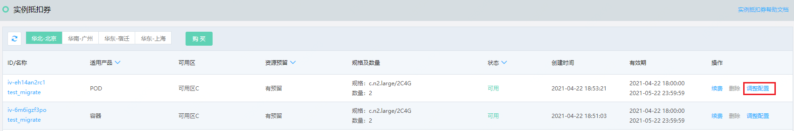
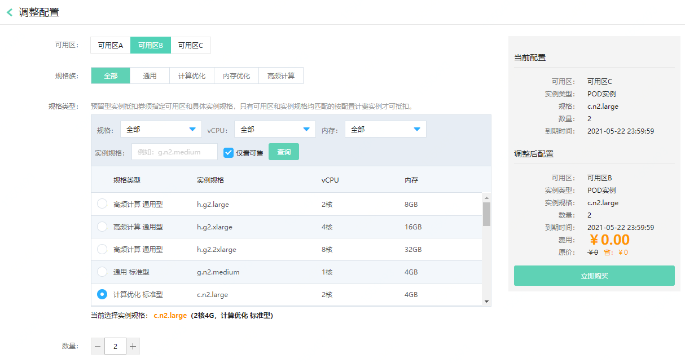

# 调整实例抵扣券配置

实例抵扣券购买后，如果资源用量有波动或者实例调整配置为其他规格类型，可通过调整配置功能调整抵扣券的部分属性，以确保和实例相匹配。

## 前提条件及限制
* 仅**可用**状态下的实例抵扣券可以调整配置。
* 无资源预留型抵扣券支持调整规格族和计算力，不可变更地域和适用实例类型；
* 资源预留型抵扣券支持调整可用区、规格和数量，不可变更地域和适用实例类型。

## 操作影响
* 如调整后价格高于调整前，则须补足差价；如调整后价格低于调整前，则将自动按差价延长抵扣券到期时间。

## 操作步骤
1、访问[实例抵扣券控制台](https://cns-console.jdcloud.com/host/instancevoucher/list)，或在[京东云控制台](https://console.jdcloud.com/overview)点击左侧导航栏**弹性计算-云主机-实例抵扣券**或**弹性计算-原生容器-实例抵扣券**进入实例抵扣券列表页。 

2、选择期望调整的实例抵扣券，点击操作中的**调整配置**。在调配页面中对抵扣券属性进行调整，点击**立即购买**完成订单确认后即可完成配置调整。

