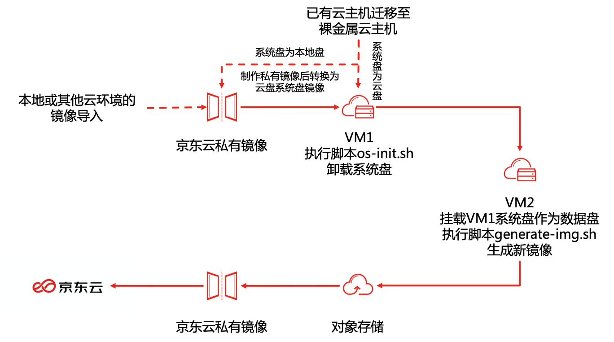
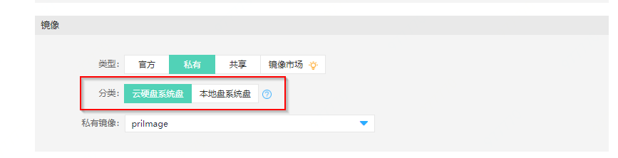
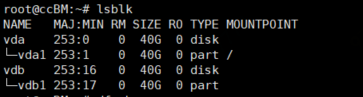
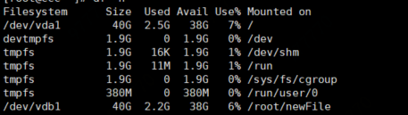
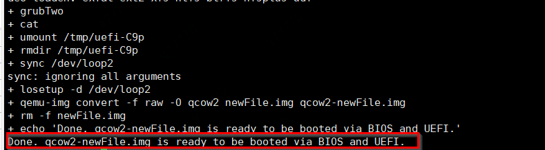
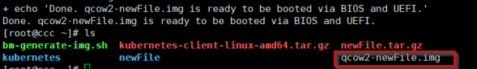

# 创建裸金属实例

## 官方镜像创建
您可以在华北-北京地域使用2020年1月2日及之后提供的以下官方镜像：CentOS 7.2、CentOS 7.4及CentOS 7.6创建裸金属实例。具体实例创建操作可参考[创建实例](https://docs.jdcloud.com/cn/virtual-machines/create-instance)。


## 私有镜像创建
裸金属实例需要您的镜像支持UEFI启动。若您需要通过京东智联云上私有镜像创建裸金属实例，请根据以下文档将您的私有镜像转换为支持UEFI启动的镜像。目前只有私有镜像操作系统版本为CentOS 7.2、CentOS 7.4、CentOS 7.6的镜像支持以下操作。

如果您需要将当前实例迁移至裸金属实例上，请确保您当前实例的操作系统版本属于CentOS 7.2、CentOS 7.4、CentOS 7.6。如果您当前实例的镜像分类为云硬盘系统盘，[将镜像转换为支持UEFI启动的镜像](create-bm-instance#user-content-2)中第一步可忽略，您可直接将此实例作为文档中的vm1并根据文档执行后续步骤；如果您当前实例的镜像分类为本地盘系统盘，请先为此实例制作镜像并完成[镜像类型转换](https://docs.jdcloud.com/cn/virtual-machines/convert-image),再根据以下文档逐步操作。

如果您想需要将您在本地或其他云环境下的应用迁移至京东智联云裸金属实例上，请先将您的应用以镜像形式保存并执行[私有镜像导入](https://docs.jdcloud.com/cn/virtual-machines/import-private-image)。

### 操作步骤



<div id="user-content-2"></div>

### 将镜像转换为支持UEFI启动的镜像：
1. 使用您的私有镜像创建一台镜像分类为云硬盘系统盘的实例VM1。<br>

2. 在VM1中下载并运行脚本：
    ```
    wget https://bm-img-trans.s3.cn-north-1.jdcloud-oss.com/os-init.sh
    chmod u+x os-init.sh
    ./os-init.sh
    ```

3. 当脚本执行完成后，在控制台将vm1停止，将其系统盘卸载。可参考[卸载云硬盘](https://docs.jdcloud.com/cn/virtual-machines/detach-cloud-disk)
4. 将已卸载的vm1系统盘作为数据盘挂载在另一台操作系统与vm1相同的实例vm2上。为可参考文档[挂载云硬盘](https://docs.jdcloud.com/cn/virtual-machines/attach-cloud-disk)。请确保vm1与vm2使用的操作系统一致，如vm1操作系统为CentOS 7.6，vm2操作系统为CentOS 7.4，vm1与vm2均为CentOS操作系统。
5. 挂载完成后，登录实例vm2, 可以通过`lsblk`命令来查看磁盘分区信息：
 如下图所示，新挂载的磁盘设备是/dev/vdb1，lsblk 的输出从完整的设备路径中去掉了 /dev/ 前缀。/dev/vdb1即为原主机vm1的系统盘。<br><div align="center"></div>

6. 需要执行以下命令创建一个文件（下述命令创建新文件newFile）作为/dev/vdb1的挂载点并将其挂载：

    ```
    mkdir newFile
    mount -o nouuid /dev/vdb1 newFile
    ```

    挂载完成后，可通过运行 `df -h`命令验证是否成功，若出现如下结果，说明/dev/vdb1已成功挂载在newFile下。<br><br><div align="center"></div>

7. 在当前目录（挂载点的上层目录）下载脚本并运行，请确保脚本文件在挂载点的上层目录中：
    ```
    wget https://bm-img-trans.s3.cn-north-1.jdcloud-oss.com/generate-img.sh
   
    chmod u+x generate-img.sh
   
    ./generate-img.sh [MountPoint] [OS] [RawSize]
    ```
    其中，mount point 为原主机vm1系统盘在当前主机vm2中的挂载点（即示例中的newFile）；OS为原主机vm1系统盘的操作系统，也可以说是您私有镜像的操作系统，在此处只需要指定操作系统不需要指定系统版本，如CentOS 7.6只需要指定为centos7即可；RawSize为制作的镜像在raw格式下的大小，若不指定默认为10G。若指定，RawSize的大小请不要小于10G。
    例如挂载点为newFile且vm1操作系统为CentOS 7.6,可执行以下命令：
    ```
    ./generate-img.sh newFile centos7 20G
    ```
    出现下图说明bm-generate-img.sh运行完成：<br><br><div align="center"></div>

    您可查询当前目录下该镜像文件是否存在。<br><br><div align="center"></div>

    该镜像文件为裸金属实例可使用的镜像文件。请通过以下操作将该镜像文件导入您的私有镜像。

### 上传镜像文件
操作导入镜像之前，需要确保已 [开通对象存储服务](https://docs.jdcloud.com/cn/object-storage-service/sign-up-service-2) 、[创建存储空间（Bucket）](https://docs.jdcloud.com/cn/object-storage-service/create-bucket-2)，然后将镜像文件上传至与期望导入镜像相同地域的存储空间中，并获取文件下载链接。<br>
实例中镜像文件上传至对象存储可参考文档[使用S3fs在Linux实例上挂载Bucket](https://docs.jdcloud.com/cn/object-storage-service/s3fs)，上传步骤需要较长时间请耐心等待。如需要快速完成上传，可选择上调弹性公网IP带宽。在上传完成后获取文件下载链接。

### 导入镜像
导入镜像请参考 [私有镜像导入](https://docs.jdcloud.com/cn/virtual-machines/import-private-image#user-content-1)

### 京东云处理
镜像导入完成后，京东云需要对您的私有镜像进行相关处理以使其能够被裸金属实例使用，请在镜像导入完成后提交工单联系我们，工单中请注明私有镜像ID。

## 相关参考
[创建实例](https://docs.jdcloud.com/cn/virtual-machines/create-instance)

[镜像类型转换](https://docs.jdcloud.com/cn/virtual-machines/convert-image)

[私有镜像导入](https://docs.jdcloud.com/cn/virtual-machines/import-private-image)

[卸载云硬盘](https://docs.jdcloud.com/cn/virtual-machines/detach-cloud-disk)

[挂载云硬盘](https://docs.jdcloud.com/cn/virtual-machines/attach-cloud-disk)

[开通对象存储服务](https://docs.jdcloud.com/cn/object-storage-service/sign-up-service-2)

[创建存储空间（Bucket）](https://docs.jdcloud.com/cn/object-storage-service/create-bucket-2)

[使用S3fs在Linux实例上挂载Bucket](https://docs.jdcloud.com/cn/object-storage-service/s3fs)
