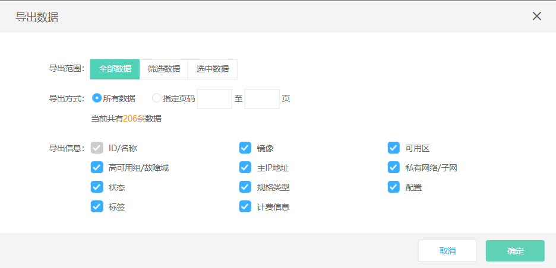
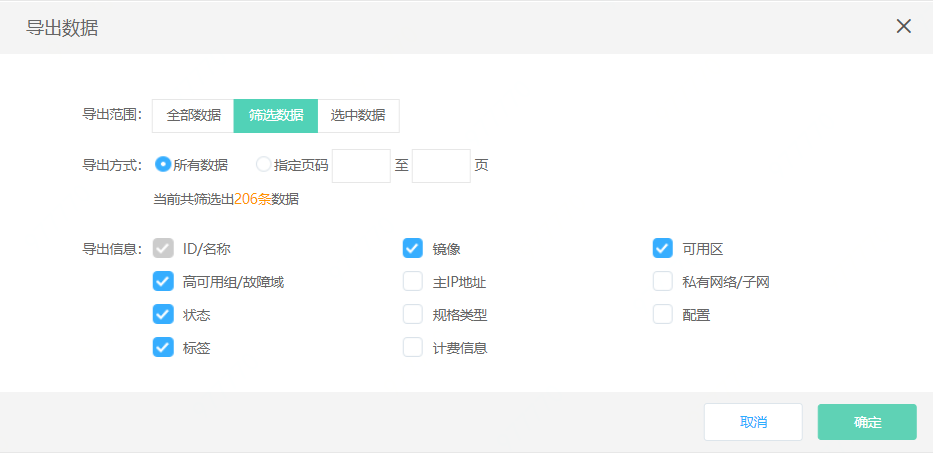

# 导出实例信息

您可通过控制台导出指定地域下的实例列表，可以自定义导出数据的范围、方式及相关信息，单次支持最多2000条数据的导出。当前支持的导出范围有：全部数据、筛选数据及选中数据，可指定的导出方式有：所有数据导出、指定页码导出，可选择的导出信息包括：ID、名称、镜像、可用区、高可用组、故障域、状态、实例规格、主内网IP、主内网IP所绑定公网IP及带宽、私有网络、子网、专有宿主机、所绑定云硬盘、计费信息、标签、创建时间及到期时间（对于包年包月计费云主机）。

## 操作步骤

1. 访问[云主机控制台](https://cns-console.jdcloud.com/host/compute/list)，即进入实例列表页面。或访问[京东智联云控制台](https://console.jdcloud.com)点击左侧导航栏【弹性计算】-【云主机】进入实例列表页。
2. 选择地域。
3. 点击实例列表页右上角点击导出列表icon。  
4. 在弹出的“导出数据”弹窗里指定导出范围与导出方式：导出范围中选择“全部数据”将导出您在当前地域下的全部资源信息，若您的数据超过2000条，请在导出方式中选择通过指定页码方式分批进行导出；导出范围中选择“筛选数据”将导出您当前通过筛选操作得到的相关数据，若您当前没有进行筛选操作，您在当前地域下的全部资源信息。若您的导出数据超过2000条，请在导出方式中选择通过指定页码方式分批进行导出。导出范围中选择“选中数据”将导出您在实例列表页中勾选的相关数据。  
5. 在弹出的“导出数据”弹窗里指定导出信息：可选择的导出的信息包括ID/名称（必选）、镜像、可用区、高可用组/故障域、主IP地址、私有网络/子网、状态、规格类型、配置、标签、专有宿主机、计费信息，您可根据实际需要选择其中一项或多项进行数据导出。您所绑定的云硬盘与地域信息将会默认随之导出。  
		请注意：导出时间受实例项数影响，若数据较多时还请耐心等待。
	
