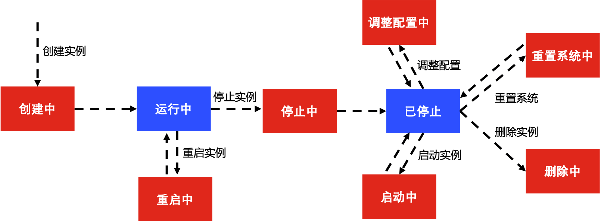

# 实例生命周期

实例的生命周期指从创建（购买）开始到最后释放（包年包月实例到期后自动删除、按配置计费实例欠费停机后自动删除或者按配置付费实例用户主动删除）的时间周期。以下表格展示了实例生命周期内实例可能的状态。
## 实例状态说明
状态|状态属性|说明
:---|:---|:---|                
创建中|中间状态|创建实例任务提交后，进入**运行中**之前的状态，如果长时间处于此状态，说明创建实例出现异常。                
运行中|稳定状态|实例正常运行状态，在这个状态的实例上可以正常运行您的业务，同时可对实例进行对应的操作。                
已停止|稳定状态|实例被正常停止后的状态，在这个状态的实例停止对外提供服务。                
删除中|中间状态|按配置计费、错误状态或包年包月到期的实例，从控制台提交删除实例到删除成功之间的状态。                
启动中|中间状态|**已停止**状态的实例进行**启动**操作之后，到**运行**状态之间的状态，如果长时间处于该状态，则说明出现异常。                
停止中|中间状态|**运行中**状态的实例进行**停止**操作后，在进入**停止**之前的状态，如果长时间处于该状态，则说明出现异常。                
重启中|中间状态|**运行中**状态的实例进行**重启**操作后，在进入**运行**之前的状态，如果长时间处于该状态，则说明出现异常。                
调整配置中|中间状态|**已停止**状态的实例进行**升级配置**操作后，在重新进入**停止**状态之前的状态，如果长时间处于该状态，则说明出现异常。                
|重置系统中|中间状态|**已停止**状态的实例进行**重置系统**操作后，在重新进入**停止**状态之前的状态，如果长时间处于该状态，则说明出现异常。                

若您实例出现异常情况，请提交工单。
## 实例状态流转图示
您可以通过控制台查看实例状态，也可通过[describeInstanceStatus](https://docs.jdcloud.com/cn/virtual-machines/api/describeinstancestatus?content=API)或[describeInstances
](https://docs.jdcloud.com/cn/virtual-machines/api/describeinstances?content=API)查看。

