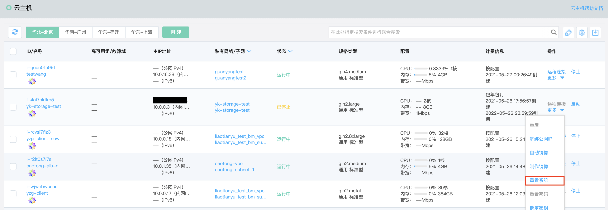
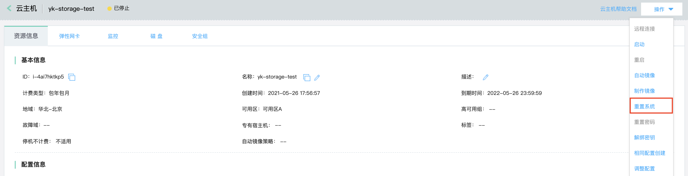
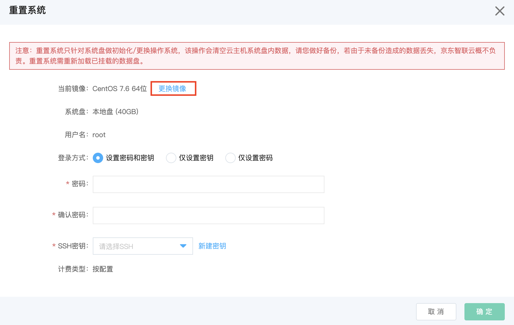
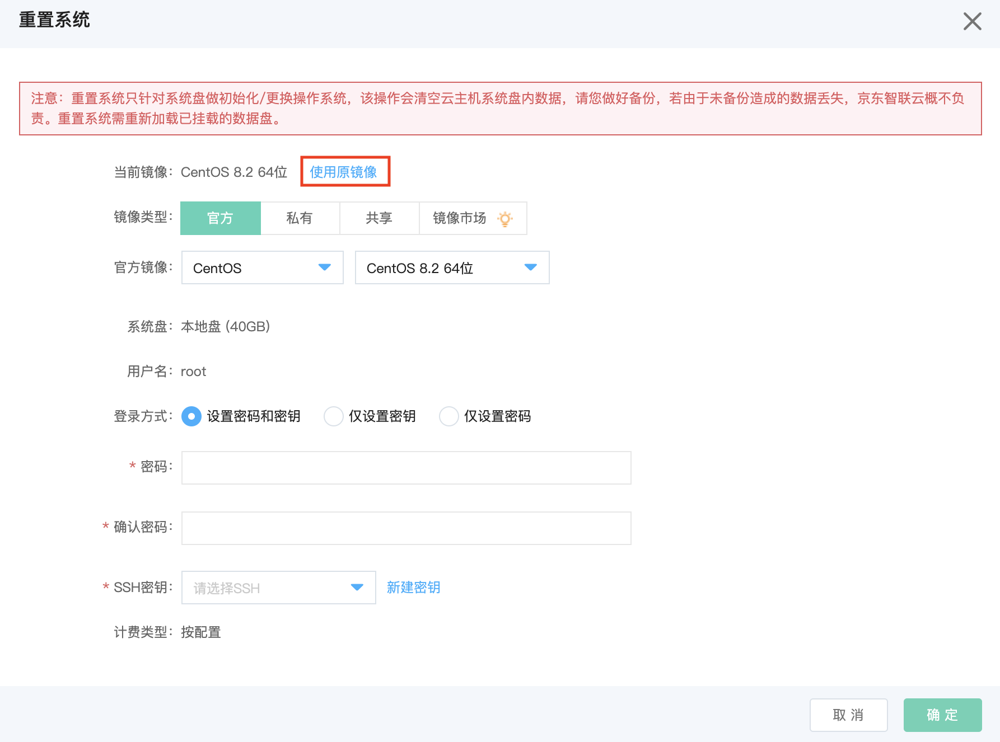

# 重置系统

您可以通过重置系统操作使实例恢复至刚创建时的系统状态，是一种在实例遭遇软件故障时的恢复手段。同时如果您希望沿用当前主机规格而更换所使用的操作系统，也可以通过重置系统操作完成。您可以选择重置实例至 Linux 类型系统或者重装至 Windows 类型系统。

## 前提条件及限制

* 实例必须处于“已停止”状态。若实例处于“运行中”状态，请先操作[停止实例](Stop-Instance.md)；若实例处于其他非稳定状态，还请等待前序操作执行完成后再操作调整配置。
	
	>注意：停止实例会中断您业务，请谨慎操作。
* 若实例基于私有镜像创建，而私有镜像已被删除，则无法使用原镜像重置系统，即无法恢复至刚创建时的系统状态，建议保留被实例引用的私有镜像。
* 重置系统所选镜像对应系统盘快照容量不可超过当前系统盘大小，其中系统盘快照容量指制作该镜像时对应系统盘文件系统大小。
* 重置系统只允许选择与当前实例系统盘类型一致的镜像，例：当前实例系统盘为云硬盘，则重置系统仅可选择云硬盘镜像。
* 部分镜像对实例规格配置有要求，若所选镜像不适用于目前实例规格，还请[调整配置](Resize-Instance.md)后操作重置系统。

## 操作影响

* 重置系统会导致系统盘的内容全部丢失，数据盘的数据不受影响（但需要重新识别）。因此，在需要保留系统运行数据的情况下，强烈建议您在重置系统前[制作私有镜像](http://docs.jdcloud.com/cn/virtual-machines/create-private-image)，之后重置时选择该私有镜像即可实现保留系统运行数据。
* 如果重置系统前后均为Linux系统，且实例上挂载了数据盘并设置了开机自动挂载分区。重置系统后，旧系统盘中的数据盘分区挂载信息将丢失。您需要自行更新/etc/fstab配置。
* 重置系统允许重新设置认证信息，包括密码及密钥，其中仅重置为Linux系统时指定SSH密钥。
* Linux默认情况下无法识别NTFS格式，Windows Server默认情况下无法识别ext3、ext4、XFS等文件系统格式。如果重置系统时有Linux与Windows Server互换的需要，建议：
	* 对于存储了需要保留的数据的数据盘，则需安装识别软件，Windows Server系统更换为Linux系统时，安装NTFS-3G或Fuse；Linux系统更换为Windows Server系统时，安装Ext2Read或Ext2Fsd。
	* 对于存储了不需要保留的数据	的数据盘，可以选择重新格式化。请参考[Linux系统数据盘分区及格式化](http://docs.jdcloud.com/cn/cloud-disk-service/linux-partition)及[Windows系统盘分区及格式化](http://docs.jdcloud.com/cn/cloud-disk-service/windows-partition)。

## 操作步骤
1. 访问[云主机控制台](https://cns-console.jdcloud.com/host/compute/list)，即进入实例列表页面。或访问[京东云控制台](https://console.jdcloud.com)点击顶部导航栏**弹性计算-云主机**进入实例列表页。
2. 选择地域。
3. 在实例列表中选择需要重置系统的实例，确认其状态为“已停止”。
4. 点击**操作-更多-重置系统**按钮，或点击实例名称进入详情页后点击**操作-重置系统**按钮。
 
5. 弹出“重置系统”弹窗，默认选择您创建实例时所用镜像，即可恢复至创建时系统状态。若您需要更换至其他镜像，则点击弹窗中**更换镜像**按钮切换至选择镜像界面，您可按需选择镜像。

6. 设置新的登录认证信息，Linux系统支持同时设置密码和SSH密钥，仅设置密码或仅设置SSH密钥，Windows Server仅支持设置密码，点击**确定**触发重置系统。 

	>若选择的Linux镜像里已配置密钥，选择设置密码时，使用镜像内原密钥登录仍将成功；若选择的Linux镜像里已配置密码，选择仅设置密钥时，使用镜像内原密码登录将失败。

之后实例将进入**重置系统中**状态，重置完成后将恢复成**已停止**状态，操作[启动实例](Start-Instance.md)后即可正常使用实例。

## 相关参考
[停止实例](Stop-Instance.md)

[调整配置](Resize-Instance.md)

[制作私有镜像](http://docs.jdcloud.com/cn/virtual-machines/create-private-image)

[Linux系统数据盘分区及格式化](http://docs.jdcloud.com/cn/cloud-disk-service/linux-partition)

[Windows系统盘分区及格式化](http://docs.jdcloud.com/cn/cloud-disk-service/windows-partition)

[启动实例](Start-Instance.md)

