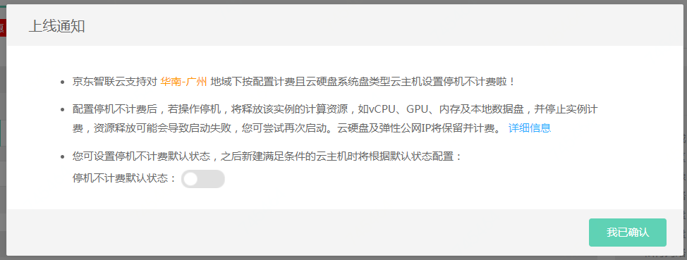
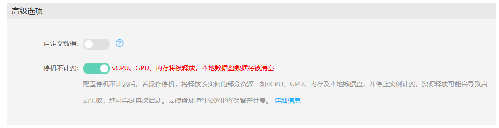

# 实例停机不计费

对于实例调度方式为自动选择宿主机、计费方式为按配置且系统盘为云硬盘的实例，可开启停机不计费功能。
* 开启了停机不计费的实例在停机后其vCPU、GPU、内存及本地数据盘资源会被释放，京东云会停止对实例本身的计费。
* 与实例绑定的云盘、弹性公网IP将会保留与实例的绑定状态，其计费维持正常，不会被停止。
* 开启停机不计费功能的实例在关机后再次启动时，会存在由于资源库存不足导致实例无法启动的风险，如果发生此种情况您可选择稍后重试启动操作或调整配置为库存充足的实例规格。

	
	请注意：
	* 某些操作，如重置系统、调整配置等，会要求实例先行停机，建议您在此情况下关闭停机不计费功能后操作，以此保证实例资源不被释放、操作完成后能够正常启动。
	* 对于已开启停机不计费的实例，在实例触发关机操作后，其计费就会停止。但是有发生停止失败导致实例继续运行的情况的可能，此时计费会恢复正常。请确认您的实例在“停止中”状态后成功转为“停止”状态，成功停止计费。如果停止实例失败，请您再次进行停止操作。
	* 在实例操作系统内部关机也可触发停机不计费，是否能够停机不计费取决于该实例当前的停机不计费状态。若您的实例不适用停机不计费功能或停机不计费功能关闭，则实例将正常计费。

## 停机不计费适用条件

实例调度方式为自动选择宿主机、计费方式为按配置且系统盘为云硬盘的实例。

如果您的实例计费类型为包年包月、系统盘为本地盘或创建在专有资源池/专有宿主机内，将不适用停机不计费。

	

## 操作步骤

### 设置实例停机不计费默认状态

您可在停机不计费功能上线通知弹窗中设置您停机不计费的默认状态，之后在新建满足条件的实例时将首先根据您选择的默认状态为您进行配置，简化您的操作。若您需要与停机不计费默认状态不同的实例，您可在每次创建实例或停止实例时更改当前实例的停机不计费状态。

### 在创建实例时开启/关闭停机不计费

1. 访问[实例控制台](https://cns-console.jdcloud.com/host/compute/list)，或访问[京东云控制台](https://console.jdcloud.com)点击左侧导航栏【弹性计算】-【云主机】-【实例】进入实例列表页。

2. 选择创建实例所属地域，点击【创建】按钮，进入云主机购买页面。

3. 在高级选项中，为您的实例设置开启/关闭停机不计费。若不做更改，实例的停机不计费状态为您之前设置的停机不计费默认状态。

4.若您当前实例不适用停机不计费功能，此处将无法进行设置。

### 在创建实例模板时开启/关闭停机不计费

1. 访问[实例控制台](https://cns-console.jdcloud.com/host/compute/list)，或访问[京东云控制台](https://console.jdcloud.com)点击左侧导航栏【弹性计算】-【云主机】-【实例模板】进入实例列表页。

2.选择地域，点击【创建】，进入实例模板创建页面。

3.在高级选项中，为您实例模板中的实例设置开启/关闭停机不计费。若不做更改，实例的停机不计费状态为您之前设置的停机不计费默认状态。

4.若您当前实例模板中的实例不适用停机不计费功能，此处将无法进行设置。

	
	请注意：
	* 如果您使用开启停机不计费功能的实例模板来创建计费方式为包年包月的实例，创建出的实例将会保持包年包月计费状态，不适用停机不计费功能。

### 在停止实例时开启/关闭停机不计费

	
	请注意：
	* 只有当实例停止后，开启了停机不计费功能的实例才会被停止计费，您可在进行实例的停止操作时再次确认实例的停机不计费状态。

1. 访问[云主机控制台](https://cns-console.jdcloud.com/host/compute/list)，即进入实例列表页面。或访问[京东云控制台](https://console.jdcloud.com)点击左侧导航栏【弹性计算】-【云主机】进入实例列表页。

2. 选择地域。

3. 在实例列表中选择需要停止且适用停机不计费的实例，点击【操作】-【停止】按钮、或点击实例名称进入详情页后点击【操作】-【停止】按钮并在“停止”弹窗中选择停机不计费功能的开启/关闭。如果您当前的实例不支持停机不计费功能，将不显示停机不计费设置相关信息，无法进行设置。

4. 可通过多选实现同时操作多台实例。在实例列表中勾选需要停止的实例，点击列表下方【停止】按钮，在“停止”弹窗中选择停机不计费功能的统一开启/关闭。勾选【保持当前配置】，每台实例的停机后是否计费将维持当前设置；勾选【统一设置】，设置的结果将对满足停机不计费配置的实例生效，若您选择的实例中包括不支持停机不计费功能的实例，该实例在“停机不计费”一列中将显示为“不适用”，您无法将该实例的该功能设置为开启/关闭。

5. 在“停止”弹窗中确认相关信息，点击【确定】提交停止操作，实例将进入“停止中”状态，当停止完成后，实例将进入“停止”状态，此时若实例开启停机不计费功能，在下次启动实例之前的时间里将不会收取实例计算资源的费用，若实例关闭/未开启停机不计费功能，实例将按配置正常计费。

