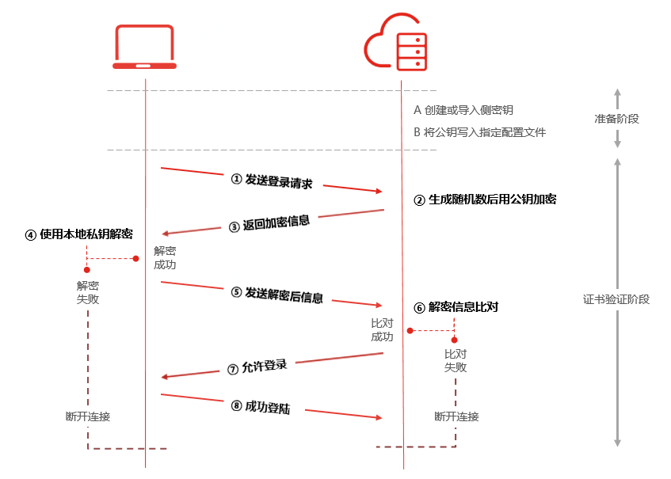

# 密钥概述
京东云为您提供两种安全可靠的登录实例方式：密码登录及SSH密钥登录。其中只有Linux系统实例支持使用SSH密钥。

SSH密钥登录是指使用密钥技术对登录信息进行加密解密，为云主机提供一个较之密码登录更加安全的登录方式，进一步提升云主机的安全。

对于密钥登录，您需要创建一对唯一匹配密钥对：**公钥** 和 **私钥**：

* 公钥需存储在京东云上，用于对数据进行加密。
* 私钥由您在本地保存，私钥只能对与之匹配的公钥所加密的数据进行解密。

## 原理流程
使用SSH密钥登录实例过程如下：

### 准备阶段：
1. 您在京东云创建密钥对（新生成或导入），并将私钥保存至本地。
2. 操作实例与密钥绑定后，平台会在实例再次启动时，通过内置的系统组件将公钥写入对应目录文件中（Linux系统下公钥存放在`~/.ssh/authorized_keys`目录中）。

### 证书校验交互阶段：

1. 用户通过客户端发送登录请求至实例。
2. 实例在对应用户目录及文件中读取到有效公钥，生成一串随机数，并使用公钥对其加密。
3. 实例将加密数据返回至用户。
4. 客户端使用本地私钥对数据进行解密。
5. 客户端将解密结果返回至实例进行信息比对。若比对成功则用户登录成功，否则则登录失败。

京东云在控制台提供密钥创建、绑定及解绑操作入口，以便于进行密钥的管理，此外也支持您登录系统后自行进行相应的配置。

## 相关参考

[创建密钥](Create-Keypair.md)

[绑定密钥](Bind-Keypair.md)

[解绑密钥](Unbind-Keypair.md)

  [1]: ./images/Operation-Guide-keypair-overview1.png "Operation-Guide-keypair-overview1.png"
