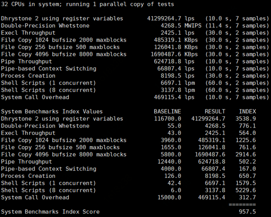
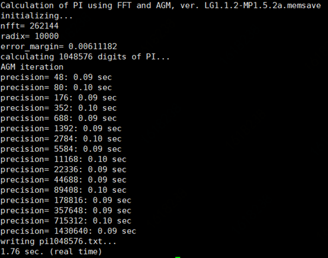
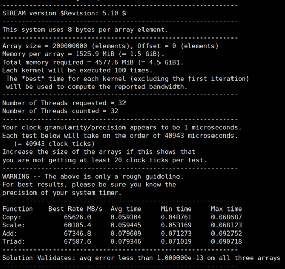

# Linux实例基准性能测试方法

随着数字化的不断发展及云服务能力的日趋完善，越来越多用户选择使用云上的云主机资源搭建自己的服务；为应对不同业务及应用场景，京东云主机也推出了多种规格类型（详见[实例规格类型](https://docs.jdcloud.com/cn/virtual-machines/instance-type-family)），您可以对云主机性能做一个基准性能测试，来确定最适合您业务需求的实例规格。本文主要介绍如何对Linux实例进行CPU、内存的基准性能测试。


## CPU基准性能测试
### 1.UnixBench
UnixBench是一个基于Unix系统的基准测试工具，为类Unix系统提供了基础的衡量指标，其包含多种测试；这些测试的结果是一个指数值(index), 这个值是测试系统的测试结果与一个基线系统测试结果比较得到的指数值，这样比原始值更容易得到参考价值。

1.1 下载工具包并解压

```shell
wget https://storage.googleapis.com/google-code-archive-downloads/v2/code.google.com/byte-unixbench/UnixBench5.1.3.tgz
tar xf UnixBench5.1.3.tgz
cd UnixBench
```

1.2 执行测试命令

	单核测试：./Run -c 1
	多核测试：./Run -c ${core}

参数说明：

- -c 后跟cpu线程数，可通过命令"cat /proc/cpuinfo | grep process | wc -l"获取。

<div align="center"></div>

1.3 分析结果

观察测试结果中的index, 该值越高越好。

### 2.SuperPI
Super PI是一个典型的CPU密集型基准测试工具，它根据用户的设置计算圆周率π小数点后的N位数据，然后统计消耗的时间，以此来确定CPU的稳定性和计算能力。

2.1下载安装包并编译
```shell
git clone https://github.com/Fibonacci43/SuperPI
yum install glibc-static（安装glibc静态库，若OS为CentOS8，需先执行dnf config-manager --enable PowerTools）
cd SuperPI
make
```

2.2执行测试命令

```shell
./pi_css5 ${scale}
```

参数说明：

- scale指定计算到小数点后多少位，通常要算小数点后1M位（2^20次方），最大到2^25次方。如：./pi_css5 $((1 << 20))结果为计算小数点后1M位圆周率的时间。 

<div align="center"></div>

2.3	分析结果
观察测试结果中的real time（计算指定位数圆周率所用的时间），该值越小越好。

## 内存基准性能测试

### 1.Stream

Stream是一款内存带宽性能测试基准工具，用于衡量系统在运行一些简单矢量计算时能达到的最大内存带宽和相应的计算速度，测试包括Copy(复制)，Scale(乘法)，Add（加法），Triad(三者复合)四种操作下的内存带宽表现；其四种操作对应的内存行为分别为：

- Copy是复制操作，先访问一个内存单元读出其中的值，再将值写入到另一个内存单元。

- Scale是乘法操作，先从内存单元读出其中的值，作一个乘法运算，再将结果写入到另一个内存单元。

- Add是加法操作，先从内存单元读出两个值，做加法运算， 再将结果写入到另一个内存单元。

- Triad是将Copy、Scale、Add三种操作组合起来进行测试。具体操作方式是：先从内存单元中中读两个值a、b，对其进行乘加混合运算（a + 因子 * b ），再将运算结果写入到另一个内存单元。

1.1 下载并编译

```shell
wget https://www.cs.virginia.edu/stream/FTP/Code/stream.c
gcc stream.c -O3 -fopenmp -DSTREAM_ARRAY_SIZE=200000000 -DNTIMES=100 -mcmodel=medium -o stream.out
```

编译参数说明：
- STREAM_ARRAY_SIZE 为测试集内存的大小，一般不小于CPU LLC（Last Level Cache）大小的4倍。
- NTIMES 测试执行次数，程序将输出除第一次外其他结果中最好的结果，所以NTIME最小值为2。

1.2执行测试命令

```shell
./stream.out
```

<div align="center"></div>

1.3 分析结果

Best Rate表示执行不同操作的程序时内存与cpu之间的带宽，该值越高越好。

### 2.Intel MLC

Intel Memory Latency Checker(Intel MLC)是一款测试内存延迟的工具。

2.1下载并解压

```shell
wget https://software.intel.com/content/dam/develop/external/us/en/documents/mlc_v3.9a.tgz
tar xf mlc_v3.9a.tgz
```

2.2执行测试命令

```shell
./Linux/mlc --idle_latency -e -r -D8192
```

参数说明：

- --idle_latency 测试系统在空闲状态下的内存延迟
- -e 不对硬件 prefetcher做任何操作
- -r 随机内存访问
- -D 指定随机访问的范围的最大值

<div align="center"></div>

2.3分析结果

ns数值（内存延迟时间）越小越好。# Linux实例基准性能测试方法

