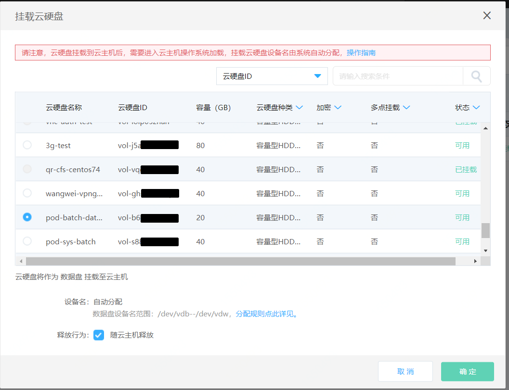
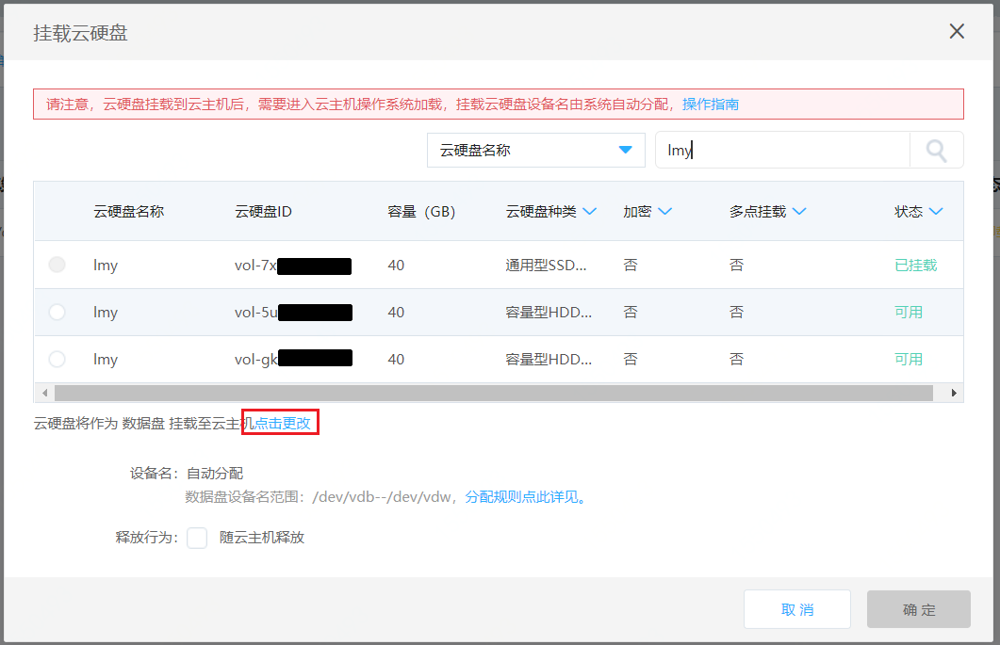
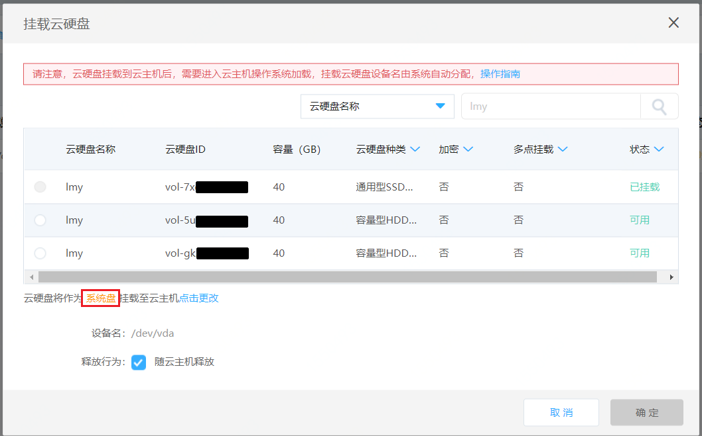

# 挂载云硬盘

可将未挂载状态的云硬盘挂载至实例作为系统盘或数据盘使用。以下介绍如何在实例侧操作挂载云硬盘，您还可以从云硬盘控制台进行挂载操作，详细步骤请参见[云硬盘侧挂载](http://docs.jdcloud.com/cn/cloud-disk-service/attach-cloud-disk)。

>提示：系统盘卸载/挂载功能建议仅在系统启动异常时用于排障使用，请谨慎操作。

## 前提条件
* 实例当前已挂载云硬盘数不可达到上限，即8块云硬盘（系统盘+数据盘）；
* 若要将云硬盘作为系统盘挂载至实例，则实例当前需未挂载系统盘，即未挂载设备名为`/dev/vda`的云硬盘，同时实例需要处于**已停止**状态，且磁盘容量在40GB～500GB之间；
* 多点挂载云硬盘只可作为数据盘挂载，且至多可挂载至16台实例（当前仅在华东-上海地域提供多点挂在云硬盘）；
* 加密云硬盘仅支持挂载至2代机以上的实例。

## 操作步骤

### 挂载为数据盘

如不特殊指定挂载点，云硬盘将默认作为数据盘挂载至实例，详细操作步骤如下：

1. 访问[云主机控制台](https://cns-console.jdcloud.com/host/compute/list)，即进入实例列表页面。或访问[京东云控制台](https://console.jdcloud.com)点击左侧顶部导航 **弹性计算-云主机** 进入实例列表页。
2. 选择地域后在实例列表中选择需要挂载云硬盘的实例，点击名称进入详情页。
3. 点击 **磁盘Tab-挂载** 按钮。
4. 在弹出的弹窗中，选择期望挂载的云硬盘，可通过云硬盘名称或ID进行搜索。若选择的是按配置计费的且非多点挂载云硬盘，则可设置随实例删除属性（释放行为），若勾选则在实例删除时将一起删除该云硬盘，若不勾选则在实例删除时云硬盘将保留。包年包月云硬盘或多点挂载盘无法指定删除属性，实例删除时保留。

### 挂载为系统盘

若实例当前未挂载系统盘，即未挂载设备名为`/dev/vda`的云硬盘，可以将云硬盘作为系统盘挂载至实例。详细操作步骤如下：

1. 访问[云主机控制台](https://cns-console.jdcloud.com/host/compute/list)，即进入实例列表页面。或访问[京东云控制台](https://console.jdcloud.com)点击左侧顶部导航 **弹性计算-云主机** 进入实例列表页。
2. 选择地域后在实例列表中选择需要挂载云硬盘的实例，点击名称进入详情页。
3. 点击 **磁盘Tab-挂载** 按钮。
4. 在弹出的弹窗中，选择期望挂载的云硬盘，可通过云硬盘名称或ID进行搜索。点击**点击更改**蓝色文字，则可作为系统盘挂载至云主机。
5. 多点挂载云硬盘不支持作为系统盘挂载。若选择的是按配置计费的且非多点挂载云硬盘，则可设置随实例删除属性（释放行为），对于系统盘默认随实例删除，属性可修改。若勾选则在实例删除时将一起删除对应云硬盘，若不勾选则在实例删除时云硬盘将保留。包年包月云硬盘无法指定删除属性，实例删除时保留。

>注意：
>* 云硬盘作为系统盘挂载时，实例须处于**已停止**状态；
>* 待挂载磁盘容量须在40GB～500GB之间。

完成以上操作后，云硬盘挂载状态将变更为**挂载中**，挂载云盘可能需要一段时间，还请您耐心等候并刷新页面，挂载成功后挂载状态将变更为**已挂载**。云硬盘在挂载完后还需要进行分区、格式化等一系列操作。具体操作方式请见：[Linux系统数据盘分区及格式化](http://docs.jdcloud.com/cn/cloud-disk-service/linux-partition)、[Windows系统盘分区及格式化](http://docs.jdcloud.com/cn/cloud-disk-service/windows-partition)。

## 相关参考

[云硬盘侧挂载](http://docs.jdcloud.com/cn/cloud-disk-service/attach-cloud-disk)

[Linux系统数据盘分区及格式化](http://docs.jdcloud.com/cn/cloud-disk-service/linux-partition)

[Windows系统盘分区及格式化](http://docs.jdcloud.com/cn/cloud-disk-service/windows-partition)
