# 自动镜像策略

京东智联云现支持使用自动镜像策略为您的云主机设置周期性的主机备份任务。自动镜像策略是一种自动任务策略，能够根据用户指定的规则定期定时为用户备份云主机数据，制作镜像。使用此产品可免去您定期手动为云主机制作镜像的工作。
	
	请注意：
	* 单地域至多允许创建20个自动镜像策略，如有额外需求请提交工单申请

## 快速导航

* [使用限制](autoImagePolicy#user-content-1)
* [创建自动镜像策略](autoImagePolicy#user-content-2)
* [修改自动镜像策略](autoImagePolicy#user-content-3)
* [关联资源](autoImagePolicy#user-content-4)
* [解除资源关联](autoImagePolicy#user-content-5)
* [禁用策略状态](autoImagePolicy#user-content-6)
* [启用策略状态](autoImagePolicy#user-content-7)
* [策略跨区复制](autoImagePolicy#user-content-8)
* [删除策略](autoImagePolicy#user-content-9)

## 使用限制

自动镜像策略仅适用于云硬盘系统盘的云主机。
云主机中本地盘数据盘不支持快照，通过自动镜像策略生成的镜像中不包含云主机中的本地数据盘。
生成的镜像将占用您镜像配额与快照配额，当无可用配额时，自动镜像将不会被创建。 

## 操作步骤

### 创建自动镜像策略

1. 访问[自动任务策略控制台][1] ，即进入自动镜像策略列表页面。或访问[京东智联云控制台][2] 点击左侧导航栏【弹性计算】-【云主机】-【自动任务策略】进入自动镜像策略列表页。

2. 点击【创建】，进入自动镜像策略创建页面。

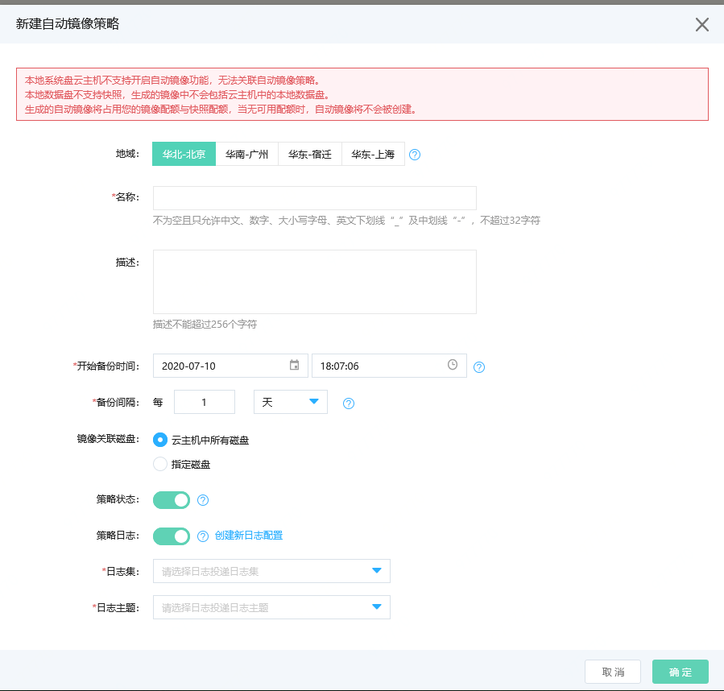

3.选择地域。请注意不可跨地域使用自动镜像策略，例华北-北京地域的策略无法与华南-广州地域的云主机相关联。如果所选地域限额已满，可以通过提交工单提升限额。

4.填写名称。名称不可为空，只支持中文、数字、大小写字母、英文下划线“_”及中划线“-”，不能超过32字符。

5.添加描述。描述不能超过256个字符。

6.指定开始执行时间。开始执行时间是指策略按照当前规则第一次开始执行的时间，最早需要在当前时间的30分钟后，您无法指定在当前时间向后30分钟以内的时间作为策略的开始执行时间。

7.指定执行间隔。可选择以“小时”、“天”或“周”为单位。为避免同一策略前后两次任务间隔过短，引起冲突，最短间隔时间为12小时。最长间隔时间为一年。

8.选择镜像关联磁盘，您的镜像中包括的云主机的磁盘在此处指定。选择“云主机中所有磁盘”，系统将为您制作云主机整体镜像，但是镜像中不会包括本地盘数据盘。选择“指定磁盘”，您可以勾选镜像中需要包括的磁盘设备名，其中系统盘（vda）必须指定，不可取消。若您指定的磁盘超出云主机本身挂载的磁盘，生成的镜像中将不会包括超出部分。若指定的磁盘中包括本地盘数据盘，生成的镜像中不会包含本地盘数据盘。

9.指定策略状态。策略状态有启用与禁用两种状态，启用状态的策略可以触发自动制作镜像任务，禁用状态的策略不会触发自动制作镜像任务。

10.策略日志。为了记录策略的执行情况，您可以在此处开启策略日志并指定日志的投递目的地（日志集、日志主题）。在指定投递目的地前，请确保您在[日志服务][3]中已创建了“日志来源”为“云产品”，“云产品”为“自动镜像任务策略”，“日志类型”为“自动镜像策略执行日志”的相关日志集与日志主题。详细操作可参考[云产品日志采集][4]
指定投递后，您可在指定的日志集下日志主题中找到相关的策略执行日志，若您删除了当前策略指定投递的日志主题或日志集，当前策略日志功能将自动关闭。
 

### 修改自动镜像策略

1. 您可以对已创建的自动镜像策略进行修改。点击【修改策略】，可进入策略修改页面
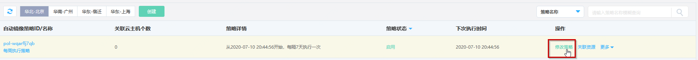

2.您可在此页面修改策略的规则与信息，若您修改了开始执行时间，则下次执行时间会相应进行改变，开始执行时间需要在当前时间的30分钟后。需若您修改了执行间隔，此次修改将不会影响下次执行时间。在下次执行完成后，新的执行间隔将生效。为避免同一策略前后两次任务间隔过短，策略的上一次执行时间与下一次执行时间要保持最少为12小时的时间间隔。
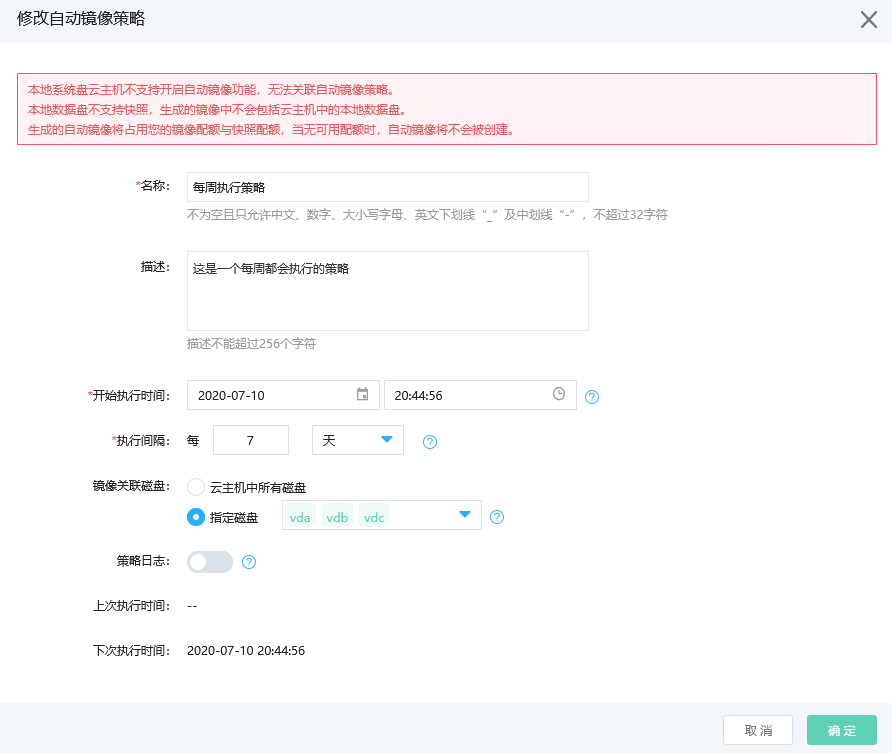

### 关联资源

#### 为自动镜像策略关联云主机资源

1.在[自动任务策略控制台][1]点击【关联资源】，或点击策略名称进入详情页后点击【操作】-【关联资源】
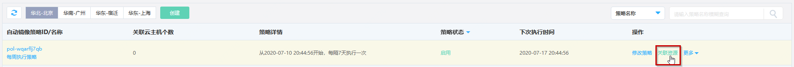

2.勾选当前地域下需要与策略进行关联的云主机，点击确定将自动镜像策略与云主机进行关联。策略不能与本地盘系统盘云主机进行关联，您无法在列表中找到您的本地盘系统盘云主机。每个云主机只能同时与一个自动镜像策略进行关联。对已关联策略的云主机进行操作将解除其与原策略的关联关系。
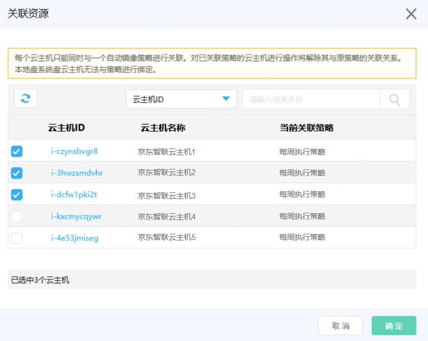

3.若您的云主机资源较多，您可以在当前页面根据云主机ID或云主机名称进行搜索，找到您希望与策略进行关联的云主机。云主机ID为精确搜索，云主机名称为模糊搜索。
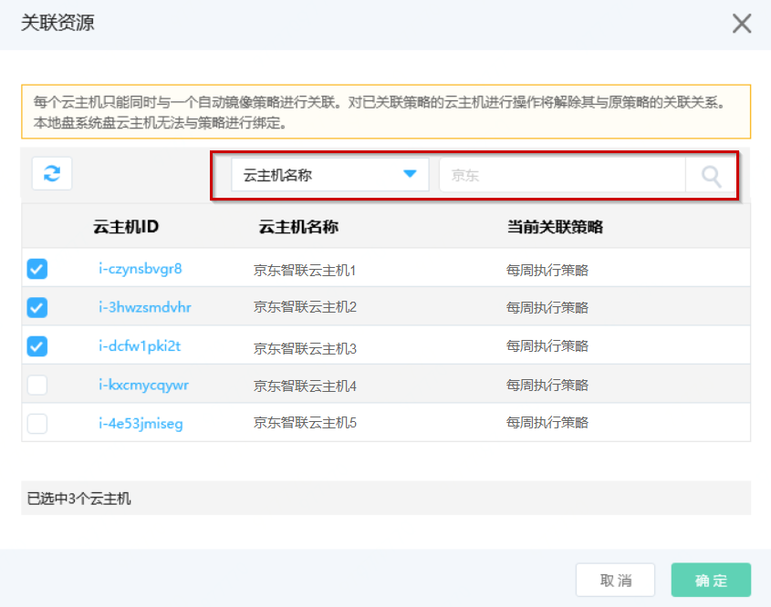

#### 为云主机资源关联自动镜像策略

##### 创建时指定自动镜像策略

1. 访问[云主机控制台](https://cns-console.jdcloud.com/host/compute/list)，点击【创建】按钮，进入云主机创建页面。

2. 在高级选项模块，打开自动镜像策略后方开关，为云主机指定自动镜像策略。 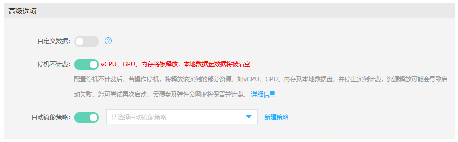

3. 请在主机创建完成后在主机详情页中查看云主机是否已与指定策略成功关联。。 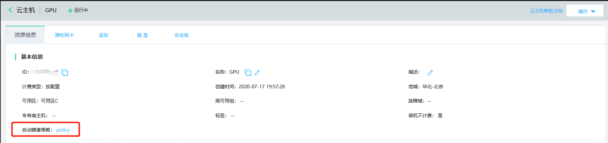

	
##### 创建后关联自动镜像策略

1. 访问[云主机控制台](https://cns-console.jdcloud.com/host/compute/list)，进入云主机列表页面。

2. 在列表中选择需要绑定策略的云主机，确认其为云硬盘系统盘云主机。如果需要同时操作多台云主机，可通过多选实现。

3. 单台操作：点击【操作】-【更多】-【自动镜像】，或点击云主机名称进入详情页后点击【操作】-【更多】-【自动镜像】，为云主机选择关联策略。
 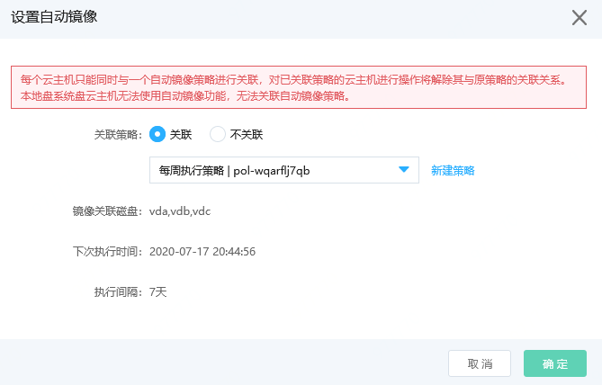

 批量操作：点击列表下方【更多】-【自动镜像】
 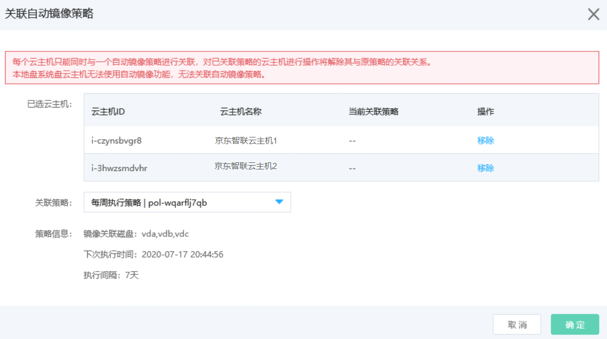

### 解除资源关联

#### 为自动镜像策略解除与云主机资源的关联

1.点击策略名称进入详情页后看到目前与与当前资源关联的云主机。
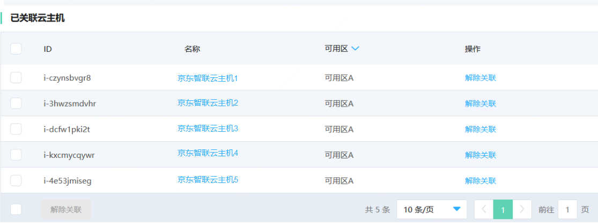

2.单台解除关联：点击资源列表右侧【操作】-【解除关联】。批量操作：勾选多台云主机，点击列表下方【解除关联】。若您的策略目前正在制作镜像，当前解除关联操作不会影响该次镜像制作结果。

#### 为云主机资源解除与自动镜像策略的关联

1. 访问[云主机控制台](https://cns-console.jdcloud.com/host/compute/list)，进入云主机列表页面。
2. 点击【操作】-【更多】-【自动镜像】，或点击云主机名称进入详情页后点击【操作】-【更多】-【自动镜像】，将关联策略设置为“不关联”。若您的策略目前正在制作镜像，当前解除关联操作不会影响该次镜像制作结果。
 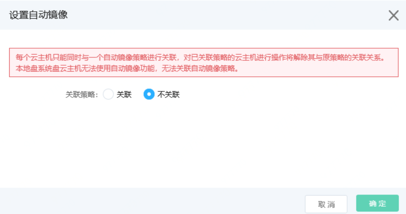

### 禁用策略状态

在[自动任务策略控制台][1]点击【操作】-【更多】-【禁用策略】，或点击策略名称进入详情页后点击【操作】-【更多】-【禁用策略】。禁用状态的策略不会触发自动制作镜像任务。
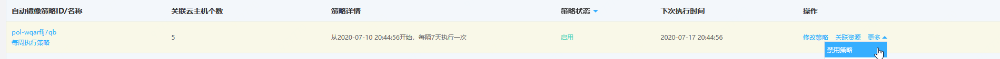

### 启用策略状态

在[自动任务策略控制台][1]点击【操作】-【更多】-【启用策略】，或点击策略名称进入详情页后点击【操作】-【更多】-【启用策略】。启用状态的策略会根据策略中的规则定时触发自动制作镜像任务。
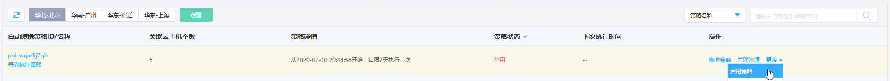

### 策略跨区复制

在[自动任务策略控制台][1]点击【操作】-【更多】-【策略跨区复制】，或点击策略名称进入详情页后点击【操作】-【更多】-【策略跨区复制】，可快速将当前策略复制至其他地域下。策略副本默认与源策略同名，同时将自动添加描述信息以标识策略来源
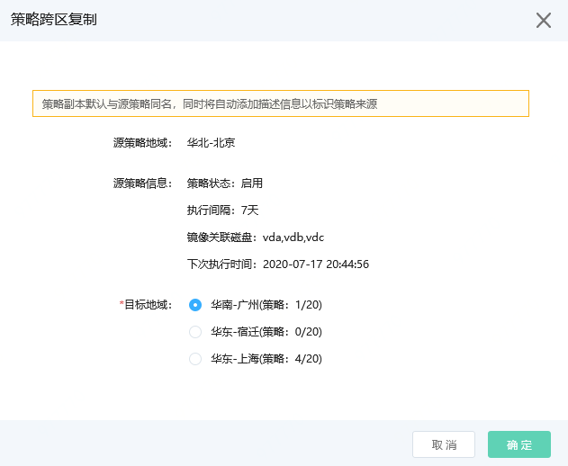

### 删除策略

在[自动任务策略控制台][1]点击【操作】-【更多】-【删除策略】，或点击策略名称进入详情页后点击【操作】-【更多】-【删除策略】，点击确定可将当前策略删除。策略删除后，与策略相关的云主机会自动解除与策略的绑定关系，系统将无法根据该条策略为云主机自动制作镜像。若当前策略正在制作镜像，本次删除操作不会影响当前镜像制作结果。 

 [1]: http://console.jdcloud.com/host/autoTaskPolicy/list
 [2]: https://console.jdcloud.com/
 [3]: https://logs-console.jdcloud.com/
 [4]: https://docs.jdcloud.com/cn/log-service/cloudresource
