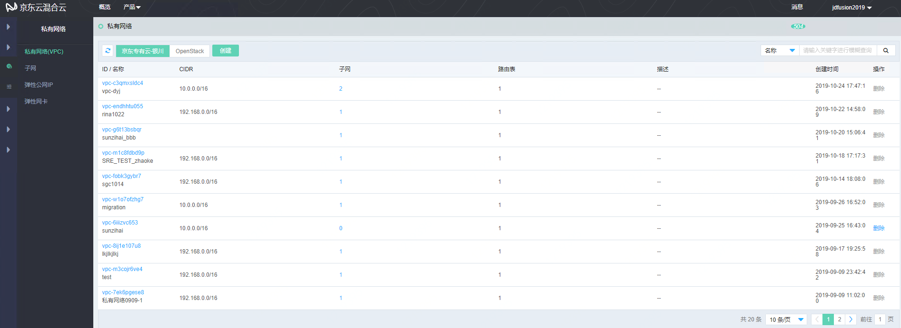

# 创建网络

## 创建VPC

访问左侧导航栏，点击网络>私有网络，进入私有网络列表页面，如图：私有网络列表页面所示。

图：私有网络列表页面

在此页面，点击“创建”按钮，弹出创建私有网络页面，如图：创建OpenStack私有网络页面所示。

图：创建私有网络页面

## 创建子网

在创建完成私有网络后，下一步在私有网络下创建子网。

访问左侧导航栏，点击网络>私有网络>子网，进入子网列表页面，如图：子网列表页面所示。

图：子网列表页面

在此页面，点击“创建”按钮，弹出创建子网页面，如图：创建OpenStack子网页面所示。

图：创建子网页面

