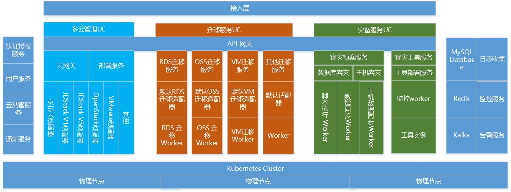

# 基础架构
   用户与京东云混合云主要交互方式为控制台界面、CLI和API，其中：
 - 控制台：混合云提供的主要交付方式，为用户提供直观、简洁的操作体验。
 - CLI工具：基于Bash环境的命令行工具，使其可以基于脚本等形式对融合云进行访问。
 - API：标准的基于HTTP协议的RestfulAPI接口，其他系统可以通过API与融合云进行集成。用户通过控制台实现的功能，均可以通过API实现。
 
 基础架构图如下：

- 京东云混合云产品严格按照微服务架构进行设计，包括多云管理、迁移服务、灾备服务、认证授权服务、通知服务、用户服务、云纳管服务、监控服务、告警服务等。
- 每个微服务保持其功能的自制，使系统具备天生的分布式能力，并通过无状态等服务实现方式，实现混合云各服务可以满足横向扩展能力。
- 各个服务按照业务进行划分，整体划分为多个相互独立的服务组。原则上，服务组之间只能进行API的交互或者MQ消息交互，并且服务组之间原则上没有强依赖关系，即有需要做到较好的容错处理。
- 每个服务组内，可有多个不同的服务组成，每个服务需按照业务进行细化拆分，并且，需要拆分为有状态/无状态两类，按照多实例/集群方案进行高可用设计。

# 相关参考
- [核心概念](Core-Concepts.md)
- [应用场景](Application-Scenarios.md)
- [基本功能](Features.md)

