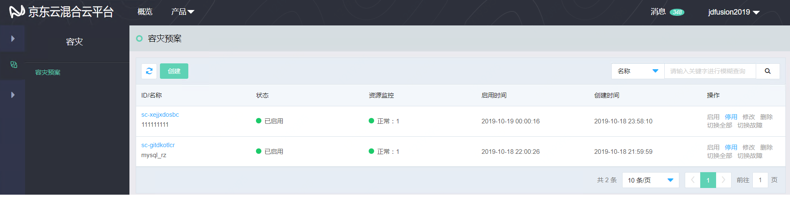
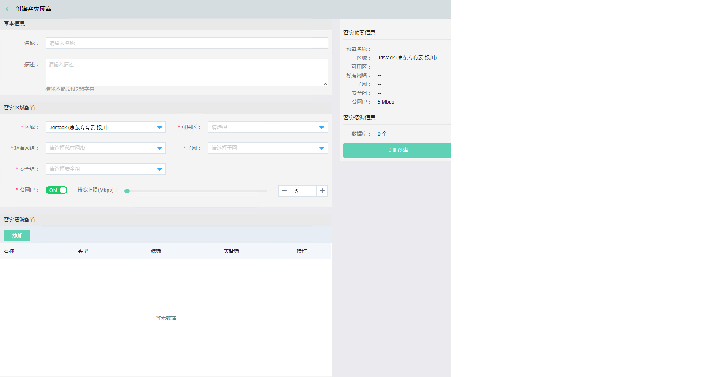

 ## 预案管理
进入容灾预案创建页面，进行容灾实例配置，可实现对容灾资源的批量维护。

 ### 创建预案
 在首页导航栏选择 产品-容灾-容灾-容灾预案，系统进入容灾预案相关操作界面。系统显示已创建的容灾预案列表，点击左上角【创建】，进入创建容灾预案页面。
 

输入创建容灾预案信息，包括基本信息，容灾区域配置，容灾资源配置。

### 添加容灾资源

在添加容灾预案页面，配置需要灾备的信息，包括源端和灾备端。同一个预案可添加多个资源。

