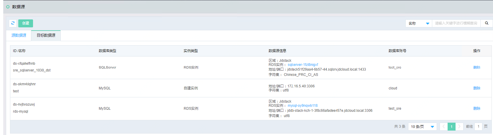
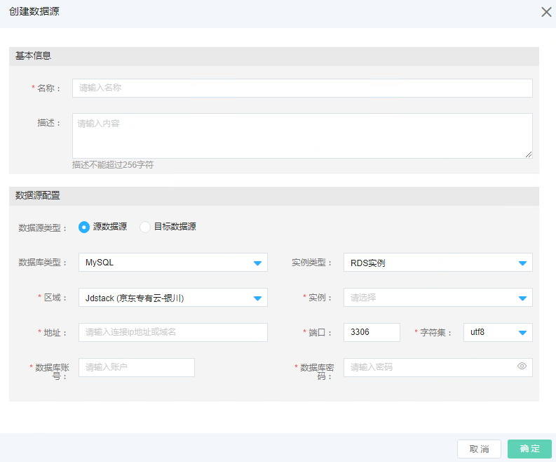

 ## 数据源管理
进入数据源创建页面，进行容灾实例配置，可实现对容灾资源的批量维护。

 ### 创建源和目标端端数据源
 在首页导航栏选择 产品-迁移-数据库-数据源管理，进入数据源管理相关操作界面。系统显示已创建的数据源列表，分别显示源数据源和目标数据源。
 

点击左上角【创建】，进入创建数据源页面。输入创建数据源信息，包括基本信息，数据源配置信息。

数据源配置信息包括:

数据源类型（源数据源和目标数据源），数据库类型（MySQL、SQL Server），实例类型（RDS实例，自建实例），实例ID，地址，端口，字符集，数据库账号和密码。

