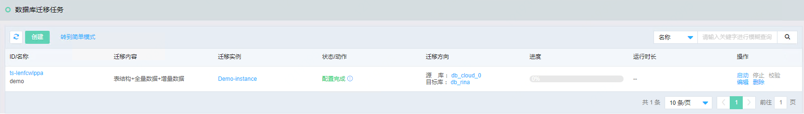
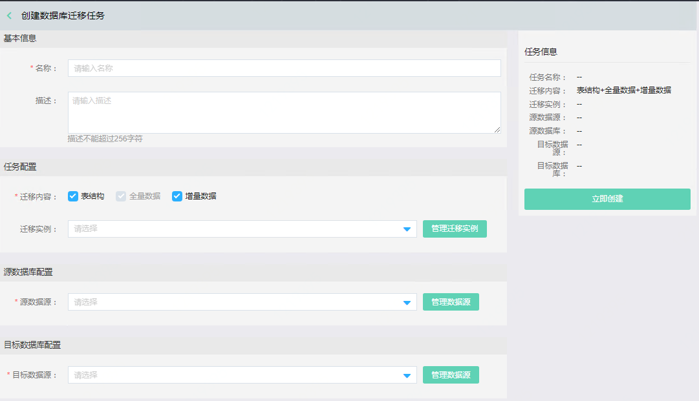

 ### 创建迁移任务
 在完成数据源和迁移实例配置后，进入配置迁移任务步骤。
 
 在首页导航栏选择 产品-迁移-数据库-迁移任务，系统进入迁移任务相关操作界面。系统显示已创建的数据库迁移任务列表。
 

点击左上角【创建】，进入创建迁移任务页面，输入创建迁移任务信息，包括基本信息，任务配置，源数据库配置，目标数据库配置。

任务配置包括：选择迁移内容（表结构、全量数据、增量数据）和迁移实例。

源数据库配置：选择需要迁移的源数据库实例，并根据源数据库实例信息，填写数据库信息，配置Schema信息。

目标数据库配置：选择目标数据库实例，并根据目标数据库实例信息，填写数据库信息。

