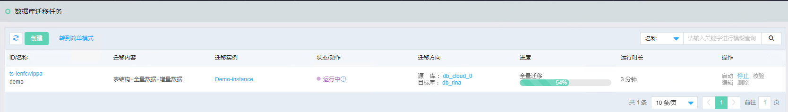
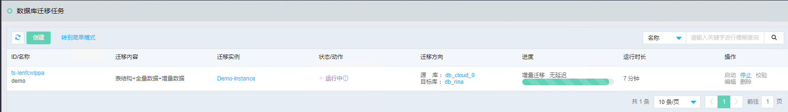
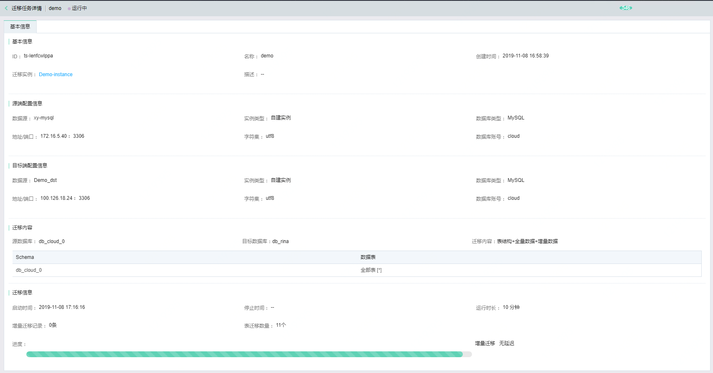

 ## 任务可视化监控
### 全量迁移
当数据库迁移任务启动后，迁移任务列表会实时展示全量数据迁移的进度、运行时长以及运行状态。

### 增量迁移
当数据库迁移任务启动后，全量数据迁移完成红藕，迁移任务列表会实时展示增量数据迁移的进度、运行时长以及运行状态。

### 迁移详情监控
当数据库迁移任务启动后，迁移任务详情页面，会实时展示全量和增量数据迁移的总体进度、运行时长、迁移数据表个数等信息。

