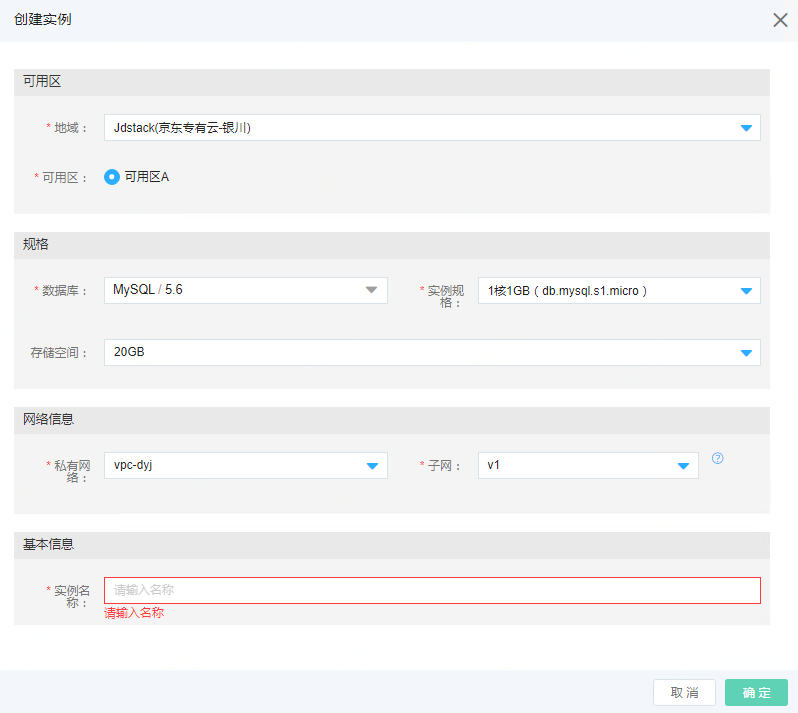
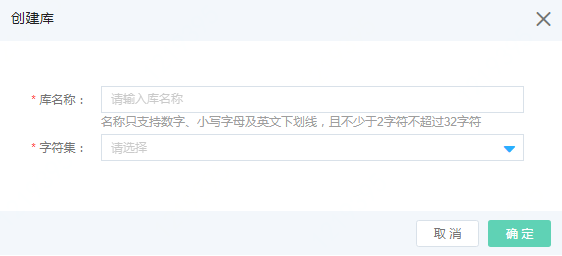
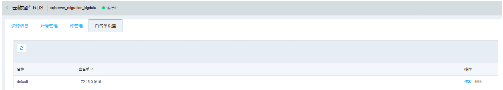
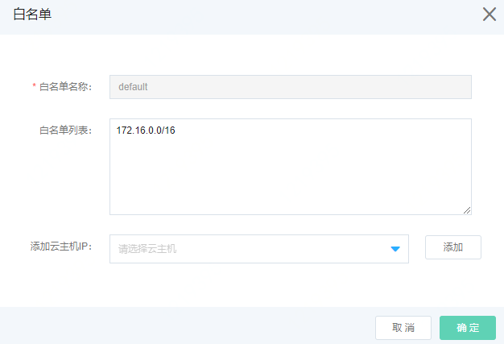

# 数据库相关

## 创建云数据库RDS实例

访问左侧导航栏，点击数据库>云数据库RDS>实例菜单，进入数据库列表页面，如图：云数据库RDS列表页面所示。

图：云数据库RDS列表页面

在此页面，点击“创建”按钮，弹出创建数据库RDS页面，如图：创建云数据库RDS页面所示。

图：创建云数据库RDS页面

在此页面选择地域、可用区、选数据库类型及版本、实例规格，存储空间，私有网络，子网，实例名称，点击“确定”按钮，弹出创建成功提示后，您可以在数据库RDS列表页面中看到您所创建的数据库。

## 账号管理

进入云数据库实例详情页面，点击“账号管理”标签，进入账号管理页面。如图：账号列表页面所示。

图：账号管理页面

在此页面选择点击“创建账号”按钮，弹出创建账号页面，输入账号名称和密码，如图：创建账号页面所示。

图：创建账号页面

点击“确定”按钮，完成账号创建，新创建的账户会在账户列表中显示。

## 库管理

进入云数据库实例详情页面，点击“库管理”标签，进入库管理页面。如图：库管理列表页面所示。

图：库管理列表页面

在此页面，点击操作列的“创建快照”按钮，弹出“创建快照”页面，如图：创建库页面所示。

图：创建库页面

在此页面，输入库名和字符集，点击“确定”按钮，完成库创建，在库列表页中可以看到新建库信息。

## 白名单设置

进入云数据库实例详情页面，点击“白名单设置”标签，进入白名单设置页面。如图：白名单设置列表页面所示。

图：白名单列表页面

在此页面，在默认的白名单记录，点击操作列的“修改”按钮，弹出“白名单设置”页面，如图：设置白名单页面所示。

图：设置白名单页面

在此页面，可以输入白名单IP地址，点击“确定”按钮，完成白名单设置，在白名单列表页中可以看到新增加的IP信息。
