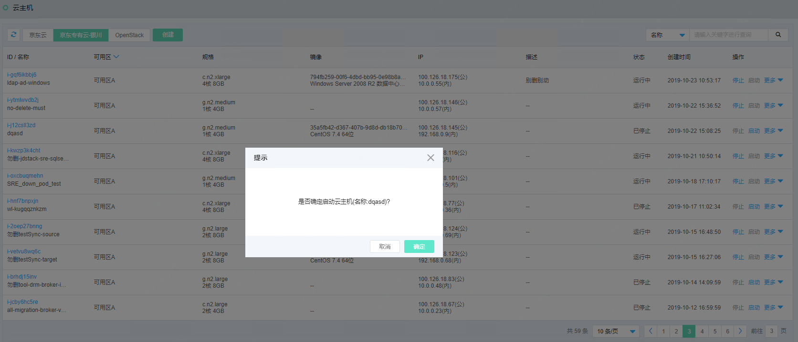
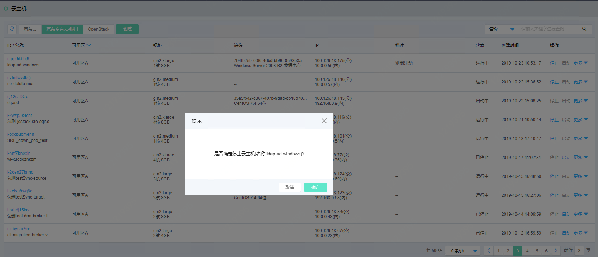

# 云主机相关

## 启动云主机

在云主机列表页，点击“启动”，弹出确认页面。如图：启动云主机页面所示。

图：启动云主机页面

在此页面点击“确定”按钮，弹出成功提示，表示启动云主机完成。

## 停止云主机

在云主机列表页，点击“停止”，弹出确认页面。如图：停止云主机页面所示。

图：停止云主机页面

在此页面点击“确定”按钮，弹出成功提示，表示停止云主机完成。

## 重启云主机

在云主机列表页，点击操作列的”更多操作”，弹出云主机操作项，点击“重启”，弹出重启云主机页面，如图：重启云主机页面所示。

图：重启云主机页面

在此页面点击“确定”按钮，弹出成功提示，云主机状态显示运行中表示重启完成。

## 创建镜像

在云主机列表页，点击操作列的”更多操作”，弹出云主机操作项，点击“创建镜像”，弹出创建镜像页面，如图：创建镜像页面所示。

图：创建镜像页面

在此页面输入镜像名称，点击“确定”按钮，弹出成功提示，表示创建镜像完成。您可以访问左侧导航栏，点击主机>镜像菜单，进入镜像列表页面，切换至私有镜像tab页，如图：私有镜像列表页所示。

图：私有镜像列表页

