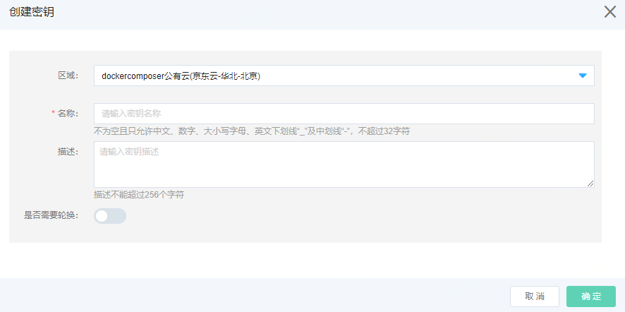

# 云安全相关

## 创建秘钥

访问左侧导航栏，点击安全>秘钥管理服务>秘钥管理菜单，进入秘钥列表页面，如图：秘钥列表页面所示。

图：云硬盘列表页面

在此页面，点击“创建”按钮，弹出创建秘钥页面，如图：创建秘钥页面所示。

图：创建秘钥页面

在此页面选择区域、输入名称、输入描述，选择是否需要轮换，点击“确定”按钮，弹出创建成功提示后，您可以在秘钥列表页面中看到您所创建的秘钥。

## 秘钥轮换

进入秘钥列表页面，如图：秘钥列表页面所示。

图：秘钥列表页面

在此页面，点击“轮换详情”按钮，弹出秘钥轮换页面，如图：秘钥轮换页面所示。

图：秘钥轮换页面

在此页面选择，可以对秘钥进行轮换、禁用和删除操作。
