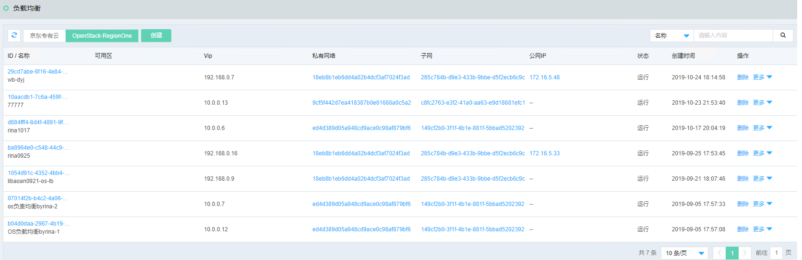
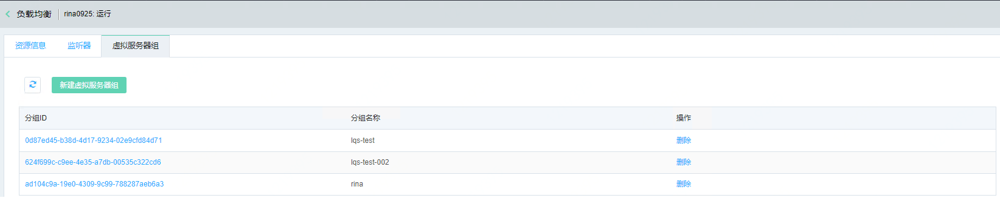

# 负载均衡

建议您通过以下方式搭建基于负载均衡的服务，快速熟悉平台的负载均衡功能。

创建一组挂载负载均衡服务的云主机，具体步骤如下：

第一步，创建负载均衡

第二步，绑定公网IP

第三步，添加虚拟服务器组

第四步，添加监听器

## 创建负载均衡

负载均衡可将大并发流量分发到多台后端实例，调整资源利用情况，消除由于单台设备故障对系统的影响，提高系统的可用性、扩展系统服务能力。

访问左侧导航栏，点击网络>负载均衡菜单，进入负载均衡列表页面，如图：负载均衡列表页面所示。

图：负载均衡列表页面

在此页面，点击“创建”按钮，弹出创建负载均衡页面，如图：创建负载均衡页面所示。

图：创建负载均衡页面

在此页面输入名称、选择网络、子网、点击“确定”按钮，弹出“创建成功”提示，您可以在负载均衡列表页面中看到您创建的负载均衡信息。

在列表页面点击操作列的点击相应操作创建监听器、绑定公网IP、删除等操作。

## 绑定公网IP

在负载均衡列表页面，点击右侧操作列的“绑定公网IP”按钮，弹出绑定公网IP页面，如图：绑定公网IP页面所示。

图：绑定公网IP页面

在此页面选择公网IP地址，点击“确定”按钮，弹出“绑定成功”提示，您可以在负载均衡详情页面中看到您绑定的公网IP信息，如图：负载均衡详情页面所示。

图：负载均衡详情页面

## 添加监听器

监听规则：监听的协议类型与端口号信息，目前支持HTTPS/HTTP/TCP三种协议类型。用户在同一个应用负载均衡内可以定义多个监听器，不同监听器可以选择不同协议类型、或者选择相同协议类型但定义不同端口号。

在负载均衡列表页面，点击右侧操作列的“添加监听器”按钮，弹出添加监听器页面，如图：添加监听器页面所示。

图：添加监听器页面

在此页面输入名称、选择协议、连接限制、输入端口号，点击“确定”按钮，弹出“创建成功”提示，您可以在负载均衡详情页面中看到您创建的监听器信息，如图：负载均衡监听器详情页面所示。

图：负载均衡监听器详情页面

注意：同一负载均衡下的监听端口不可重复，监听器创建后监听协议、端口不允许修改。

## 创建虚拟服务器组

在负载均衡详情页面，选择“虚拟服务器组”标签，点击“新建虚拟服务器组”按钮，弹出创建虚拟服务器组页面，如图：创建虚拟服务器组页面所示。

图：创建虚拟服务器组页面

在此页面输入组名称、选择实例、输入端口号和权重，点击“确定”按钮，弹出“创建成功”提示，您可以在负载均衡详情页面中看到您创建的虚拟服务组信息，如图：负载均衡虚拟服务器组详情页面所示。

图：负载均衡虚拟服务器组详情页面

