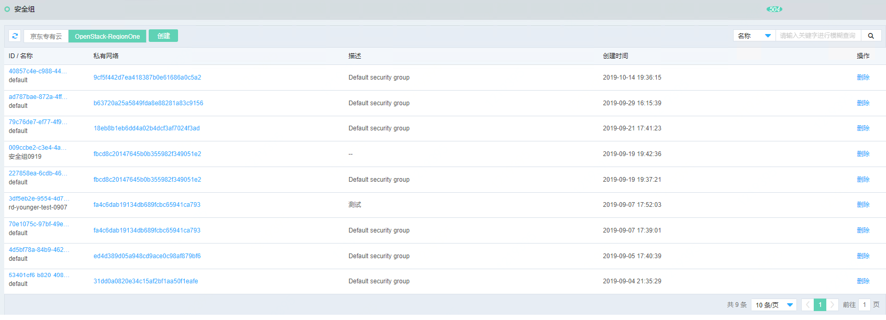
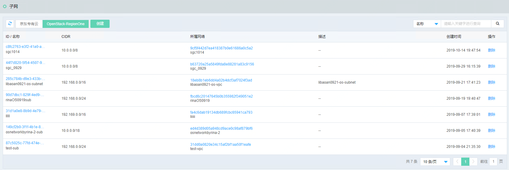
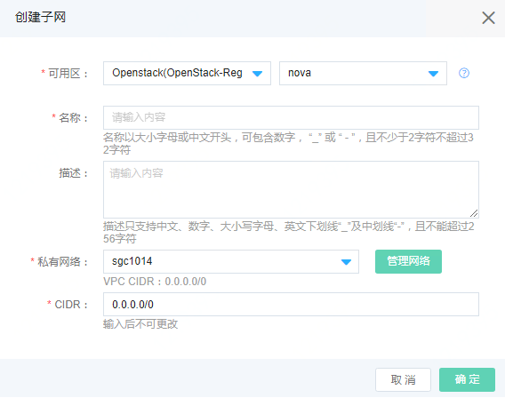
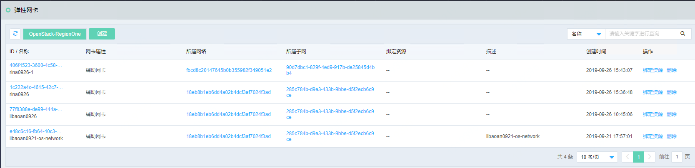
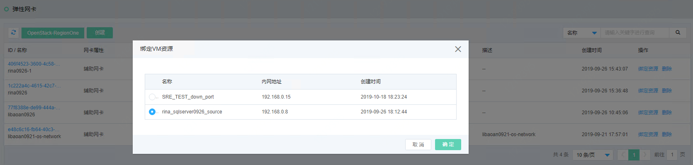

# 网络相关

## 创建安全组

访问左侧导航栏，点击弹性计算>云主机>安全组菜单，进入安全组列表页面，如图：安全组列表页面所示。

图：安全组列表页面

在此页面，点击“创建”按钮，弹出创建安全组页面，如图：创建安全组页面所示。

图：创建安全组页面

在此页面输入安全组名称，选择可用域，点击“确定”按钮，弹出“创建成功”提示，您可以在安全组列表页面中看到您所创建的安全组，点击进入安全组详情页面，如图：安全组详情页面所示。

图：安全组详情页面

在此页面，可以点击操作项的“入站规则”，“出站规则”，实现对安全组的管理功能。

## 创建VPC

访问左侧导航栏，点击网络>私有网络，进入私有网络列表页面，如图：私有网络列表页面所示。

图：私有网络列表页面

在此页面，点击“创建”按钮，弹出创建私有网络页面，如图：创建OpenStack私有网络页面所示。

图：创建私有网络页面

## 创建子网

在创建完成私有网络后，下一步在私有网络下创建子网。

访问左侧导航栏，点击网络>私有网络>子网，进入子网列表页面，如图：子网列表页面所示。

图：子网列表页面

在此页面，点击“创建”按钮，弹出创建子网页面，如图：创建OpenStack子网页面所示。

图：创建子网页面

## 创建弹性网卡

弹性网卡是一种虚拟网络接口，您可以在云主机上连接弹性网卡使云主机接入不同网卡。弹性网卡可以在构建业务流量分离、多业务承载以及网络高可用等应用场景提供支持。每台云主机可以连接多块弹性网卡。

访问左侧导航栏，点击基础云>网络资源>弹性网卡菜单，进入弹性网卡列表页面，如图：弹性网卡列表页面所示。

图：弹性网卡列表页面

在此页面，点击“创建”按钮，弹出创建弹性网卡页面，如图：创建弹性网卡页面所示。

图：创建弹性网卡页面

在此页面输入名称、选择区域、选择VPC、选择子网、选择安全组、分配IP，点击“确定”按钮，弹出“创建成功”提示，您可以在弹性网卡列表页面中看到您所创建的弹性网卡，如图：弹性网卡列表页面所示。

在列表页面，点击相应操作执行绑定到云主机、从云主机解绑、删除操作。

## 弹性网卡绑定

在弹性网卡列表页，点击操作列的“绑定资源”操作项，弹出绑定到云主机页面，如图：绑定资源页面所示。

图：绑定资源页面

在此页面选择绑定的云主机，点击“确定”按钮，弹出“绑定成功”提示，您可以在弹性网卡列表页面中看到您绑定的云主机信息。

## 弹性网卡解绑

在弹性网卡列表页，点击操作列的“解绑资源”操作项，弹出从云主机解绑页面，如图：解绑资源页面所示。

图：解绑资源页面

在此页面选择解绑的云主机，点击“确定”按钮，弹出“解绑成功”提示，您可以在弹性网卡列表页面中看到您绑定的云主机信息。
