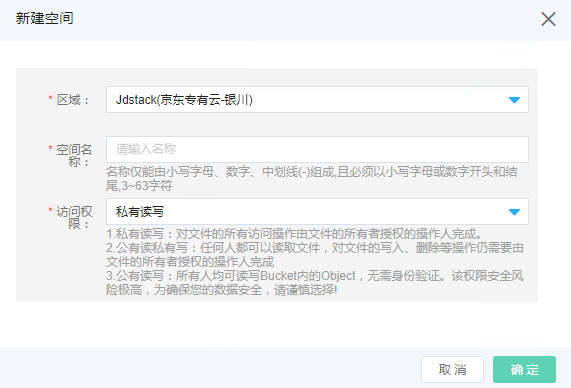

# 对象存储相关

## 创建空间

访问左侧导航栏，点击存储>对象存储>空间管理菜单，进入对象存储空间列表页面，如图：对象存储空间列表页面所示。

图：对象存储空间列表页面

在此页面，点击“创建空间”按钮，弹出创建对象存储空间页面，如图：创建空间页面所示。

图：创建空间页面

在此页面选择区域、空间名称、访问权限，点击“确定”按钮，弹出创建成功提示后，您可以在对象存储空间列表页面中看到您所创建的空间。
