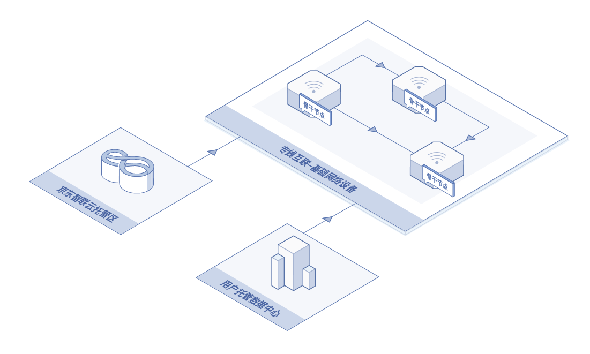
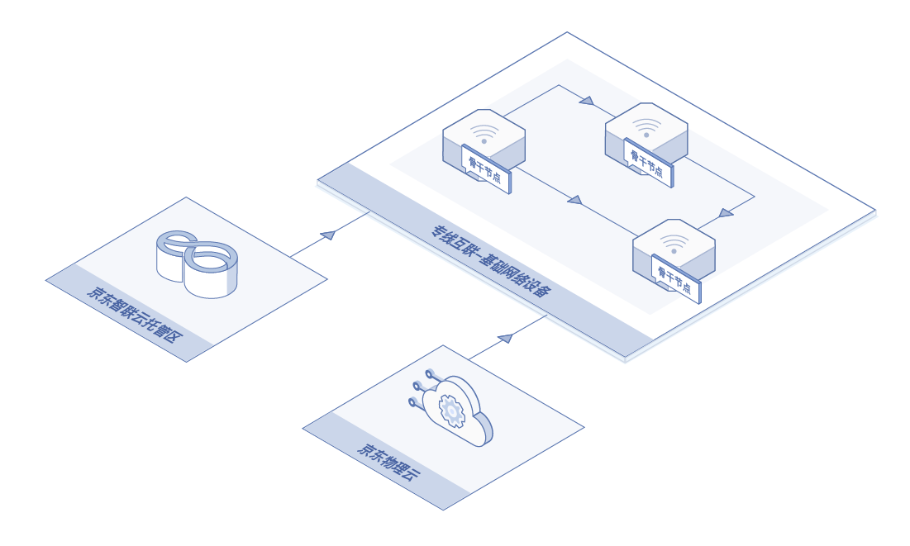

# 应用场景
      
#### 应用场景一：托管区与数据中心互联
打通用户托管数据中心与京东智联云托管区，使用户业务从单数据中心向多数据中心发展，消灭单点问题，规避单数据中心故障带来的风险。

#### 应用场景二：托管区与物理云互联
快速打通京东智联云托管服务与京东物理云，对于需要业务扩容的场景，满足用户弹性扩容及快速部署业务，在业务高峰期，可以通过京东物理云作为弹性扩容手段，同时可以满足业务备份及容灾部署的需求。

