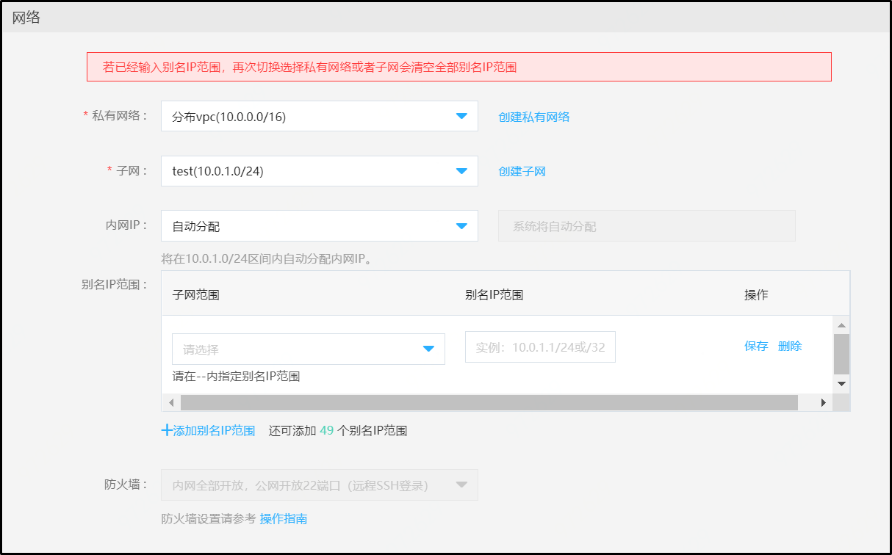
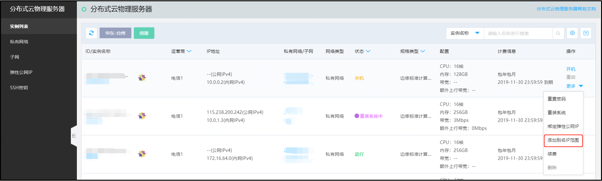

# 别名IP范围

业务使用：如果您有多项服务在一台分布式云物理服务器上运行，并且希望为每项服务分配一个不同的 IP 地址，可以使用别名IP范围（Alias IP）功能实现。

### 名词解释
1、主要CIDR：创建子网输入的CIDR段，称“主要CIDR”。 
2、次要CIDR：创建子网可以添加次要CIDR（非必填），目前仅支持添加一个，仅用于分配别名IP范围使用。 
3、别名IP范围分配来源：别名IP范围可以从主要CIDR中分配，或者从次要CIDR中分配。 

### 操作步骤
进入分布式云物理服务器创建页面，网络部分新增“+添加别名IP范围”链接，点击后可以添加别名IP范围，一个实例最多可添加上限为50个。具体如下图： 

若您已创建完实例，可以通过操作-添加别名IP范围按钮继续添加，具体如下图： 

