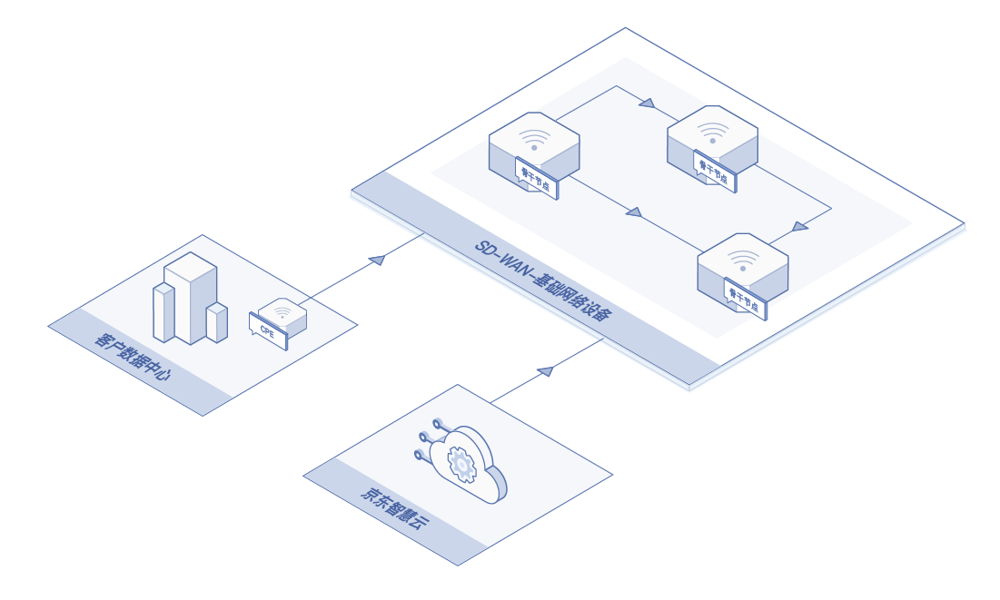
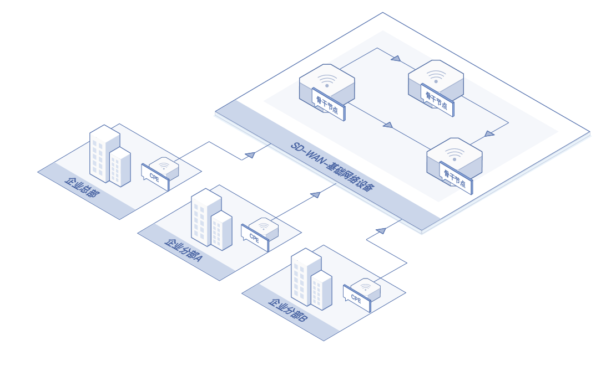

# 应用场景
      
#### 应用场景一：企业上云
企业传统的上云方式是通过专线实现数据中心与公有云之间的互联，但存在最后一公里交付较慢、成本高等问题。京东智联云SD-WAN服务可以解决这些问题。

#### 应用场景二：企业组网
大型集团和连锁企业机构，往往在不同地域分布着众多分支机构，有迫切的组网需求，京东智联云SD-WAN服务支持企业搭建专属网络，分支机构部署SD-WAN设备就近连接京东智联云2个节点完成主备专线接入，显著提高组网效率，降低组网成本。

