# 设备接入

登录物联管理平台官网， 共4步即可完成设备快速接入。

## 创建物类型

进入**设备管理中心**->**物类型列表**，点击**创建物类型**，并按如下步骤操作：

设置物类型的名称、连网方式等基本信息：

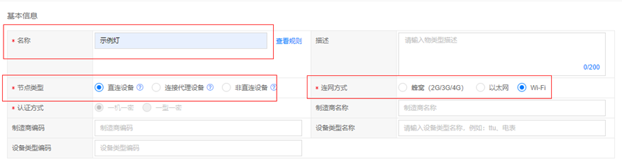

点击**创建**，如下所示，会生成物类型ID，确定基本信息无误后，点击**保存**

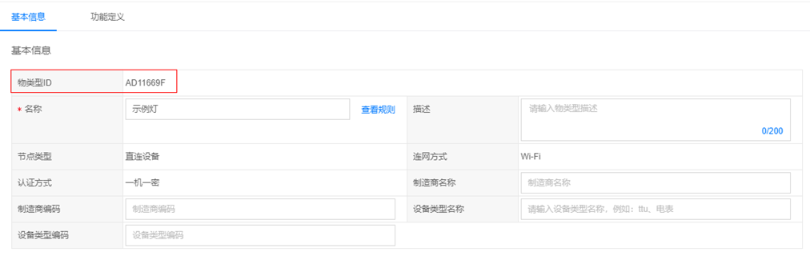

然后进行物类型的**功能定义**

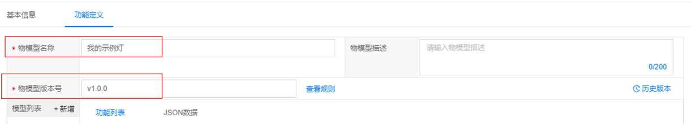

填入模型名称和版本号等信息，点击**模型列表**的**+新增**，来添加模型，设置好名称和标识之后点击**确认**

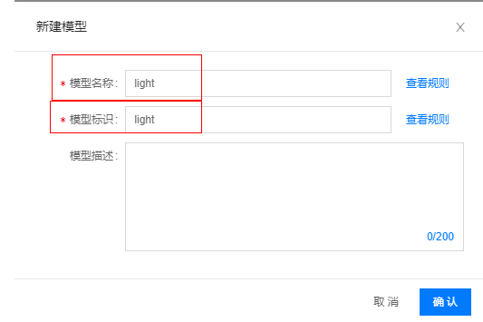

属性添加：点击**+添加属性**

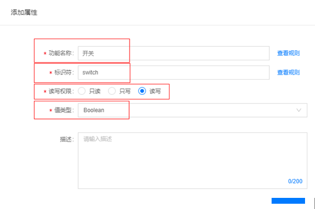

设置好相关信息后，点击**确认**添加属性成功：

添加事件：点击**事件**，添加一个事件，这个事件包含一个date类型输出参数

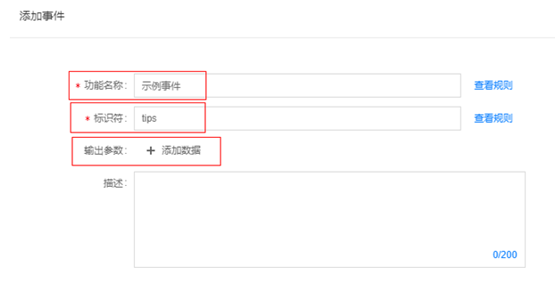

设置事件输出参数的功能名称、标识符、读写权限等信息，

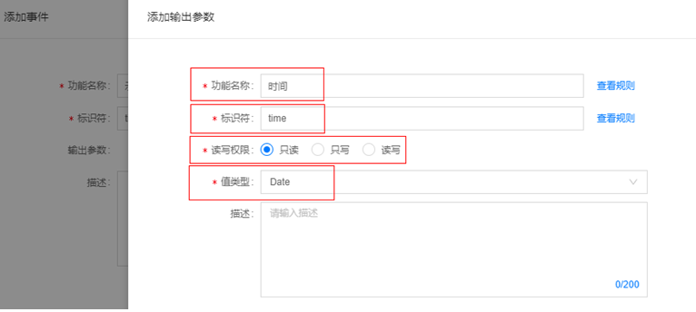

然后点击**保存**，创建物类型成功，最后点击**发布**按钮完成物类型的发布。

## 注册设备

进入**设备管理中心**->**设备列表**，点击**注册设备**，并按如下步骤操作：

设置基本信息，其中物类型选择上一节创建的示例灯：

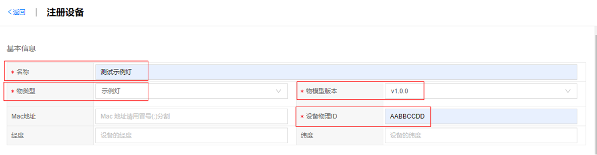

确认基本信息无误后，点击**创建**，即可完成设备的创建

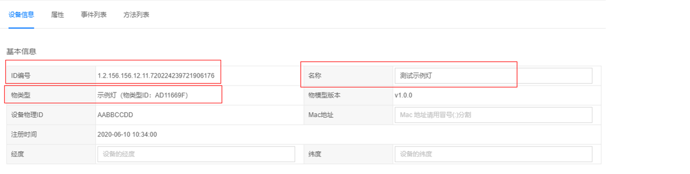

## 下载设备证书

返回设备列表，找到刚注册成功的设备，点击**证书下载**

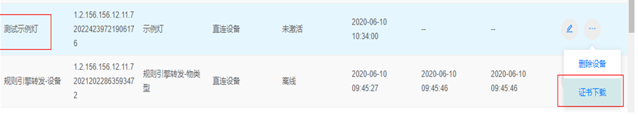

## SDK快速集成

SDK 路径结构如下列表，每个路径是一个模块，在其下可以单独编译生成以路径为名的静态库和动态库，以及用于测试模块的测试程序。生成的所有库文件都会存放在target /lib，生成的可执行文件存放在target /bin，顶层的README.md是基本的编译规则说明

 

├── doc              		    -- 说明文档

├── example          	   -- sdk使用示例

├── external_libs      	-- 外部依赖库

│  ├── cJSON        	     -- 外部依赖库 cJSON

│  ├── CppUTest      	 -- 外部依赖库 CppUTest

│  └── mosquito     	  -- 外部依赖库 mosquito

├── joylink           		  -- SDK核心代码

│  ├── inc           			-- SDK头文件

│  └── src           			-- SDK源文件

├── Makefile        		 -- Makefile

├── Makefile.rule     	-- Makefile 编译选项配置

├── once.sh          		-- 工程路径自动设置

├── pal              			-- 平台抽象层

│  ├── inc           		   -- 平台抽象层头文件

│  └── src           		   -- 平台抽象层源文件(Linux下适配代码)

├── README.md         -- 编译说明

├── run_test.sh           -- 可执行程序运行脚本

├── scripts                   -- 交叉编译脚本文件夹

│  └── x86.mk             -- x86系统下的编译脚本

├── target 

│  ├── bin           		 -- 可执行程序存放目录

│  └── lib           		  -- 库文件存放目录

编译环境

在linux下安装gcc、make、cmake。

### 安装open-ssl库

% sudo apt-get install openssl

% sudo apt-get install libssl-dev

### 编译外部依赖库 moquitto

% cd external_libs/ mosquito

% mkdir build

% cd build

% cmake ..

% make

### 设备信息设置

将example/joylink_device_demo.h文件中的如下宏定义换成注册的设备信息：

SDK_CONFIG_HOST_NAME：物联管理平台的host地址；

SDK_CONFIG_HOST_PORT：物联管理平台的端口号；

SDK_CONFIG_DEVICE_ID：设备标识；

SDK_CONFIG_CA_PATH：设备ca证书路径；

SDK_CONFIG_CERT_PATH：设备cert证书路径；

SDK_CONFIG_KEY_PATH：设备key证书路径；

DEVICE_INFO_THING_MODEL_ID：设备的物模型id；

DEVICE_INFO_THING_MODEL_VERSION：设备的物模型版本号；

### 编译

% ./once

% make distclean

% make

### 运行

    在根目录执行 ./run_test.sh 即可运行可执行程序

 出现设备上报上线信息，说明设备与物联管理平台连接成功

在物联管理平台查看当前设备状态，显示在线：

进入设备编辑页面，点击**属性**tab页，能够看到设备当前的属性值如下：

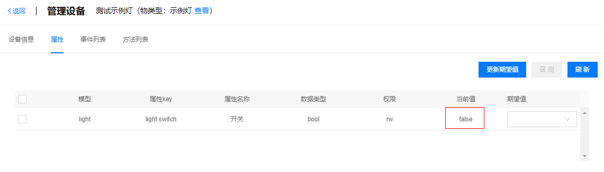

期望值选择true，并点击**更新期望值**，提示保存成功后如下图：

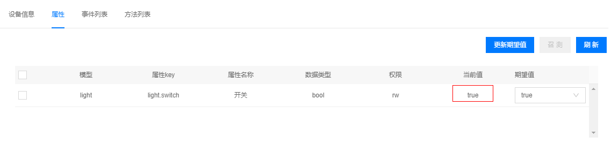

点击**事件列表**，可以看到上报的示例事件

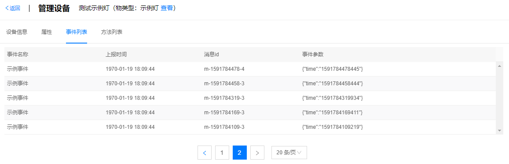

