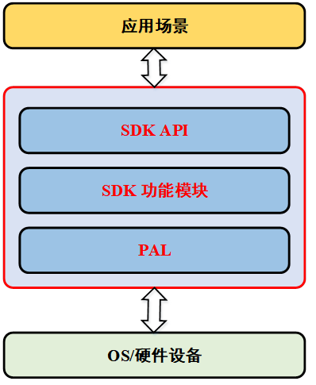

# 概述

设备SDK是提供给设备厂商，用于集成在设备之上并通过SDK安全连接至物联管理平台进行管理。设备必须要支持TCP/IP协议才能使用SDK，其他非IP设备通过非标准MQTT协议的设备，需要通过网关才能接入物联管理平台。
SDK面向MQTT C语言开发者。本文档用于指导开发者快速接入，如果开发者需要了解SDK细节，可参考用户开发手册，目前SDK仅支持linux系统环境。

# 获取SDK开发包
目前SDK提供了C语言开发包，请点击下载： ******

开发者可参考 **最佳实践-设备接入** 章节，使用SDK快速接入设备。

# 产品框架
应用场景、SDK、PAL的关系如下图所示：

应用只需关心使用SDK API组合业务逻辑，不用关心通信细节，PAL层需要用户根据自身的OS和设备信息进行适配，SDK提供了linux的PAL层适配。

其中MQTT的适配，SDK提供了mosquito的适配示例，开发者可根据示例适配成硬件平台自身的MQTT。

