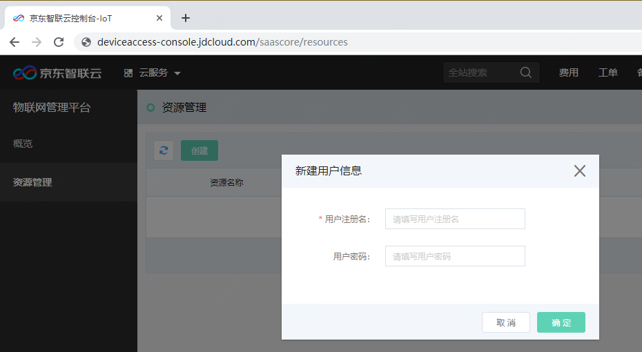
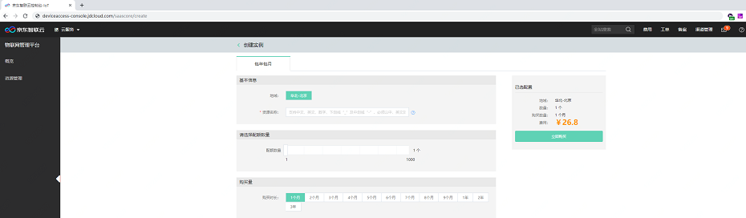
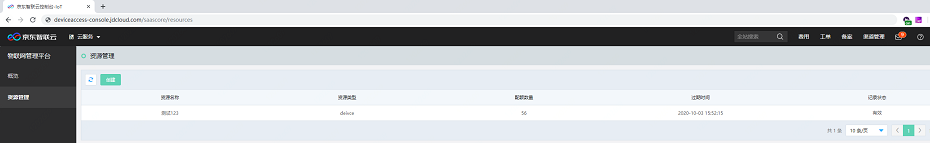
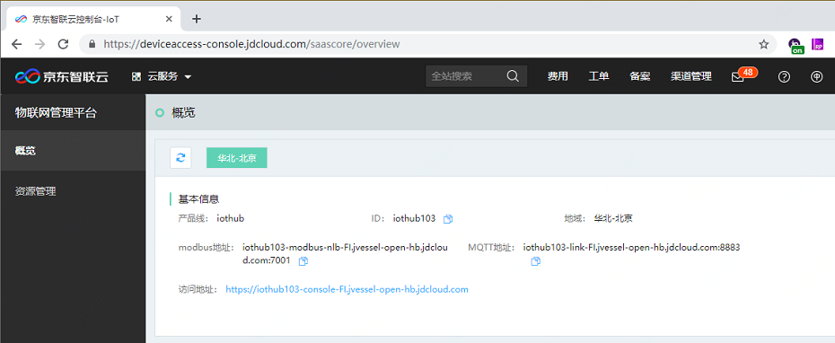

# 开通设备接入服务

本文介绍如何快速开通设备接入服务。

1. 登录设备接入服务控制台, 进入服务开通页，阅读相关产品信息与服务协议后，点击“立即开通”。

2. 在实例创建页面，填写您的资源名称，配额数量及购买时长等信息。

3. 点击“立即购买”，进入购买订单确认页，订单确认无误后点击“立即支付”。
4. 支付订单完成后会跳转至服务资源准备的页面，预计需要等待15-20分钟。页面实时刷新实例创建进度。

5. 在概览页查看实例基本信息，如访问地址、MQTT地址和Modbus地址等。

