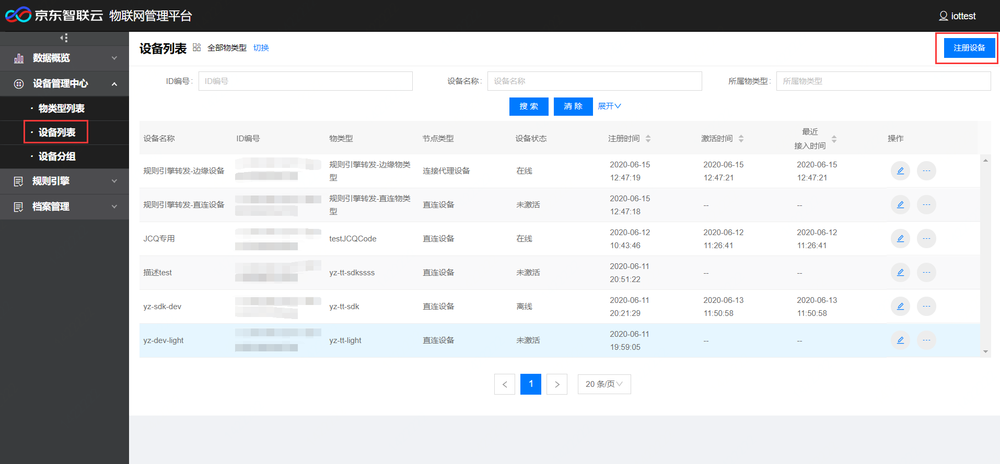
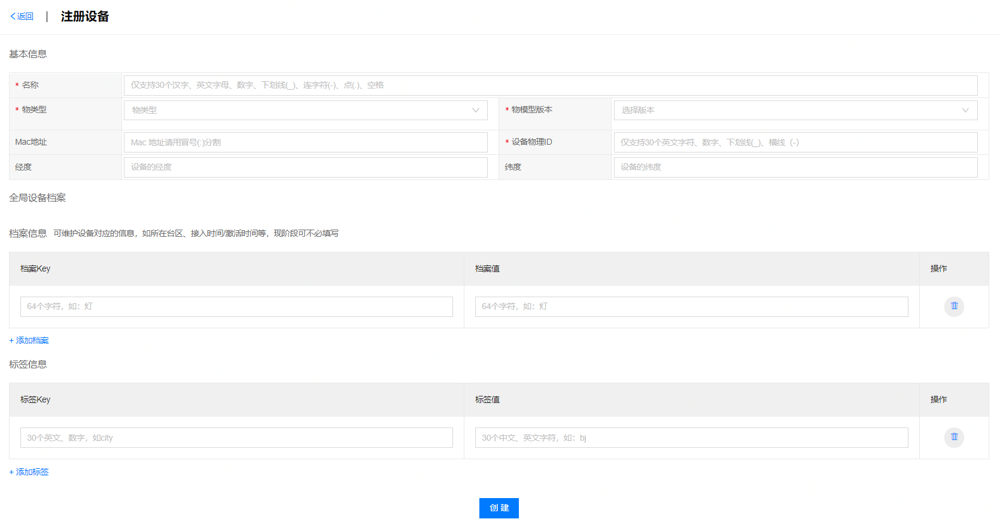
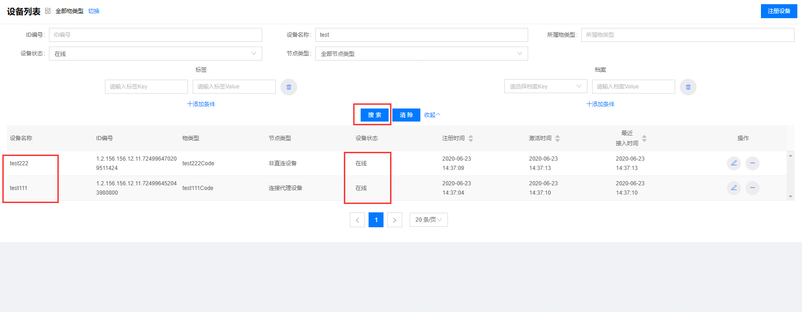
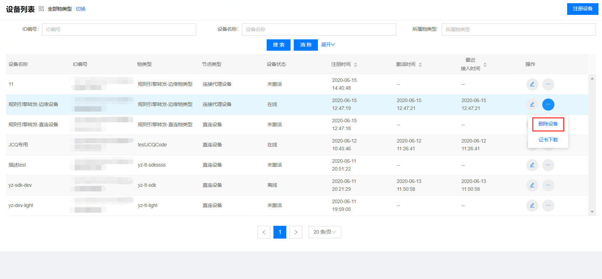
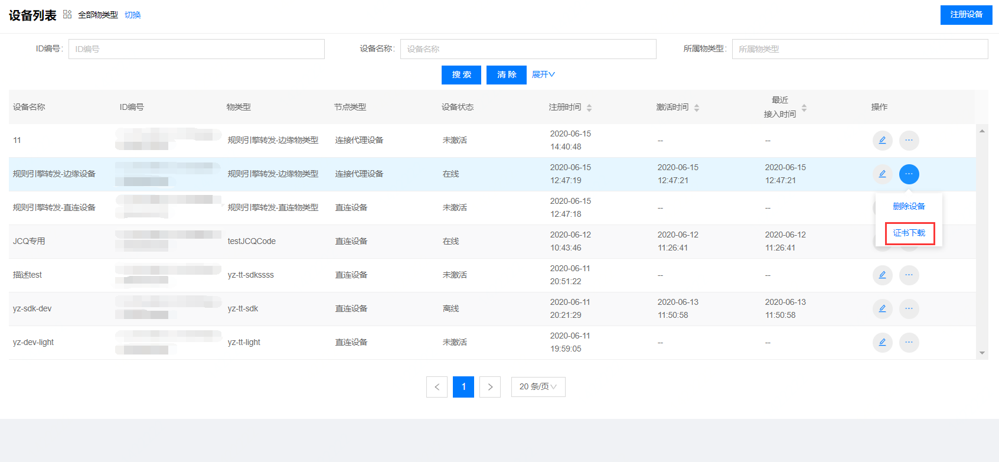

# 注册设备

1. 登录物联管理平台
2. 左侧导航栏选择 **设备管理中心** -> **设备列表**
3. 点击页面右上方 **注册设备**

4. 填写设备的基本信息，全局设备档案信息，档案信息，标签信息等。

**基本信息**

- 名称：设备的名称，仅支持30个以内的汉字、英文、数字、下划线(_)、连字符(-)、点(.)、空格。
- 物类型：选择设备的物模型，可选的物类型可在 **设备管理中心** -> **物类型列表** 中查看或添加。
- 物模型版本：选择已选物类型中已发布的物模型版本。
- Mac地址：Mac地址请用冒号(:)分割，非必填。
- 设备物理ID:仅支持30个以内的汉字、英文、数字、下划线(_)，连字符(-)。
- 经度：描述设备的经度，非必填。
- 纬度：描述设备的纬度，非必填。

**全局设备档案**

对所有设备统一的信息维护，如所在台区、接入时间/激活时间等。可在 **档案管理** -> **档案列表** 中对全局设备档案进行管理，若档案列表中没有全局设备档案，则此处不显示。

**档案信息**

当前设备可维护的信息，如所在台区、接入时间/激活时间等，现阶段可不必填写。

**标签信息**

可对设备添加标签。

**管理设备**

 设备注册完成后自动跳转 **管理设备** 页面，设备管理详情请见[设备信息](../Device-Manager/Device-Info.md)

 ## 查询设备

 可根据ID编号，设备名称，所属物类型，设备状态，节点类型，自定义标签等条件进行设备信息查询。点击清楚可清空已选查询条件。

 ## 删除设备

在设备列表页面点击要删除的设备对应的删除设备按钮，弹出确认删除框，点击删除。

 ## 证书下载

在设备列表页面点击要下载证书的设备对应的证书下载按钮，开始下载证书。

 