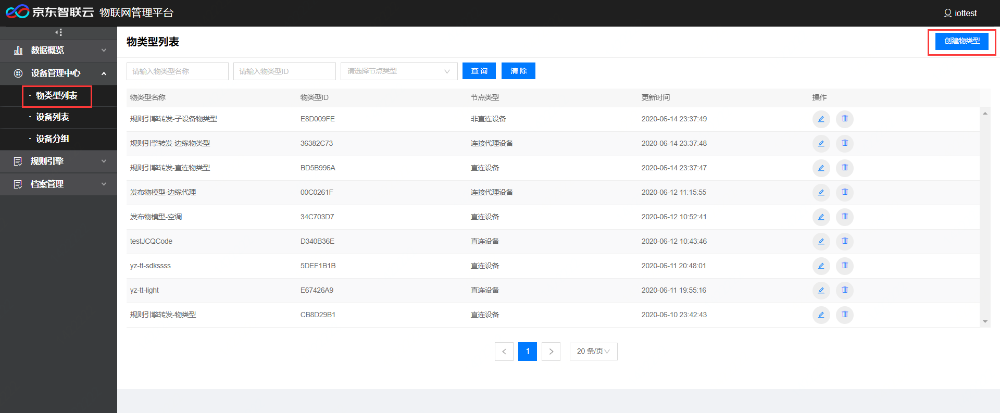
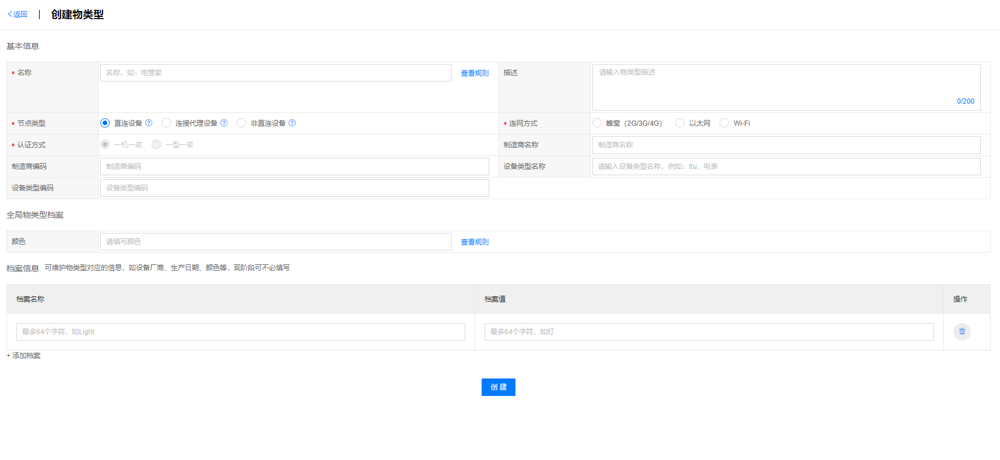
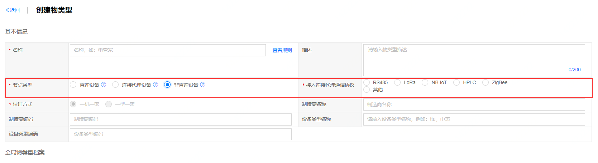
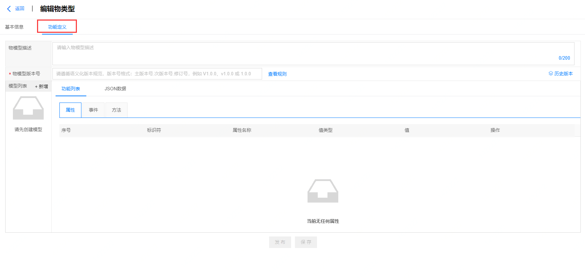

# 创建物类型

1. 登录物联管理平台
2. 左侧导航栏选择 **设备管理中心** -> **物类型列表**
3. 点击页面右上方 **创建物类型**

4. 填写物类型的基本信息，全局物类型档案信息，添加档案等。

**基本信息**
- 名称：仅支持30个以内的汉字、英文、数字、下划线(_)、连字符(-)、点(.)、空格
- 节点类型：支持直连设备，连接代理设备，非直连设备三种节点类型。

| 节点类型 | 描述|
| ----- | ----- |
|直连设备 | 即一般可直接联网的设备，可通过基站、路由器直接入因特网，本身具有IP地址且不能挂载子设备。|
|连接代理设备| 这类设备不仅自身具有 IP 地址，可以连入因特网;同时代理子设备，具有子设备管理模块，可以维持子设备的拓扑关系。 |
|非直连设备|这类设备不具有独立 IP，不能直接连入因特网，需要依赖连接代理设备设备接入物联网平台，如电表等。 |

- 认证方式：支持一机一密，一型一密两种(目前只支持一机一密方式)。
- 制造商编码：非必填。
- 设备类型编码：非必填。
- 描述：对物类型的描述，非必填。
- 连网方式：支持蜂窝（2G/3G/4G），以太网，Wi-Fi三种方式。
注：当节点类型为非直连设备时，不支持网络连接，可以选择以下通讯协议接入连接代理设备。 

- 制造商名称：非必填。
- 设备类型名称：非必填。

**全局物类型档案** 

所有物类型需填写对应的信息，如设备厂商、生产日期、颜色等。
可在 **档案管理** -> **档案列表** 中对全局物类型档案进行管理，若档案列表中没有全局物类型档案，则此处不显示。

**档案信息**

当前物类型对应的信息，如设备厂商、生产日期、颜色等，现阶段可不必填写。

**功能定义**

物类型创建成功后自动跳转编辑物类型页面，可为该物类型添加功能定义即物模型，功能定义添加详情请见[创建物模型](../Device-Manager/Create-Thing-Model.md)

