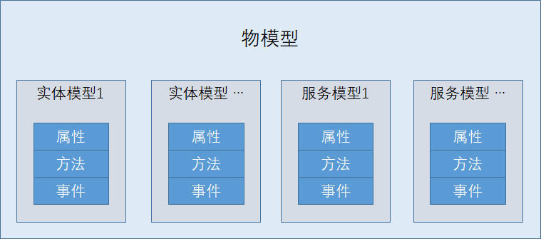

# 物模型介绍
物模型（Thing Model）是真实世界的物体在数字世界里的数据模型，物模型描述了归属于同一个物类型下的物所具备的通用功能。通过定义物模型，真实世界的物理设备、传感器可以更方便的被物联网平台进行管理。

物模型由一个或多个模型组成。每个模型定义了该类型设备所支持的一组功能，这些功能通过属性、事件和方法三个方面进行描述，最终形成了应用与平台、平台与设备之间通讯的基础数据规范。模型分为两类，实体模型和服务模型。

| 物模型概念  | 说明 |
| :-----| :----- |
|属性(properity) | 描述设备状态、属性的独立参数，分为只读，只写和读写类型。例如时间，名称，温度，开关等基础属性。 |
|方法(function) | 方法是一个可被应用或平台调用的具的操作，有入参与出参。相对于属性设置，方法可以提供更复杂的业务逻辑。如：执行某一任务。 |
|事件(event)  | 一些由条件触发的消息，由设备主动上报。事件体里可携带事件参数，传输更多信息。 |
|模型(model) | 由属性、事件和方法构成的集合，代表了设备的一组功能特性。|
|实体模型(entity model)|表示设备实体物理特性、感知的功能集合，例如一个灯的模型。|
|服务模型(service model)|由设备应用支持的服务类型的功能集合，例如 连接代理服务模型，OTA 服务模型。|

#### 物模型构成



#### 物模型元素标识

物模型规范通过 id 来标识属性，事件，方法 ，模型，物模型，id 的值采用urn（uniform resource name）的格式来组织，形式如下：

id= urn:"{spec-namespace}":"{type-namespace}":"{object-name}":"{object-code}"


各字段说明：

| 字段           | 说明                                                         |
| :------------  | :-----------------------------------------------------------|
| urn            | 固定字段                                                     |
| spec-namespace | 规范命名空间，有效值：标准定义：jiot-spec-[version]；用户自定义：[user]-spec-[version]； |
| type-namespace | 类型命名空间，有效值:   property[属性]; function[方法];event[事件;model[模型];thing-model[设备/物模型] |
| object-name    | 对像名称，有效值：type-namespace下值需要唯一,是一个有明确含义的命名，例如属性名，方法名，事件名，模型名，物类型等。在不同的type-namespace下，其值的意义可能不同，例如在物模型{thing-model}下该值是物类型{thing-type}，表示该物模型属于具体一款物，这时物类型可以由平台生成。 |
| object-code    | 对像编码， 有效值：在object-name空间下必须保持唯一[在实现时可以全局唯一]，这是object-name有多种定义时的不同唯一编码；例如一个object-name为current-temperature的定义可能有多个值范围定义，不同的范围定义，该编码不同，该编码应由系统自动分配，是大写字线与数字的组合至少8个字符。 |

#### 物模型范例

```
{
    "description":"智能抽油烟机",
    "id":"urn:user-spec-v1:model:ventilator:9720087b86789a2b40478b656ca6bf98",
    "version":"v1.0.0",
    "models":[
        {
            "display-name":"灯",
            "description":"",
            "id":"urn:user-spec-v1:model:light:d4a9dfa096ee156d0a4586c7b1ba1cfc",
            "type":"entity",
            "key":"light",
            "properties":[
                {
                    "description":"电源开关",
                    "id":"urn:user-spec-v1:property:power:ca6dcec49750f53ff7dc23f9aa8dd450",
                    "key":"light.power",
                    "access":"rw",
                    "display-name":"power",
                    "valuedef":{
                        "type":"bool",
                        "specs":{
                            "0":"false",
                            "1":"true"
                        }
                    }
                }
            ]
        },
        {
            "display-name":"风扇",
            "description":"",
            "id":"urn:user-spec-v1:model:fan:888e7a2296de25810c0b4f30a1f97cbd",
            "type":"entity",
            "key":"fan",
            "properties":[
                {
                    "display-name":"电源开关",
                    "description":"电源开关",
                    "id":"urn:user-spec-v1:property:power:ca6dcec49750f53ff7dc23f9aa8dd450",
                    "key":"fan.power",
                    "access":"rw",
                    "valuedef":{
                        "type":"bool",
                        "specs":{
                            "0":"false",
                            "1":"true"
                        }
                    }
                },
                {
                    "display-name":"风扇转速",
                    "description":"风扇转速",
                    "id":"urn:user-spec-v1:property:speed:869e64a39304496d7810fbc4ab83e5e0",
                    "key":"fan.speed",
                    "access":"rw",
                    "valuedef":{
                        "type":"enum",
                        "specs":{
                            "values":{
                                "1":"一级转速",
                                "2":"二级转速",
                                "3":"三级转速"
                            }
                        }
                    }
                }
            ]
        }
    ]
}
```
