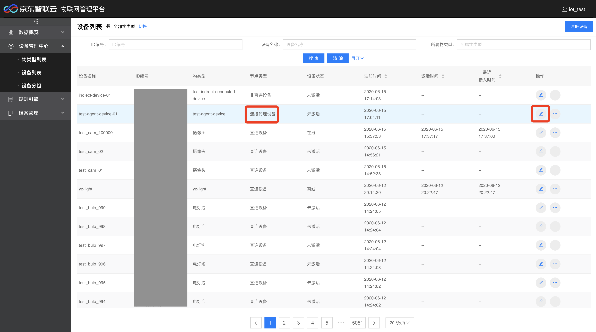
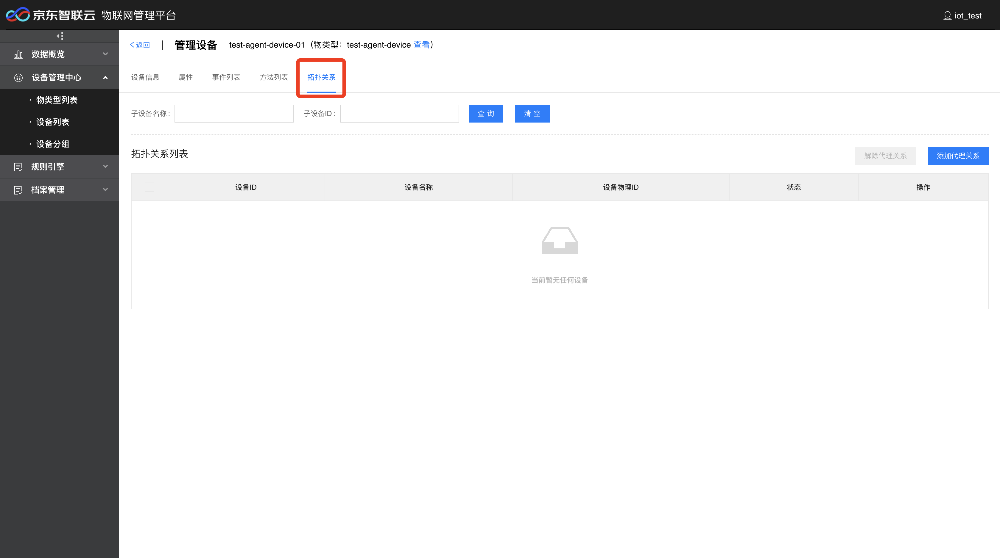
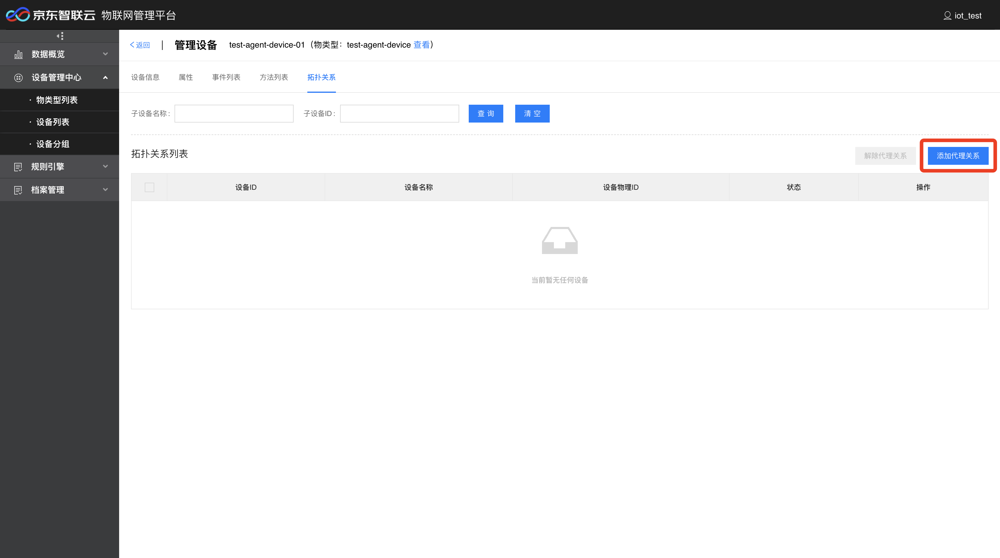
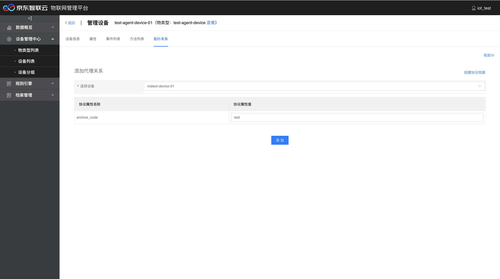
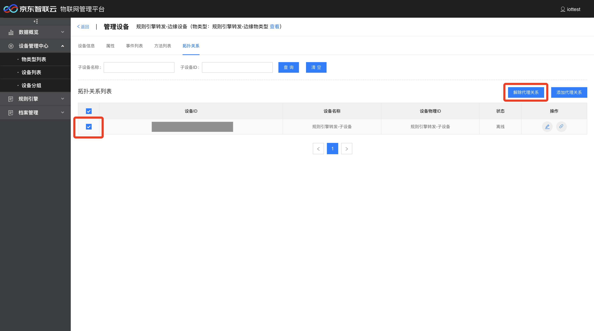
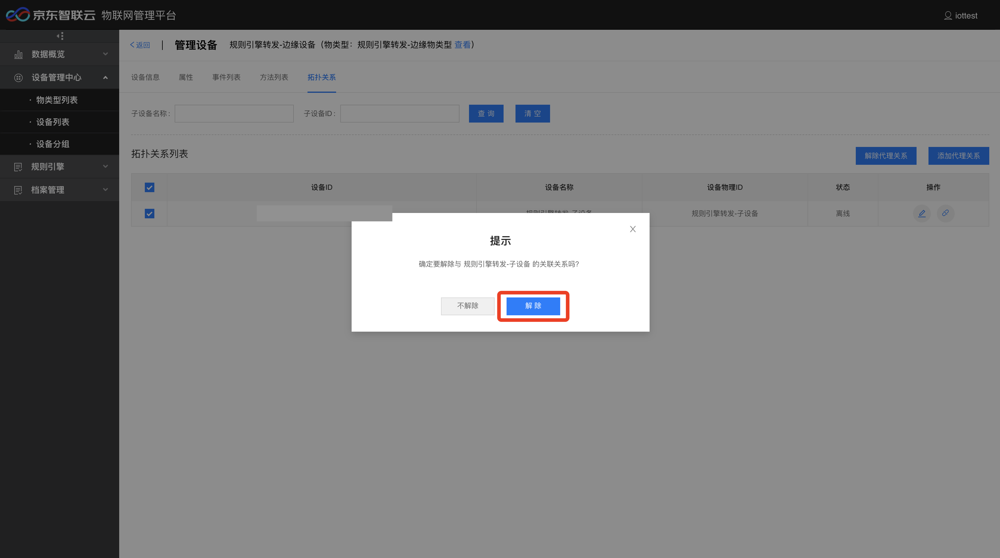

# 设备拓扑关系维护

设备拓扑关系维护可以管理连接代理设备与非直连设备的拓扑关系，包括添加、解除代理设备和子设备的代理关系。

## 编辑连接代理设备

1. 登录物联管理平台。
2. 左侧导航栏选择 **设备管理中心** -> **设备列表**。
3. 选择要编辑的连接代理设备，（如果没有注册连接代理设备，请先创建连接代理设备物类型并注册连接代理设备），点击右侧编辑按钮，进入编辑设备页面。

4. 可以看到，如果设备类型是连接代理设备，编辑页面会有拓扑关系按钮，点击拓扑关系按钮，进入编辑拓扑关系页面。

### 添加代理关系

点击添加代理关系按钮，选择要代理的设备（如果没有可选设备，请先创建非直连设备物类型并创建非直连设备），可以输入协议属性值（协议档案在连接代理设备物类型中可以编辑），点击添加，如果连接代理设备在线，则代理关系添加完成。

### 解除代理关系

在拓扑关系列表勾选设备，点击解除拓扑关系，弹出的提示窗点击解除按钮，即可完成代理设备与子设备的拓扑关系解除。

