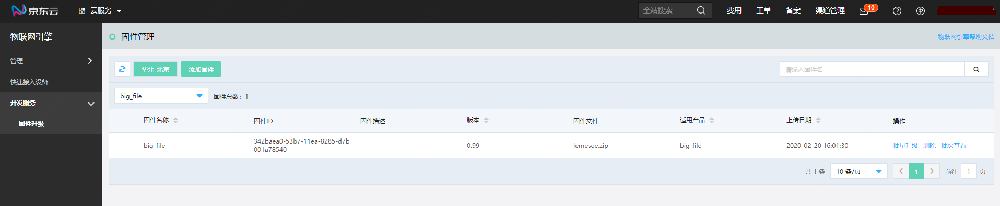
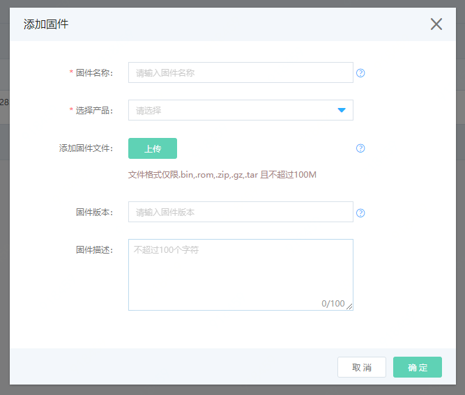
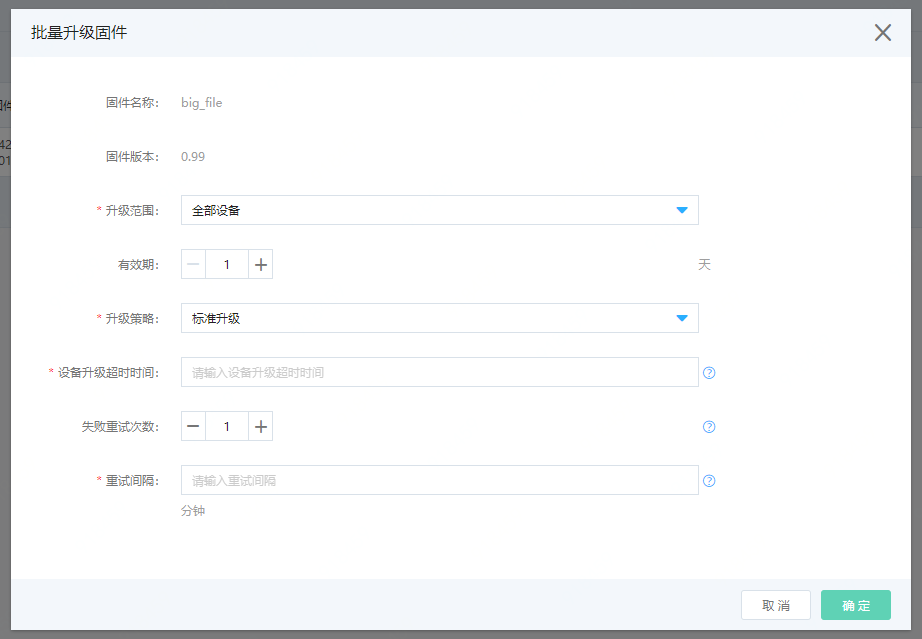
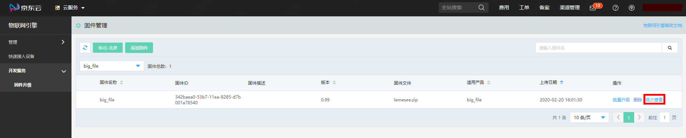
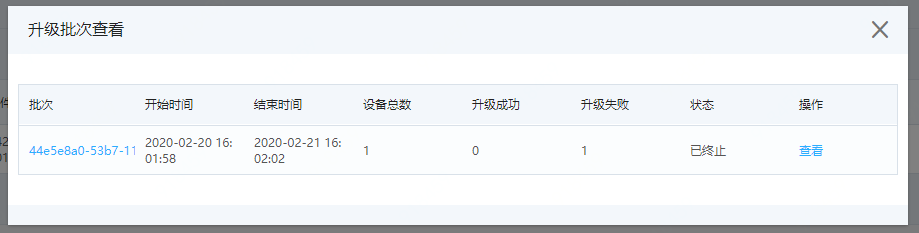
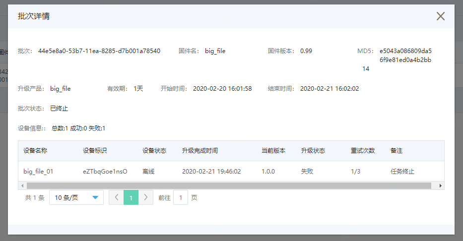

# 固件升级服务

京东云物联网平台提供固件升级与管理服务。本文介绍如何在物联网引擎控制台进行添加固件、管理固件和向设备批量推送固件以及固件升级批次管理。

### 前提条件

1. 设备端支持OTA升级服务
2. 设备端需集成京东云物联网设备开发SDK，详情请见：[设备端OTA升级](../../Developer-Guide-Device/Device-OTA.md)

### 操作步骤

1. 登入[物联网引擎控制台](https://iot-console.jdcloud.com/core/)

2. 选择左侧导航栏中 **开发服务** -> **固件升级**，进入固件升级页面

   

3. 点击页面上方的 **添加固件**，在添加固件对话框中，输入固件信息并上传固件。

   

   添加固件页面参数说明：

   | 参数         | 说明                                                         |
   | ------------ | ------------------------------------------------------------ |
   | 固件名称     | 填写您的固件名称，1~50个字符，固件名称唯一。支持中文，英文字母，数字及常用符号（下划线，中划线，点，括号），必须以中文汉字，英文字母及数字开头和结尾。 |
   | 选择产品     | 选择固件所支持的产品，每一个固件仅唯一对应一个产品。         |
   | 添加固件文件 | 上传您的固件文件，固件格式支持bin，rom，zip ，gz，tar，tar.gz。固件文件名要求：支持中文、英文字母、数字和下划线，中划线，长度限制1~64。 **注意：1. 每个固件大小不超过100MB，每个产品下不超过50个固件。               2. 上传固件成功后，系统将为该固件生成一个MD5值，设备端在下载固件之后，需要用此MD5值进行校验。** |
   | 固件版本     | 填写您的固件版本号，1~100个字符，支持英文字母，数字及英文符号（下划线，中划线以及点） 。同一产品下的固件 ，版本号唯一 |
   | 固件描述     | 填写您的固件描述信息。不超过100个字符。                      |

   添加完成的固件，将在固件列表中显示。物联网引擎会为用户的每一个固件创建唯一的系统固件ID。

4. 在固件列表中，点击某一固件操作列中的**批量升级**，可创建批量升级任务，向设备推送固件升级消息。

   

   

   批量升级页面参数说明：

   | 参数             | 说明                                                         |
   | ---------------- | ------------------------------------------------------------ |
   | 固件名称         | 当前准备创建批量升级任务的固件名称                           |
   | 固件版本         | 当前准备创建批量升级任务的固件版本号                         |
   | 升级范围         | 选择本次升级消息推送的范围：  全部设备：推送消息至该产品下的所有符合升级要求的设备上  定向升级：推送消息至该产品下的指定设备上。选择定向升级后，将会出现设备选择列表，请按照您的需求，选择需要升级的设备。  **注意：未激活的设备，固件版本一致的设备以及正在执行升级任务的设备是不会出现在选择列表中的。** |
   | 有效期           | 本次批量升级任务的有效期，最小为1天，最长为7天。到期后，将不再推送任何升级消息，包括重试消息。 |
   | 升级策略         | 指定设备收到升级消息后的处理方式。  标准升级 ：收到升级消息后设备立即进行固件升级操作。  静默升级： 设备自主决定收到升级消息后，何时去进行固件升级。此功能需要您的设备支持静默升级方式。 |
   | 设备升级超时时间 | 从设备第一次上报升级进度开始计算，该时长内未升级成功，则记为超时。您可在批次详情中查看到设备升级失败原因为升级超时。 |
   | 失败重试次数     | 设备升级失败后平台重新推送升级消息的次数。为0表示不重试。最大次数为5次。设置重试次数后，将需要您指定重试间隔。 |
   | 重试间隔         | 设备升级失败后，重新推送升级消息的间隔时长，最小为1分钟，最大为4320分钟，请您自己根据设备的实际情况设定。 |

   创建完批量升级任务后，物联网引擎会为每一个任务创建唯一的批次ID。

5. 在固件列表中，点击某一固件操作列中的**批次查看**，可以查看本次升级任务的具体进度和结果。

   

   

   批次列表参数说明：

   | 字段     | 说明                                                         |
   | -------- | ------------------------------------------------------------ |
   | 批次     | 创建批量升级任务后，物联网引擎为该任务创建的唯一批次ID       |
   | 开始时间 | 创建批量升级任务的时间                                       |
   | 结束时间 | 该批次任务结束(包括手动终止、批次周期到期以及全部设备升级完成)的时间 |
   | 设备总数 | 该批次中选择升级的设备总数                                   |
   | 升级成功 | 该批次中升级状态为成功的设备数                               |
   | 升级失败 | 该批次中升级状态为失败的设备数                               |
   | 状态     | 该升级批次的当前状态。  进行中：批量升级任务创建完成后，状态变为进行中。  已完成：批量升级任务在有效期内，所有设备状态为完成或失败的，状态为已完成。  已终止：手动终止任务或任务有效期结束，还有设备没有处于完成或失败的。状态为已终止。 |
   | 操作     | 终止：您可对在进行中的任务强行终止，终止后，不再向设备推送升级消息。 查看：点击查看或者批次ID，可进入批次详情查看页面 |

   

   批次详情页面参数说明：

   | **字段**           | **说明**                                                     |
   | ------------------ | ------------------------------------------------------------ |
   | **批次**           | 显示该批次的批次ID                                           |
   | **固件名**         | 显示该批次的固件名                                           |
   | **固件版本**       | 显示当前固件的版本号                                         |
   | **MD5**            | 显示固件文件的MD5值                                          |
   | **升级产品**       | 显示当前固件所对应的产品名                                   |
   | **有效期**         | 显示当前批次的有效期                                         |
   | **开始时间**       | 显示创建批量升级任务时的时间                                 |
   | **结束时间**       | 显示当前任务结束的时间                                       |
   | **设备信息：总数** | 该批次中选择升级的设备总数                                   |
   | **设备信息：成功** | 该批次中升级状态为成功的设备数                               |
   | **设备信息：失败** | 该批次中升级状态为失败的设备数                               |
   | **设备名称**       | 显示设备的设备名称                                           |
   | **设备标识**       | 显示设备的设备标识                                           |
   | **设备状态**       | 显示设备的在离线状态                                         |
   | **升级完成时间**   | 显示设备升级结束的时间                                       |
   | **当前版本**       | 显示任务完成时，当前设备上报的版本                           |
   | **升级状态**       | 设备升级时的状态：   待推送：平台还未向设备推送升级消息。   已推送：平台已向设备推送升级消息，设备还未返回消息。   待升级：设备返回收到升级指令的消息。   升级中：设备开始进行升级。   待重试：设备升级失败，等待重新推送升级消息（需指定重试次数和间隔）。   成功：设备升级成功。   失败：设备升级失败。 |
   | **重试次数**       | 显示当前重试次数/最大重试次数                                |
   | **备注**           | 显示失败原因：   推送失败：未收到设备返回收到升级指令的消息，超时时间为10秒。   下载固件失败：设备下载固件时失败。   固件校验失败：设备对下载的固件进行MD5校验时失败。   固件烧录失败：设备进行固件烧录时失败。   固件升级超时：设备整体升级时间超过设定的超时时间。   任务终止：任务被强行终止。 |

6. 在固件列表中，点击某一固件操作列中的**删除**，可以删除当前固件。注意：如有正在进行的批量升级任务中有使用该固件的，则无法删除固件。 
