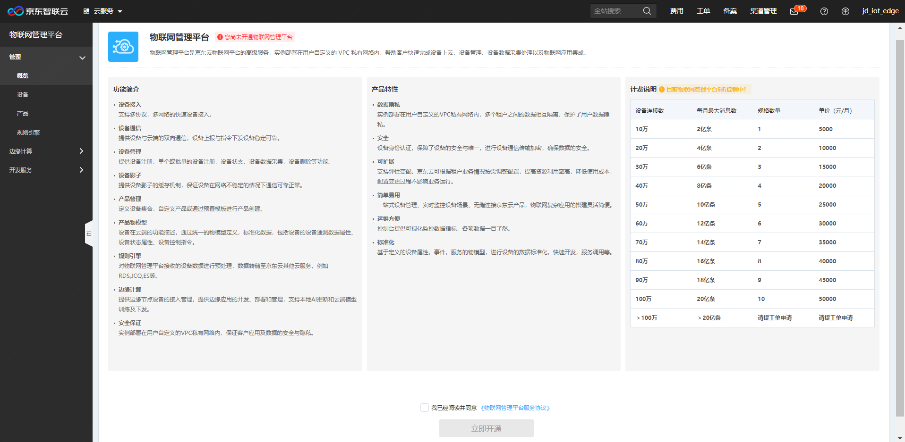
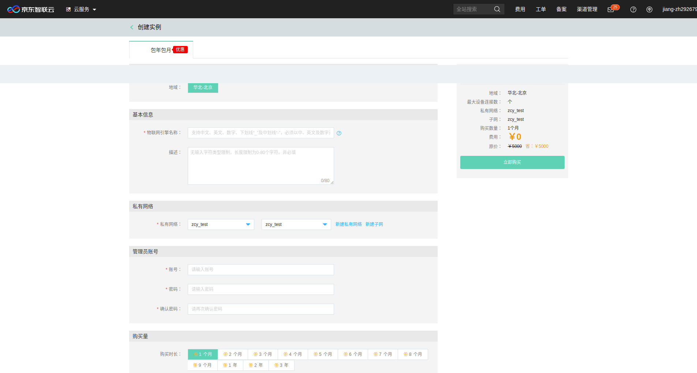
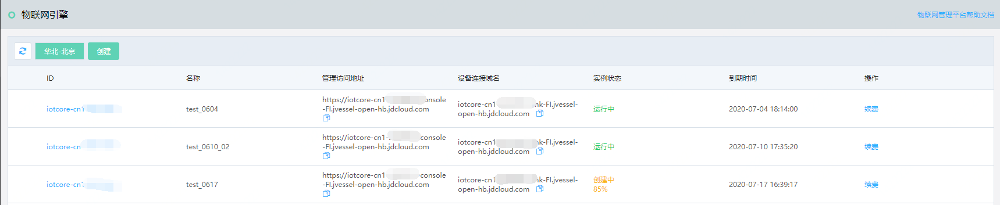
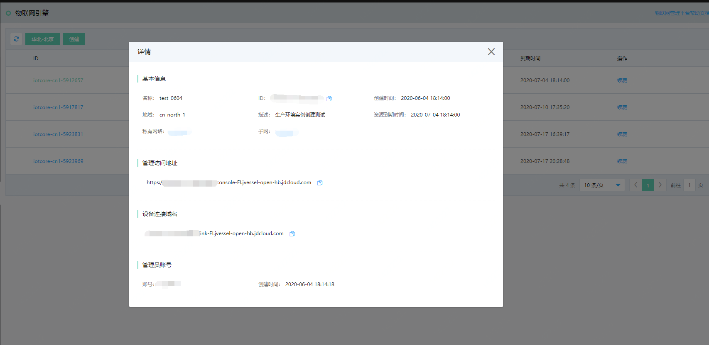

# 创建实例

本文介绍如何快速创建物联网引擎服务实例。

1. 登录物联网引擎控制台, 进入服务开通页，阅读相关产品信息与服务协议后，点击“立即开通”。

2. 在实例创建页面，填写您的设备接入量，实例名称，想要部署的私有网络，子网，及购买时长等信息。

3. 点击“立即购买”，进入购买订单确认页，订单确认无误后点击“立即支付”。
4. 支付订单完成后会跳转至服务资源准备的页面，预计需要等待15-20分钟。页面实时刷新实例创建进度。

5. 资源创建成功后，列表显示实例状态为运行中。点击实例名称可显示实例详情。

