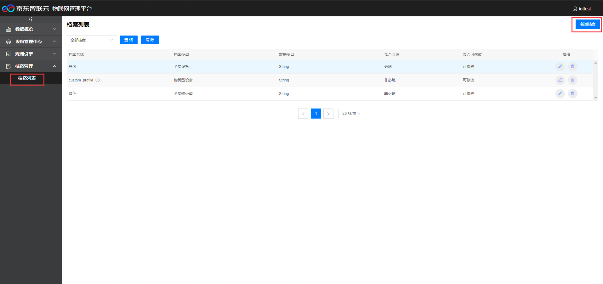
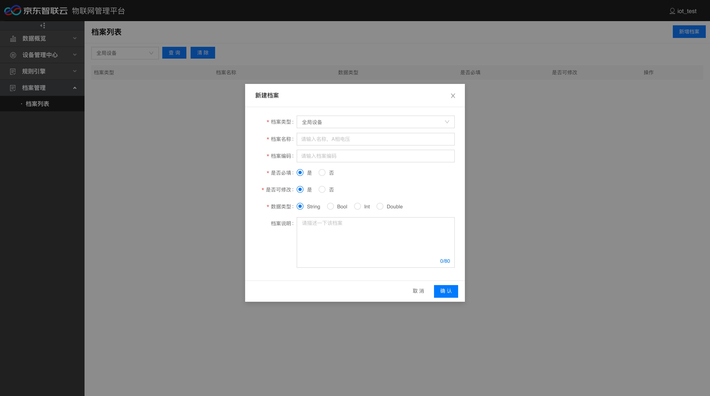
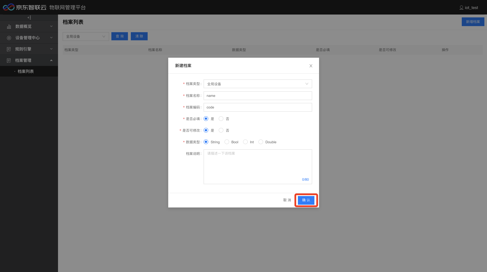
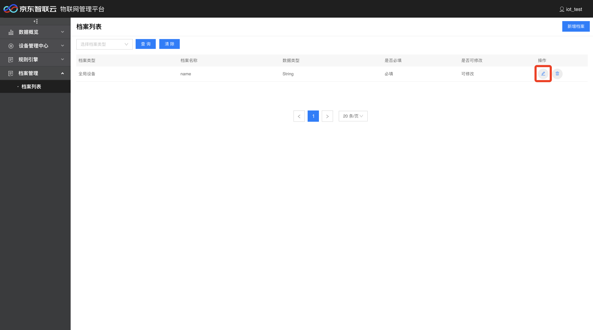
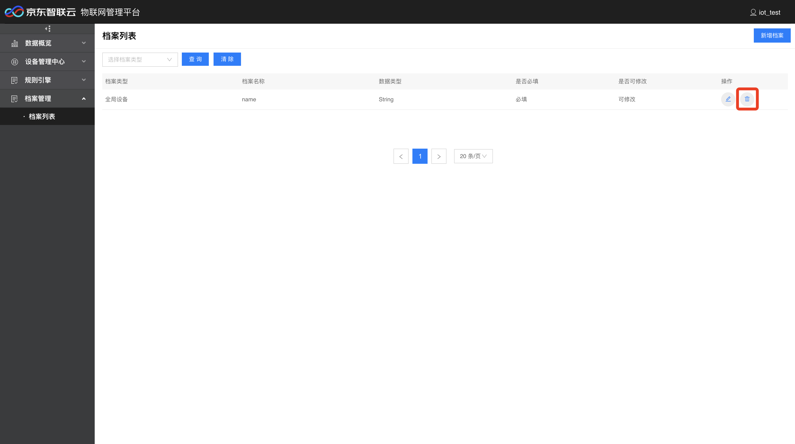
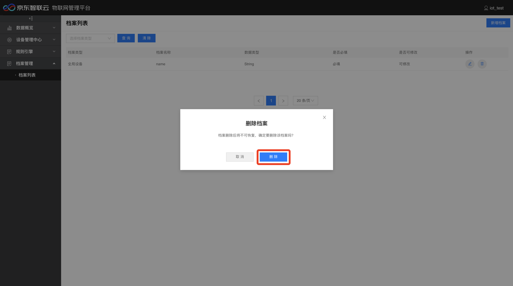
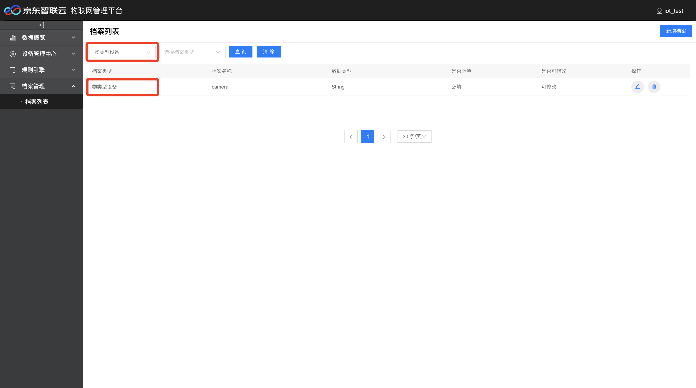

# 档案管理

## 新增档案

1. 登录物联管理平台。
2. 左侧导航栏选择 **档案管理** -> **档案列表**。
3. 点击页面右上方 **新增档案**。

4. 选择档案类型，三种类型：全局设备、全局物类型和物类型设备。填写档案名称、档案编码、是否必填、是否可修改、选择数据类型和档案说明。

5. 点击保存，新建完毕。

## 编辑档案

1. 查询到要编辑的对象，点击编辑按钮。

2. 编辑档案信息，可以修改是否必填、是否可修改和档案说明，修改完成后点击确认。

## 删除档案

1. 查询到要删除的对象，点击删除按钮。

2. 弹出确认删除框，点击删除。

## 查询档案

1. 选择档案类型（全部档案、全局设备、全局物类型、物类型设备），点击查询。

2. 列表会显示所选择类型的全部信息。

