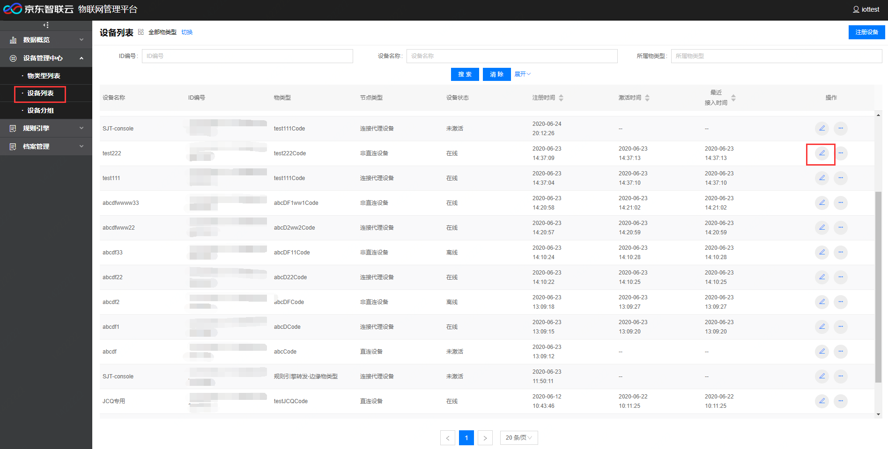
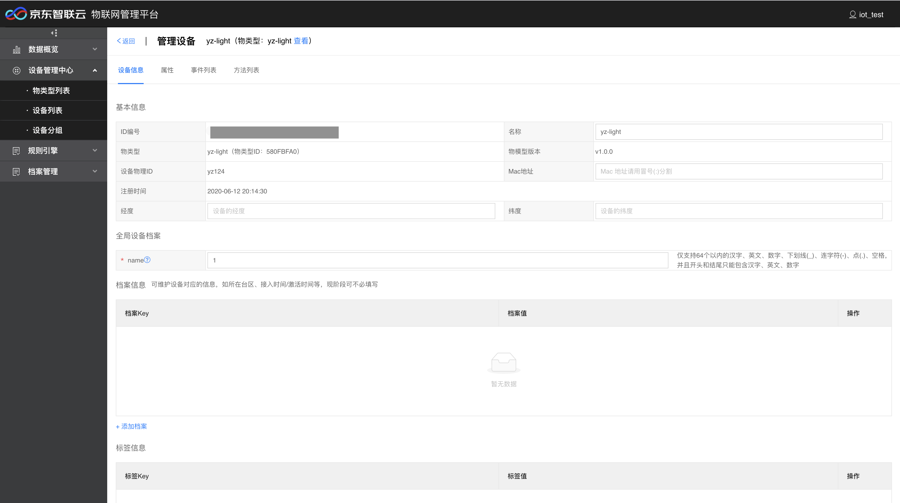
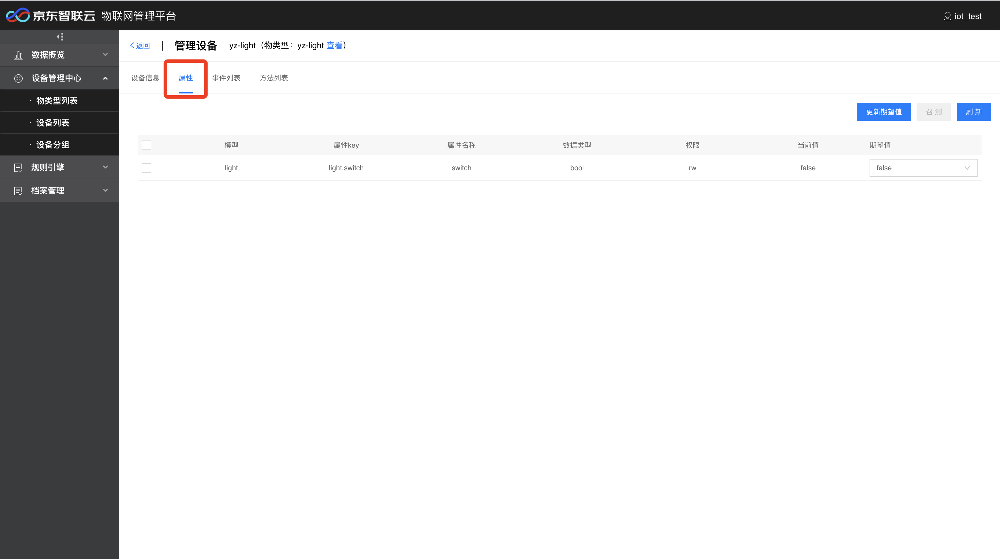
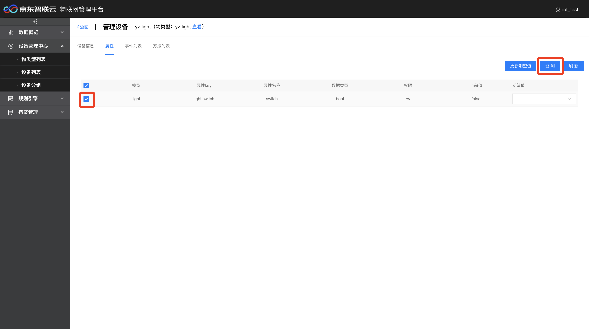
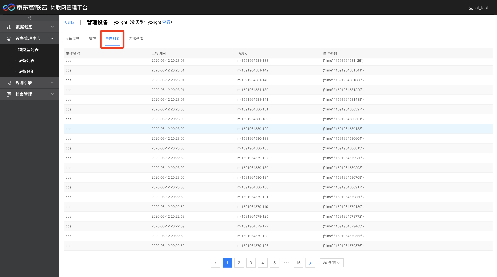
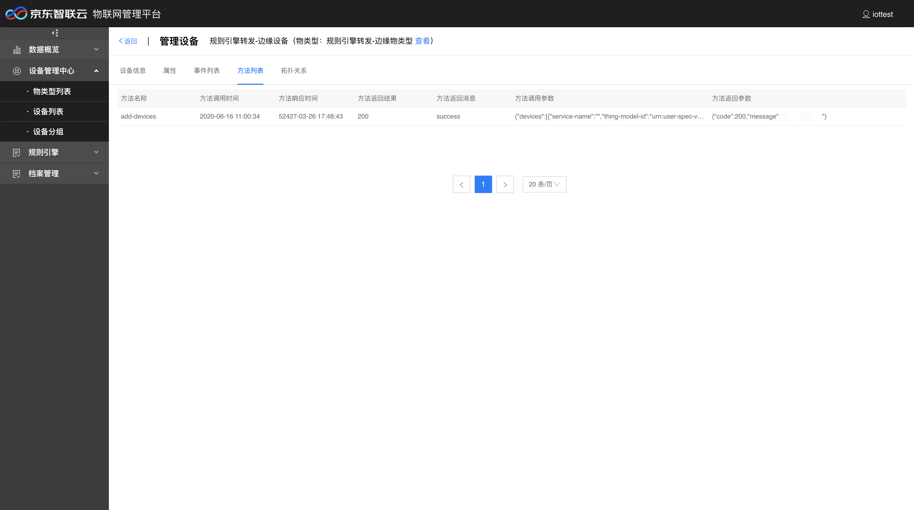
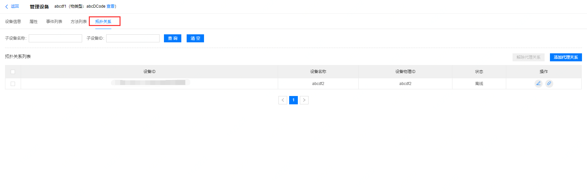

# 管理设备

设备信息页可以编辑设备的信息，管理设备的属性、事件和方法。

## 编辑设备信息

1. 登录物联管理平台。
2. 左侧导航栏选择 **设备管理中心** -> **设备列表**。
3. 选择要编辑的设备，点击右侧编辑按钮，进入管理设备页面。

4. 在管理设备页，默认打开的是设备信息，可以更改设备的名称、Mac地址、经度、纬度、全局设备档案、档案信息和标签信息。

### 编辑设备属性

属性支持编辑设备的属性期望值和召测。

#### 更新期望值

当修改设备属性期望值，点击更新期望值按钮，如果该设备在线，设备侧对应属性的值会改变。

#### 召测
当勾选某条或多条设备属性，点击召测按钮，设备会上报一次所选属性的当前数据。

### 查看设备事件列表

事件列表展示了设备上报的所有事件。

### 查看设备方法列表

方法列表展示了设备所有方法调用记录。

### 查看设备拓扑关系

如果设备类型是连接代理设备，编辑页面会有拓扑关系按钮，设备拓扑关系维护可以管理连接代理设备与非直连设备的拓扑关系，包括添加、解除代理设备和子设备的代理关系。具体详情请见[设备拓扑关系维护](../../Best-Practices/Device-Gateway-Topo.md)

