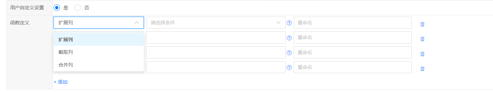
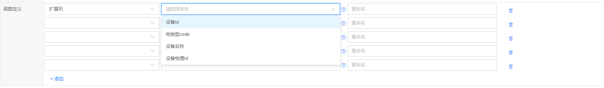
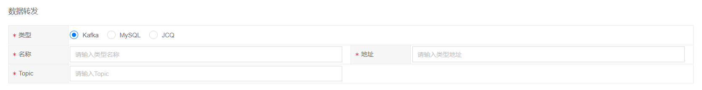
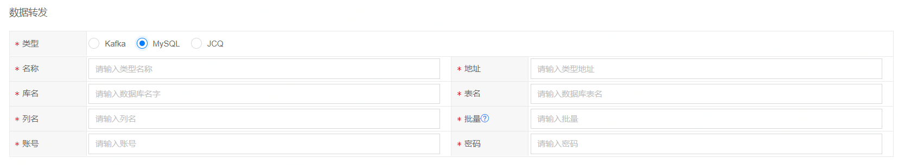
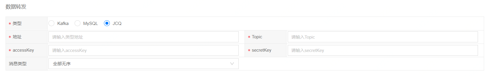
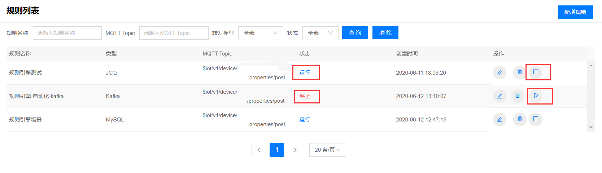
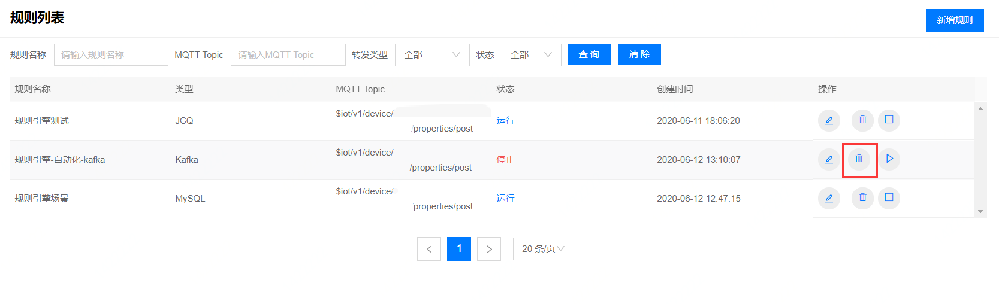

# 创建规则引擎

1. 登录物联管理平台
2. 左侧导航栏选择**规则引擎** -> **规则列表**
3. 点击页面右上方**新建规则**


**基本信息** 

- 规则名称：规则引擎唯一标识，支持2-30个字符内的中文、英文、数字、下划线（_）和中划线（-）。

- 物类型ID：这里目前可以不填，以后系统会支持对多个产品下的所有设备上报信息进行规则过滤，届时这里天对应产品ID。

- MQTT Topic：设备上报的MQTT Topic，表明对该Topic上报的数据进行处理。

- SQL语句：定义数据过滤时执行的SQL语句，所有上报的数据都会经过SQL语句进行处理，然后进行数据转发。表名可以随意写，没有实际意义。

```
目前仅支持以下几种格式：

1. SELECT * FROM Orders
2. SELECT a, c AS d FROM Orders
3. SELECT * FROM Orders WHERE b = 'red'
4. SELECT * FROM Orders WHERE a> 0
```

- 设备上报数据：说明设备上报的数据字段以及字段类型。

```
{ 
  "messageId":"1234567898765432",
  "event":"connected",
  "deviceId":"1.2.156.156.11.11.962",
  "timestamp":1573696479
}
```
- 用户自定义设置：在对设备上报的数据进行增强时，可以选择用户自定义设置来为上报数据进行增强信息。可通过扩展列、截取列、合并列的方式对上报数据进行增强。



扩展列：增加扩展属性到转发数据中，现支持设备ID，物类型code,设备名称，设备物理id四种属性的扩展。


截取列：针对字符型列，可以指定截取该列的某些字符，比如：‘device.profile.name, 0, 4’,代表要截取device.profile.name列，从0开始，截取长度为4，如果不输入长度，默认截取到末尾。

合并列：连接组合列（支持多列），支持字符与数值型多组合形式连接组合，比如：连接字符列(person.name:xiaoli)与数值列(person.age:23)，请输入'person.name, person.age'，最终输出结果为：'xiaoli23'


**数据转发**

通过规则过滤后的数据可以转发至三种消息存储：Kafka、MySQL、JCQ。

- 注意：Kafka和MySQL必须和当前物联管理平台实例处于相同的VPC下。

1. 转发到Kafka
填写转发到kafka需填写名称、地址、Topic。



获取Kafka的参数信息：
- 进入**消息队列 Kafka 版** -> **实例列表**
- 点击目标Kafka名称进入该Kafka详情页。若实例列表页没有创建好的Kafka,则点击新建按钮，创建Kafka。
- AK/SK信息在Access Key管理页可以创建/获取。

2. 转发到MySQL
转发到MySQL需要填写名称、数据库地址、库名、表名、列名、批量（数据入库阀值）、账号、密码。



获取MySQL的参数信息：
- 进入**云数据库RDS** -> **实例列表**
- 点击目标MySQL名称进入该MySQL详情页获取名称和地址，点击登录数据库，获取数据库名，表名，列名。若实例列表页没有创建好的MySQL,则点击新建按钮，创建MySQL。
- AK/SK信息在Access Key管理页可以创建/获取。

3. 转发到JCQ
转发到JCQ需填写地址、Topic、AccessKey/SecretKey、消息类型等信息。



获取消息队列JCQ的参数信息：
- 进入**消息队列JCQ** -> **Topic管理**
- 点击目标Topic名称进入该Topic详情页。若Topic管理页没有创建好的Topic,则点击新建按钮，创建Topic。
- AK/SK信息在Access Key管理页可以创建/获取。

## 编辑规则
1. 进入规则引擎-规则列表页面，选择一条规则点击编辑按钮，进入编辑规则页面。
2. 如果规则处于停止状态，进入编辑规则页面，可以修改规则的各项属性，点击保存后生效。
3. 如果规则处于运行状态，进入编辑规则页面，不可以修改规则的各项属性。

## 启停规则
1. 进入规则引擎-规则列表页面，点击运行/停止按钮。
2. 运行成功后，状态变为运行，在规则列表中操作中运行按钮变成停止按钮。停止成功后状态变为运行，在规则列表中操作中运行按钮变成停止按钮。



## 删除规则

进入规则引擎-规则列表页面，点击删除按钮。如果规则处于运行状态，则不可以删除；如果规则处于停止状态，则可以删除；删除成功后，在规则列表中查询不到。


