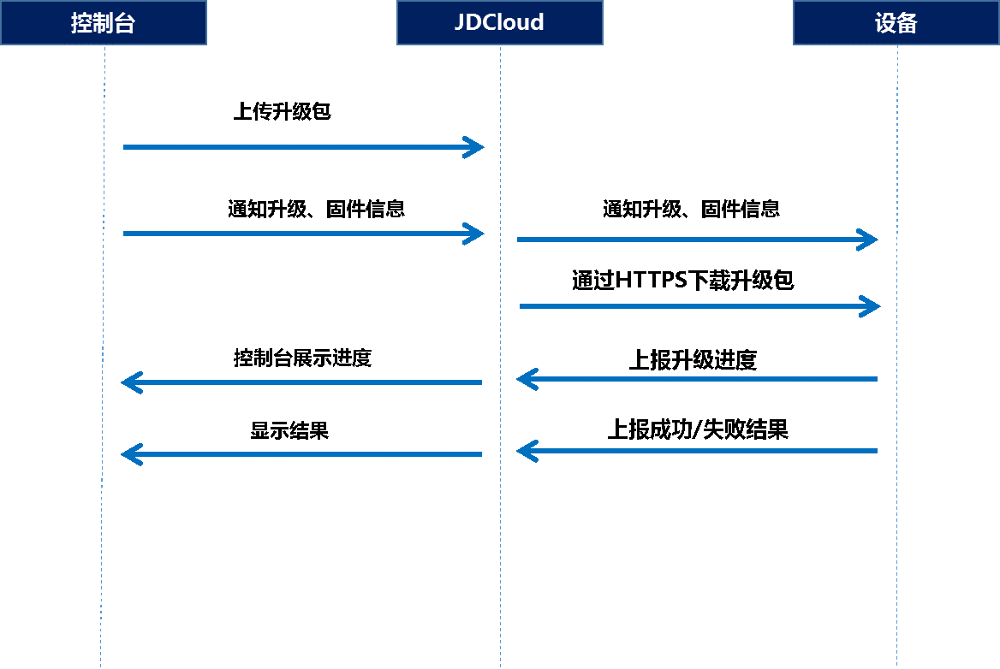

# 设备端OTA升级指导

物联网平台通过MQTT协议通知设备进行固件升级，设备通过http/https下载固件包。下载和升级过程会上报整体进度并检查固件包的完整性,目前设备端SDK的OTA功能只支持网关和直连设备。

## SDK文件说明：

​	1. 通过iot_config.h中的DEVICE_OTA开启OTA功能。

​	2. 编译生成的执行文件在 build/x86_64/bin/ota_example里

## 注意：

1. 设备固件版本号需要在系统启动过程中和升级成功后上报一次。

2. 物联网控制台发起批量升级后，设备升级操作记录状态是待升级，设备上报进度后开始计时。 

3. 根据版本号来判断设备端OTA升级是否成功。

4. 设备离线时，不能接收服务端推送的升级消息。

## 固件升级流程：



## 接口说明

### 1. OTA初始化

 `void *iot_ota_init(const char *product_key, const char *device_name, void * mqtt_client);`

接口说明：初始化OTA的资源，默认会订阅升级命令下发的topic。

返回值：成功返回ota 实例，失败返回null

参数说明：

| **参数名**  | **参数类型**  | **必填** | **描述**                          |
| ----------- | ------------- | -------- | --------------------------------- |
| product_key | const  char * | 是       | 设备的product_key                 |
| device_name | const  char * | 是       | 设备的device_name                 |
| mqtt_client | void*         | 是       | mqtt实例，通过mqtt实例创建api生成 |

升级命令下发的Topic格式: 

`/sys/{productKey}/{identifier}/ota/firmware/upgrade`

下发数据格式：

```
{
"msgId ":"123",//消息id
"version":"1.0",//协议版本
"data ":{
	"policy":" standard/ silent",//升级模式，设备主动获取固件信息无此项
	"size":432945,//固件大小
	"firmwareVersion":"固件版本",
	"url":"固件地址",
	"sign":"固件签名",
	"signMethod":"Md5"//签名方法
	}
}
```

### 2. 注销OTA申请的资源

 `int iot_ota_destroy(void *handle);`

接口说明：注销OTA申请的资源。

返回值：成功返回0，失败返回iot_ota_err_t

参数说明：

| **参数名** | **参数类型** | **必填** | **描述**          |
| ---------- | ------------ | -------- | ----------------- |
| handle     | Void*        | 是       | init生成的ota实例 |

### 3. 上报升级进度和升级状态

`int iot_ota_report_progress(void*handle iot_ota_status_t status,uint32_t progress);`

接口说明：上报下载进度和升级的进度，成功或失败的状态上报。

返回值：成功返回0，失败返回iot_ota_err_t

参数说明：

| **参数名** | **参数类型**     | **必填** | **描述**                 |
| ---------- | ---------------- | -------- | ------------------------ |
| handle     | Void*            | 是       | ota实例                  |
| status     | iot_ota_status_t | 是       | 上报类型iot_ota_status_t |
| progress   | uint32_t         | 是       | 下载和升级的进度0-100    |

### 4. 上报固件版本

`int iot_ota_report_firmware_version(void *handle, const char *version);`

接口说明：上报当前的固件版本信息。

返回值：成功返回0，失败返回iot_ota_err_t

参数说明：

| **参数名** | **参数类型**  | **必填** | **描述** |
| ---------- | ------------- | -------- | -------- |
| handle     | void*         | 是       | ota实例  |
| version    | const  char * | 是       | 版本信息 |

### 5.  判断当前是否为下载中状态

`int iot_ota_is_fetching(void *handle);`

接口说明：判断当前状态是否为下载中。状态如下：

​	uninit：下载模块未初始化

​	init：已经初始化

​	fetching：下载中

​	fetched：下载结束

返回值：下载中1，非下载中0   

参数说明：

| **参数名** | **参数类型** | **必填** | **描述** |
| ---------- | ------------ | -------- | -------- |
| handle     | Void*        | 是       | ota实例  |

### 6.    判断当前是否为下载结束状态

`int iot_ota_fetch_finish(void *handle);`

接口说明：判断当前是否为下载结束状态，供有uninit（下载模块未初始化）、init（已经初始化）、fetching（下载中）、fetched（下载结束） 四种状态。

返回值：结束1，进行中0

参数说明：

| **参数名** | **参数类型** | **必填** | **描述** |
| ---------- | ------------ | -------- | -------- |
| handle     | Void*        | 是       | ota实例  |

### 7.  开始下载

`int iot_ota_fetch_yield(void *handle, char *buf, uint32_t buf_len, uint32_t timeout_s);`

接口说明：开始下载。

返回值：成功返回读取字节数，如果返回值<0下载结束，失败返回iot_ota_err_t

参数说明：

| **参数名** | **参数类型** | **必填** | **描述**         |
| ---------- | ------------ | -------- | ---------------- |
| handle     | Void*        | 是       | ota实例          |
| buf        | Char  *      | 是       | 读取buf          |
| buf_len    | Uint32_t     | 是       | buf的长度        |
| Timeout_s  | Uint32_t     | 是       | 本次读取超时时间 |

### 8. 获取固件信息

`int iot_ota_get_firmware_info(void *handle, const char *product_key, const char *identifier, const char * version);`

接口说明：获取指定版本的固件信息。需要订阅topic MQTT_SUB_TYPE_OTA_FIRMWARE_GET_INF_REPLY返回请求结果。

Ø 返回值：成功返回 packageid，失败返回 -1

参数说明：

| **参数名**  | **参数类型** | **必填** | **描述**          |
| ----------- | ------------ | -------- | ----------------- |
| handle      | Void*        | 是       | ota实例           |
| product_key | Char  *      | 是       | 设备的product key |
| identifier  | Char *       | 是       | 设备的identifier  |
| version     | Char *       | 是       | 需要查询的版本号  |

  Topic MQTT_SUB_TYPE_OTA_FIRMWARE_GET_INF_REPLY的格式:

`/sys/{productKey}/{identifier}/ota/firmware/get_reply`

响应数据格式：

有固件信息下发，响应数据格式如下：

```
{
"msgId ":"123",//信息ID
"version":"1.0",//协议版本
"data ":{
	"firmwareVersion":"固件版本",
	"url":"固件地址",
	"sign":"固件签名",
	"signMethod":"Md5"
	}
}
```

无固件信息下发，响应数据格式如下：

```
{
"msgId ":"123",
"code":404,
"message":"FirmwareVersion {{firmwareVersion}} not existed"
}
```

