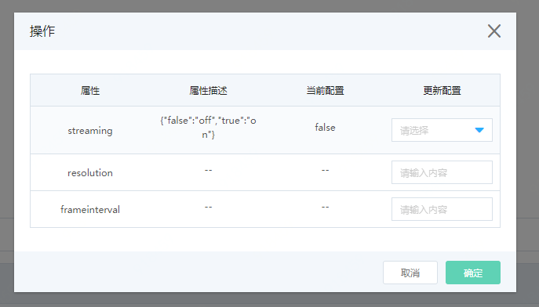

# 边缘视觉检测实践

目前，使用物联网智能边缘计算产品提供的IP摄像头设备服务和对象检测应用，可以快速搭建边缘智能视觉业务。

## 前提条件

- 已注册京东云账号，并完成实名认证。如果还没有账号请 [注册](https://accounts.jdcloud.com/p/regPage?source=jdcloud%26ReturnUrl=%2f%2fuc.jdcloud.com%2fpassport%2fcomplete%3freturnUrl%3dhttp%3A%2F%2Fuc.jdcloud.com%2Fredirect%2FloginRouter%3FreturnUrl%3Dhttps%253A%252F%252Fwww.jdcloud.com%252Fhelp%252Fdetail%252F734%252FisCatalog%252F1)，或 [实名认证](https://uc.jdcloud.com/account/certify)。
- 已创建 物联网引擎服务 实例，创建网络摄像头产品并在该产品下登记注册摄像头设备。
- 已创建并激活 边缘节点，并完成IP摄像头设备服务部署和对象检测应用部署。
- 请保证您的边缘节点本地存储有足够的空间。**注意：单路摄像头在1280x720分辨率下，每小时产生的录像文件约为2.2GB，请确保您的本地硬盘有足够空间。系统会在每天凌晨2点进行清理。**

## 接入IP摄像头设备

1. 摄像头和边缘节点保持在同一局域网内。
2. 进入当前边缘节点详情页面，点击子设备管理->添加子设备。将该摄像头添加至边缘节点上。
3. 点击消息路由->新建消息路由，创建一个消息路由，将刚刚添加的摄像头作为消息源，对象检测应用作为目的端。

## 开启摄像头并运行对象检测应用

1. 点击子设备管理标签页，更新摄像头设备影子。

   

   streaming 设置为 on  （打开摄像头）

   其他可保持初始值。

2. 点击对象检测应用的更新影子。按实际需求，填写相关参数值后，更新影子。

   
   
| 参数              | 描述                 | 输入说明                                                     |
| ----------------- | -------------------- | ------------------------------------------------------------ |
| detectHardware    | 检测硬件             | 当前应用做检测时，依赖的硬件资源，默认值为：0:CPU。<br>0:CPU 仅使用CPU进行计算<br>2:HDDL 仅使用HDDL进行计算<br>20:HDDLCPU 优先使用HDDL计算，CPU辅助计算。|
| targetLabels      | 检测目标             | 填写期望的检测目标名称。最大填写Label数为10个，置空请填写[]。为空则依据最大检测数和设定的置信度，输出对应的检测结果。填写方式为["label1","label2","label3"]参考示例["person","cup",”bicycle“]。 对象检测应用默认的目标名称请参考[Label文件](../../../../image/IoT/IoT-Edge/objectLabel.txt) 。|
| recordVideoSwitch | 检测到目标，录制视频 | ON/OFF。默认值为ON。录像会同时保存在本地和云端对象存储中。**注意：单路摄像头在1280x720分辨率下，每小时产生的录像文件约为2.2GB，请确保您的本地硬盘有足够空间。系统会在每天凌晨2点进行清理。** |
| duration          | 录制视频时长         | 单位：秒，类型：整型，输入范围：5~30，步长为1 。默认值为：10 |
| modelName         | 检测模型名称         | 填写对象检测应用使用的AI模型文件名，不能带扩展名。名称输入长度最长为：256个字符。 对象检测应用内置模型文件为：vgg_coco_ssd_300x300_openvino_FP16 |
| maxResults        | 最多检测目标个数     | 类型：整型，输入范围：1~10，步长：1 。单帧图像对多检测的目标结果数。 默认值为3。 |
| threshold         | 置信度阀值           | 类型：浮点，输入范围：0.01~0.99，步长：0.01。当对象检测应用检测到目标的置信度≥该设定值时，才输出检测结果。默认值为：0.9。 |

3. 点击边缘应用标签页，启动对象检测应用。

## 查看对象检测结果

1. 登录 [京东云 控制台](https://console.jdcloud.com/overview)。

2. 进入您创建的用于存储边缘计算结果的OSS Bucket目录下查看当前应用的检测结果。

   结果文件包括：

   ​		图片文件：检测到目标的对应图像文件pic_20191105140035.jpg

   ​		文本文件：检测结果信息，包括检测到的物体label，置信度以及在图片中的坐标位置，例如： pic_20191105140035.txt 。文件格式如下：
```
{"lable":"mouse","score":0.56487995,"left":227,"right":347,"top":289,"bottom":411}
```
   ​		视频文件：如在对象检测应用影子中设置了开启录像，则在检测到目标后，会持续录制一段时间（时间请配置应用影子参数duration。默认为10秒）的视频。例如：video_20191105140045.mp4 

   
    
## 相关参考

- [管理边缘应用](../Operation-Guide/Edge-App.md)
- [管理子设备](../Operation-Guide/SubDevice.md)
- [管理消息路由](../Operation-Guide/MsgRouter.md)

