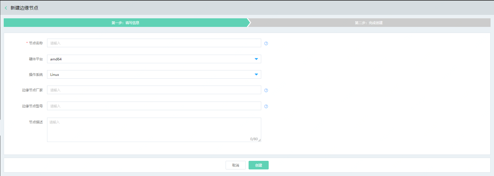
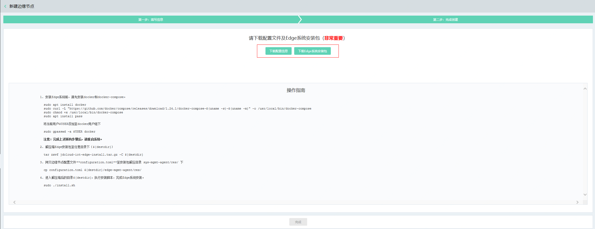

# 创建边缘节点

您可以通过物联网智能边缘计算控制台或 API 快速创建和注册边缘节点，关于计费说明请参见“[计费规则](../Pricing/Billing-Rules.md)”。

本文介绍如何通过控制台创建边缘节点。

## 前提条件
- 已注册京东云账号，并完成实名认证。如果还没有账号请 [注册](https://accounts.jdcloud.com/p/regPage?source=jdcloud%26ReturnUrl=%2f%2fuc.jdcloud.com%2fpassport%2fcomplete%3freturnUrl%3dhttp%3A%2F%2Fuc.jdcloud.com%2Fredirect%2FloginRouter%3FreturnUrl%3Dhttps%253A%252F%252Fwww.jdcloud.com%252Fhelp%252Fdetail%252F734%252FisCatalog%252F1)，或 [实名认证](https://uc.jdcloud.com/account/certify)。
- 已经创建好了物联网引擎实例。如果还没有创建，请登录 [物联网引擎控制台](https://iot-console.jdcloud.com/core) 创建实例。

## 操作步骤
1. 登录 [物联网智能边缘计算控制台](https://iot-console.jdcloud.com/edge)。

2. 在“边缘节点列表”页面，点击 **新建边缘节点** ，进入“新建边缘节点”页面。

3. 在“新建边缘节点-第一步”页面，按页面提示填写相应信息。

    

    | 项目         | 说明                                                         |
    | ------------ | ------------------------------------------------------------ |
    | 节点名称     | 必填项，不可为空，支持英文、数字、下划线“_”及中划线“-”，必须以英文及数字开头结尾，长度限制3-30个字符。 |
    | 硬件平台     | 边缘节点硬件架构，目前仅支持amd64                            |
    | 操作系统     | 边缘系统安装所依赖的操作系统环境，目前仅支持Linux 64位系统   |
    | 边缘节点厂家 | 边缘节点硬件设备生产厂家或制造商。非必填。支持中文、英文、数字、下划线“_”及中划线“-”，必须以中、英文及数字开头结尾，最大输入30个字符。 |
    | 边缘节点型号 | 边缘节点硬件型号。非必填。支持中文、英文、数字、下划线“_”及中划线“-”，必须以中、英文及数字开头结尾，最大输入30个字符。 |
    | 节点描述     | 边缘节点本身的描述信息。非必填，最大80个字符。               |

    

4. 在"新建边缘节点-第二步"页面，请**务必下载**Edge系统安装文件和配置文件并妥善保存配置信息，之后请按照页面下方操作指南进行Edge系统的安装。注意：安装Edge系统时，您需要保持边缘节点设备连接互联网。

    

5. 点击**完成创建**，页面自动跳转到 “边缘节点列表”页面，等待边缘节点创建完成，您可以在“边缘节点列表”页面查看新创建的边缘节点。

## 相关参考

- [安装Edge系统](Install-Edge-System.md)
