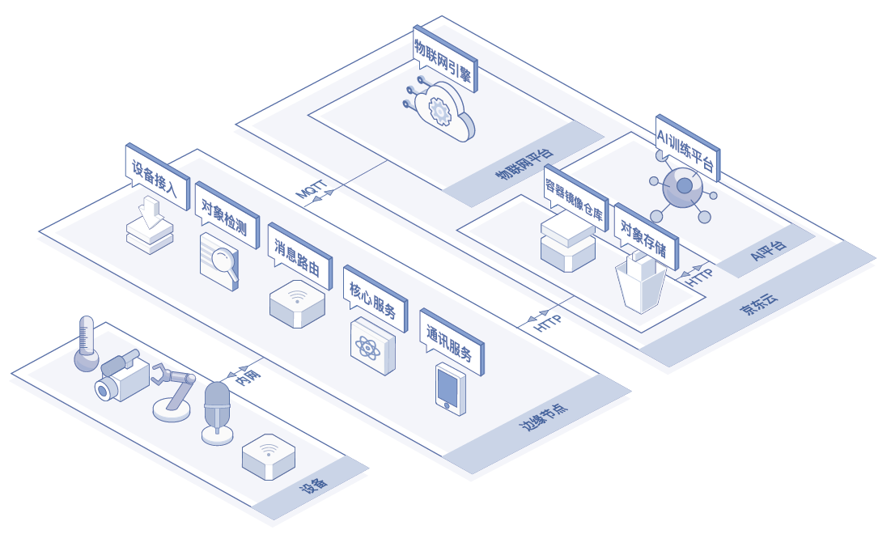

# 基础架构

物联网智能边缘计算（IoT Edge）包含设备接入、核心服务、边缘应用以及通讯服务这几个核心功能。

## 业务架构

业务架构如下图：

| 名称     | 描述                                                         |
| -------- | ------------------------------------------------------------ |
| 核心服务 | 提供整个边缘计算系统的基础运行环境，并提供数据管理，调度管理，日志监控，通知以及存储等服务。 |
| 设备接入 | 提供和底层硬件接口以及操作系统对接能力以及数据解析服务。                   |
| 边缘应用 | 部署在边缘节点上的应用，用以完成设备数据协议本地计算，AI推断等业务。一个边缘节点可以部署多个边缘应用。 |
| 通讯服务 | 使用标准协议（MQTT，HTTP）连接物联网引擎和京东云服务，提供数据上行和下行功能。                               |

## 相关参考

- [产品优势](../Introduction/Benefits.md)
- [产品功能](../Introduction/Features.md)
- [创建边缘计算节点](../Getting-Started/Create-Edgenode.md)
- [安装Edge系统](../Getting-Started/Install-Edge-System.md)
