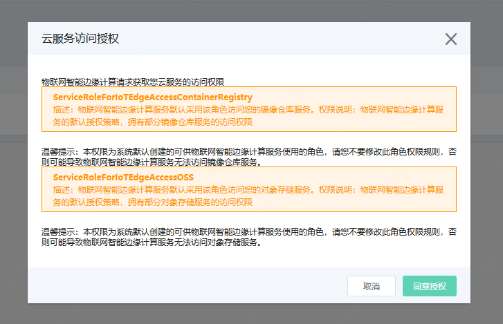
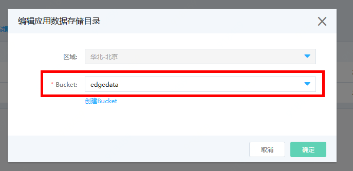
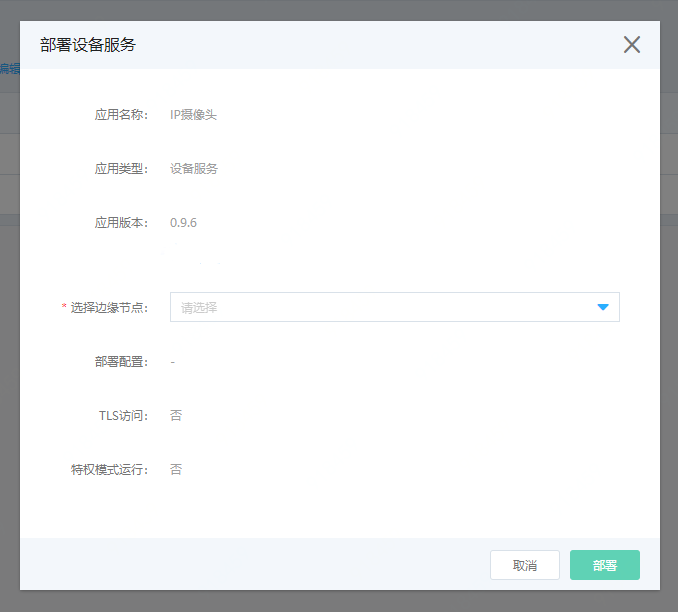
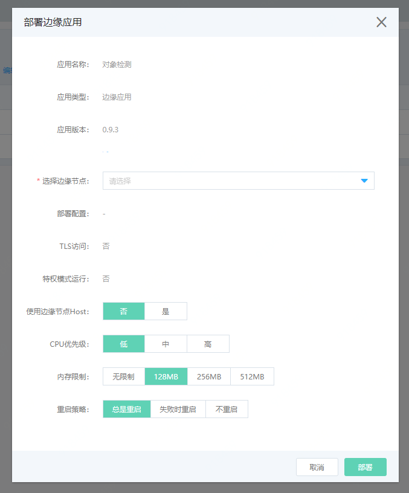
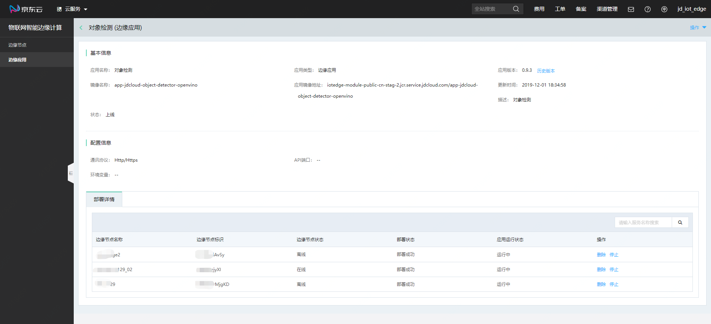
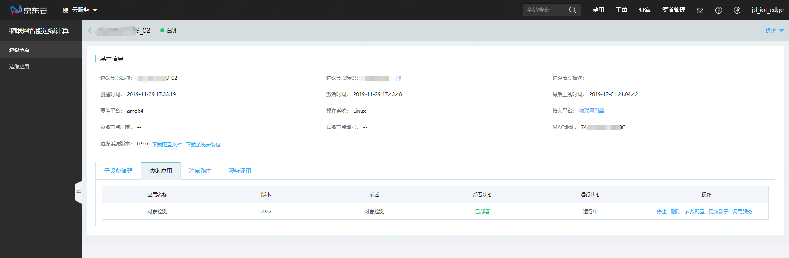
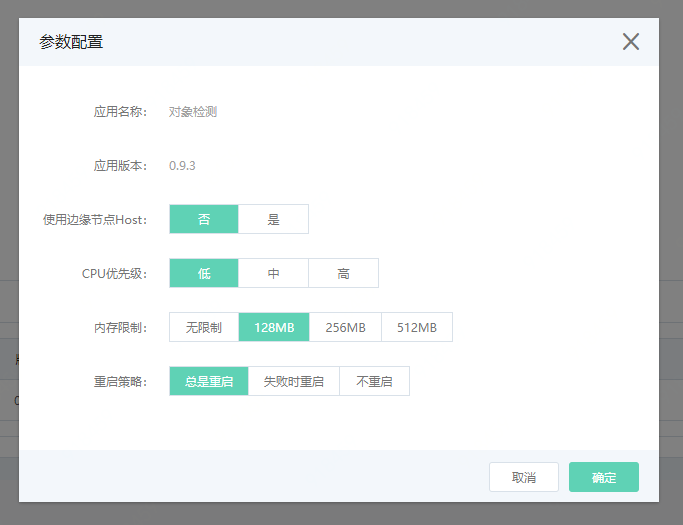
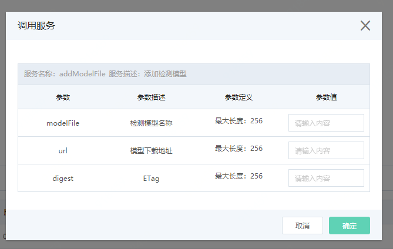

# 管理边缘应用

您可以通过物联网智能边缘计算控制台，管理边缘应用。

## 前提条件

- 已经完成Edge系统的安装，并且保持边缘节点在线。
- 已经开通对象存储业务，并创建好一个用于存储边缘计算结果数据的Bucket。如未开通，请先进入[对象存储](https://oss-console.jdcloud.com)控制台申请开通服务。
- **注意：当边缘节点处于未激活、离线或者系统更新状态时，无法进行应用的相关操作。**

## 部署安装边缘应用

1. 登录 [物联网智能边缘计算控制台](https://iot-console.jdcloud.com/edge)。

2. 点击左侧菜单进入“边缘应用”页面，首次进入“边缘应用”页面，会请求获取您的镜像仓库和对象存储的访问授权，请您同意授权，否则将无法正常部署安装应用。同意授权后，请您务必指定应用数据的对象存储路径。
    
    
3. 在应用列表页中，您可以看到目前物联网平台上已经发布上线的应用。边缘应用分为两类：一类是设备服务类边缘应用，一类是标准边缘应用。

   ### 部署设备服务

   点击设备服务应用后面的部署按钮，打开部署页面。

    

   选择需要安装设备服务的边缘节点后，点击部署。边缘节点会收到安装指令，自动安装设备服务。

   ### 部署边缘应用
   
   点击边缘应用后的部署按钮，打开部署页面。
   
    
   
   | 参数             | 说明                                                         |
   | ---------------- | ------------------------------------------------------------ |
   | 选择边缘节点     | 需要部署安装应用的边缘节点名称。                             |
   | 使用边缘节点Host | 边缘应用在运行时是否使用边缘节点系统的Host。默认为【否】     |
   | CPU优先级        | 边缘应用运行时，申请的CPU运行权限，默认为【中】              |
   | 内存限制         | 边缘应用运行时，最多使用的内存数，您需要根据您边缘节点设备的实际情况进行配置。     |
   | 重启策略         | 总是重启：应用退出后自动重启 失败时重启：应用异常终止时重启 不重启：应用终止后不重启。 |
   
   按页面提示选择需要安装应用的边缘节点，并选择好相关配置，完成选择后点击部署。边缘节点会收到安装指令，自动安装设备服务。您可在边缘应用详情页中查看部署情况。

## 边缘应用详情

​	在边缘应用列表中，点击应用名称，进入该应用的详情页。详情页中您可以对所有进行过该应用部署的边缘节点进行相应的操作。
     

### 重新部署边缘应用

​	你可对边缘节点上部署失败的应用进行重新部署。重新部署要求边缘节点必须在线。

### 删除边缘应用

​	您可以删除已经部署在边缘节点上的应用。当应用部署失败时，删除操作为删除当前的部署记录。删除应用要求边缘节点必须在线。

​	删除应用时需注意以下几点：

	1.  当删除设备服务类应用时，需先移除当前边缘节点下所有依赖该设备服务的子设备，否则无法删除设备服务；
   	2.  当删除边缘应用时，需确保该应用在当前边缘节点下的所有消息路由中未被指定为消息目的端，否则无法删除边缘应用。
   	3.  若删除失败，请进入对应的边缘节点详情，在服务调用标签页中查看结果。

### 启停边缘应用

​	您可以对任意边缘节点上的部署成功的应用进行启停操作。启停操作要求边缘节点必须在线。

## 配置边缘应用

​	进入边缘节点->边缘节点详情->边缘应用，您可以对部署在当前边缘节点上的应用进行管理。
  

### 启停边缘应用

​	您可以对任意边缘节点上的部署成功的应用进行启停操作。启停操作要求边缘节点必须在线。

### 删除边缘应用

​	您可以删除已经成功部署在当前边缘节点上的应用。删除应用要求边缘节点必须在线。

​	删除应用时需注意以下几点：

  	1.  当删除边缘应用时，需确保该应用在当前边缘节点下的所有消息路由中未被指定为消息目的端，否则无法删除边缘应用。
   	2.  若删除失败，请在服务调用标签页中查看结果。

### 		参数配置

您可以对当前应用的容器运行参数配置进行更新。更新参数配置时，要求边缘节点必须在线
 

### 		更新影子

您可以通过更新边缘应用的影子配置，进行应用的相关控制操作。
 

| 参数              | 描述                 | 输入说明                                                     |
| ----------------- | -------------------- | ------------------------------------------------------------ |
| detectHardware    | 检测硬件             | 当前应用做检测时，依赖的硬件资源，默认值为：0:CPU 0:CPU 仅使用CPU进行计算 2:HDDL 仅使用HDDL进行计算 20:HDDLCPU 优先使用HDDL计算，CPU辅助计算 |
| targetLabels      | 检测目标             | 填写期望的检测目标名称。最大填写Label数为10个，置空请填写[]。为空则依据最大检测数和设定的置信度，输出对应的检测结果。填写方式为["label1","label2","label3"]参考示例["person","cup","bicycle"]。 对象检测应用默认的目标名称请参考[Label文件](../../../../image/IoT/IoT-Edge/objectLabel.txt) |
| recordVideoSwitch | 检测到目标，录制视频 | ON/OFF。默认值为ON。录像会同时保存在本地和云端对象存储中。**注意：单路摄像头在1280x720分辨率下，每小时产生的录像文件约为2.2GB，请确保您的本地硬盘有足够空间。系统会在每天凌晨2点进行清理。** |
| duration          | 录制视频时长         | 单位：秒，类型：整型，输入范围：5~30，步长为1 。默认值为：10 |
| modelName         | 检测模型名称         | 填写对象检测应用使用的AI模型文件名，不能带扩展名。名称输入长度最长为：256个字符。 对象检测应用内置模型文件为：vgg_coco_ssd_300x300_openvino_FP16 |
| maxResults        | 最多检测目标个数     | 类型：整型，输入范围：1~10，步长：1 。单帧图像对多检测的目标结果数。 默认值为3。 |
| threshold         | 置信度阀值           | 类型：浮点，输入范围：0.01~0.99，步长：0.01。当对象检测应用检测到目标的置信度≥该设定值时，才输出检测结果。默认值为：0.9 。 |

### 		调用服务
如您想使用自己的AI模型进行视觉检测，您可通过调用对象检测应用的服务，将您自己的模型文件更新至边缘节点上。您可点击调用记录查看已经调用过的服务状态。
 
您的模型文件必须符合OpenVino的框架，如您使用的是其他框架的模型，请您参考[AI模型转换指南](../Operation-Guide/Trans-ModelFile.md)。

添加检测模型（ addModel）

| 参数      | 描述         | 输入说明                                                     |
| --------- | ------------ | ------------------------------------------------------------ |
| modelName | 检测模型名称 | 名称输入长度最长为：256个字符。注意：不能输入内置AI模型名 vgg_coco_ssd_300x300_openvino_FP16 |
| url       | 模型下载地址 | 文件要求：必须为符合OpenVino框架的检测模型，格式为.tar.gz。注意：包中必须提供检测标签文件，格式为txt。 |

删除检测模型（ deleteModel）

| 参数      | 描述         | 输入说明                                                     |
| --------- | ------------ | ------------------------------------------------------------ |
| modelName | 检测模型名称 | 名称输入长度最长为：256个字符。 对象检测应用内置模型不可删除。 |

## 相关参考

- [创建边缘计算节点](../Getting-Started/Create-Edgenode.md)
- [安装Edge系统](../Getting-Started/Install-Edge-System.md) 
- [管理子设备](../Operation-Guide/SubDevice.md)
- [管理消息路由](../Operation-Guide/MsgRouter.md)
