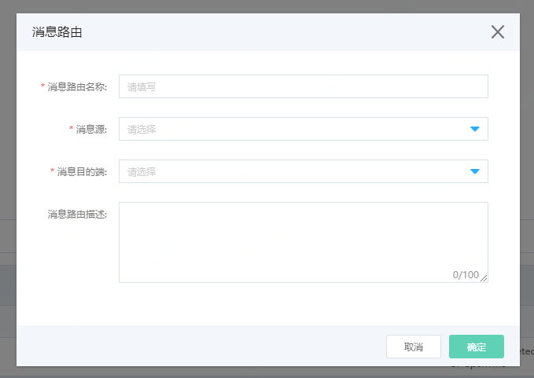
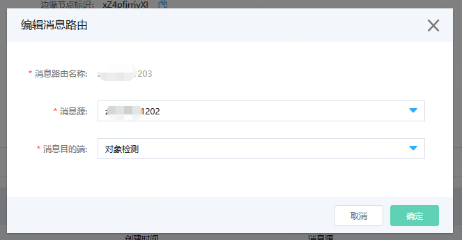

# 管理消息路由

您可以通过物联网智能边缘计算控制台，进行边缘节点上的消息路由管理。

消息路由是通过设置规则来配置消息的传输路径，使消息按照规则设置的过滤条件，从消息源路由到目的端。 

## 前提条件

- 已经完成Edge系统的安装，并且保持边缘节点在线。
- 已经安装部署成功了边缘应用，并且成功添加了自涉笔。
- **注意：当边缘节点处于未激活、离线或者系统更新状态时，无法进行消息路由的相关操作。**

## 新建消息路由

1. 登录 [物联网智能边缘计算控制台](https://iot-console.jdcloud.com/edge)。

2. 点击左侧菜单进入“边缘节点”页面，点击任意边缘节点名称，进入边缘节点详情页。

3. 进入“消息路由”标签页，点击新建消息路由。

    

   | 参数         | 说明                                                         |
   | ------------ | ------------------------------------------------------------ |
   | 消息路由名称 | 1到30字符，支持数字、大小写字母、下划线和中划线。必须以数字及大小写字母开头结尾，该边缘节点下唯一。 |
   | 消息源       | 消息的发出方。目前仅支持当前边缘节点下的子设备作为消息源。消息源在当前边缘节点下的各条消息路由中不能重复。 |
   | 消息目的端   | 消息的接受方。目前支持当前边缘节点下的已部署应用作为目的端。 |
   | 消息路由描述 | 100个字符。用于描述此条消息路由。                            |

## 启停消息路由

​		在已经创建完成的消息路由列表后方，点击启动或停止，可对当前消息路由进行启动或停止操作。

​		1. 消息路由为启动状态时，可对其进行停止操作。

​		2. 消息路由为停止状态时，可对其进行启动操作。

## 编辑消息路由

​		在已经创建完成的消息路由列表后方，点击编辑，可对当前消息路由的消息源和消息目的端进行编辑更新操作。

​		

## 删除消息路由

​		 在已经创建完成的消息路由列表后方，点击删除，可以删除当前的消息路由。删除成功后，该条消息路由将不会再列表中显示。

## 相关参考

- [创建边缘计算节点](../Getting-Started/Create-Edgenode.md)
- [安装Edge系统](../Getting-Started/Install-Edge-System.md) 
- [管理边缘应用](../Operation-Guide/Edge-App.md)
- [管理子设备](../Operation-Guide/SubDevice.md)
