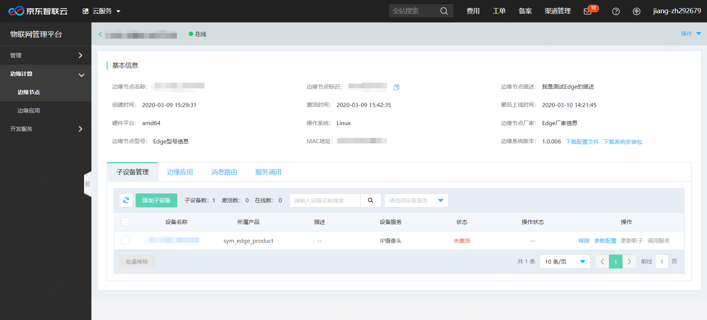
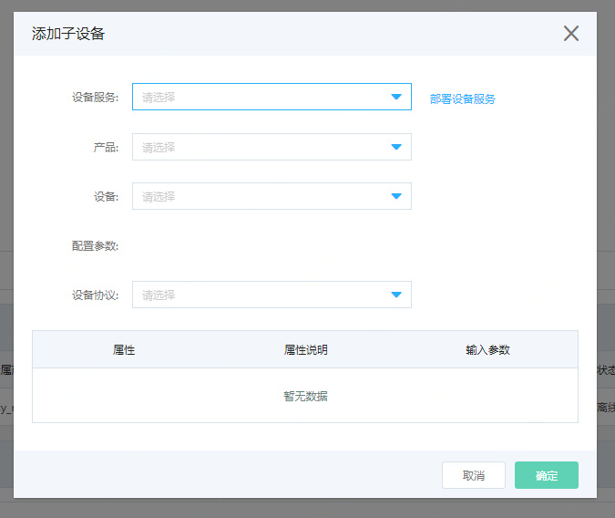
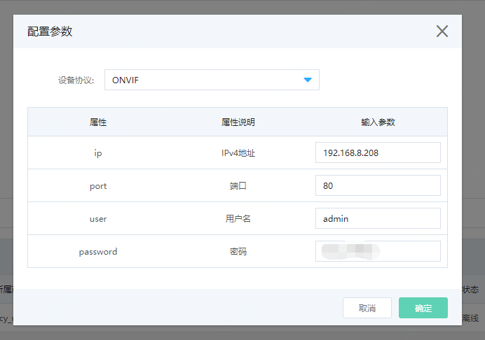

# 管理子设备

您可以通过物联网智能边缘计算控制台，管理边缘节点子设备。

## 前提条件

- 已经完成Edge系统的安装，并且保持边缘节点在线。
- 已经在边缘节点完成对应设备服务的安装，并在[物联网引擎控制台](https://iot-console.jdcloud.com/core)，使用对应的物模型模板创建好设备的产品并登记注册完成对应的设备。本节以京东云官方提供的IP摄像头设备模板和设备服务为例。
- **注意：当边缘节点处于未激活、离线或者系统更新状态时，无法进行子设备的相关操作。**

## 添加子设备

1. 登录 [物联网智能边缘计算控制台](https://iot-console.jdcloud.com/edge)。

2. 点击左侧菜单进入“边缘节点”页面，点击需要添加子设备的边缘节点名称，进入边缘节点详情页。

3. 进入“子设备管理”标签页，

    

   点击“添加子设备”，进行子设备添加。

    

   | 参数     | 说明                                                         |
   | -------- | ------------------------------------------------------------ |
   | 设备服务 | 选择已部署在边缘节点上的设备服务，如未部署，请点击右侧的部署设备服务。 |
   | 产品     | 选择需要添加的子设备所属的产品。产品创建时请使用与设备服务相关的物模型模板。当前IP-Camera服务支持使用网络摄像头模板创建的产品。 |
   | 设备     | 选择需要添加的子设备，每次仅能添加一个。已经添加过的设备无法再次添加。**注意：不能添加网关类型的设备** |
   | 设备协议 | 设备接入协议的配置参数，供客户自行配置其设备信息。IP摄像头设备服务支持ONVIF协议。 |
   | ONVIF协议配置参数 | ip: 需要添加的IP摄像头的IPv4地址 port: IP摄像头的端口号 user: 访问IP摄像头的用户名 password: 访问IP摄像头的密码 |

   点击“确定”后，在当前页下方子设备列表中，可以查看子设备添加状态，并可对子设备进行控制操作。
   
   **注意：子设备添加失败，将不会在列表中出现，请点击服务调用标签页查看添加结果。**

## 移除子设备

1. 进入“子设备管理”标签页，点击某一设备后方的移除按钮，可以从当前边缘节点上移除该子设备。

2. 点击设备名称前方的复选框，可选择多个子设备或全部子设备进行批量移除。

   提示：

   ​	a. 移除操作仅是将子设备与边缘节点解除绑定关系，并非在物联网引擎中删除该设备。

   ​	b. 若子设备已经作为源配置在某一消息路由上，则无法移除子设备。

## 参数配置

1. 进入“子设备管理”标签页，点击某一设备后方的参数配置按钮，可对设备接入协议参数进行修改。

   

## 更新影子

1. 进入“子设备管理”标签页，点击某一设备后方的更新影子按钮，可以更新当前子设备的影子。

   

   目前IP摄像头提供下面几个影子：

   | 参数          | 描述       | 输入说明                                                     |
   | ------------- | ---------- | ------------------------------------------------------------ |
   | streaming     | 设备开关   | on/off  初始值：off                                          |
   | resolution    | 拍照分辨率 | 格式：长x宽，初始值：1024x768。请按照摄像头实际支持分辨率填写。 |
   | frameinterval | 拍照频率   | 单位：ms，输入范围[1000,100000]，步长为500 初始值：2000      |

## 调用服务

1. 进入“子设备管理”标签页，点击某一设备后方的调用服务按钮，可以远程调用设备提供的服务。

   

   目前IP摄像头提供 RecordVideo录像服务。您可通过调用该服务，实现摄像头录像功能。服务调用的结果您可点击“调用记录”进行查看。录像结果将上传至您在边缘应用页面指定的OSS目录中。
   
   | 参数     | 描述         | 输入说明                                                     |
   | -------- | ------------ | ------------------------------------------------------------ |
   | duration | 持续录像时间 | 单位：秒，输入范围[5,60]，步长：1。**注意：单路摄像头在1280x720分辨率下，每小时产生的录像文件约为2.2GB，请确保您的本地硬盘有足够空间。系统会在每天凌晨2点进行清理。** |
   
   

## 相关参考，

- [创建边缘计算节点](../Getting-Started/Create-Edgenode.md)
- [安装Edge系统](../Getting-Started/Install-Edge-System.md)
- [管理边缘应用](../Operation-Guide/Edge-App.md)
- [管理消息路由](../Operation-Guide/MsgRouter.md)                          
