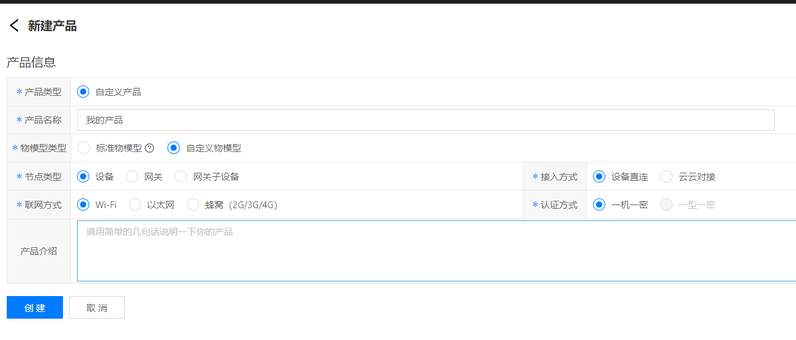
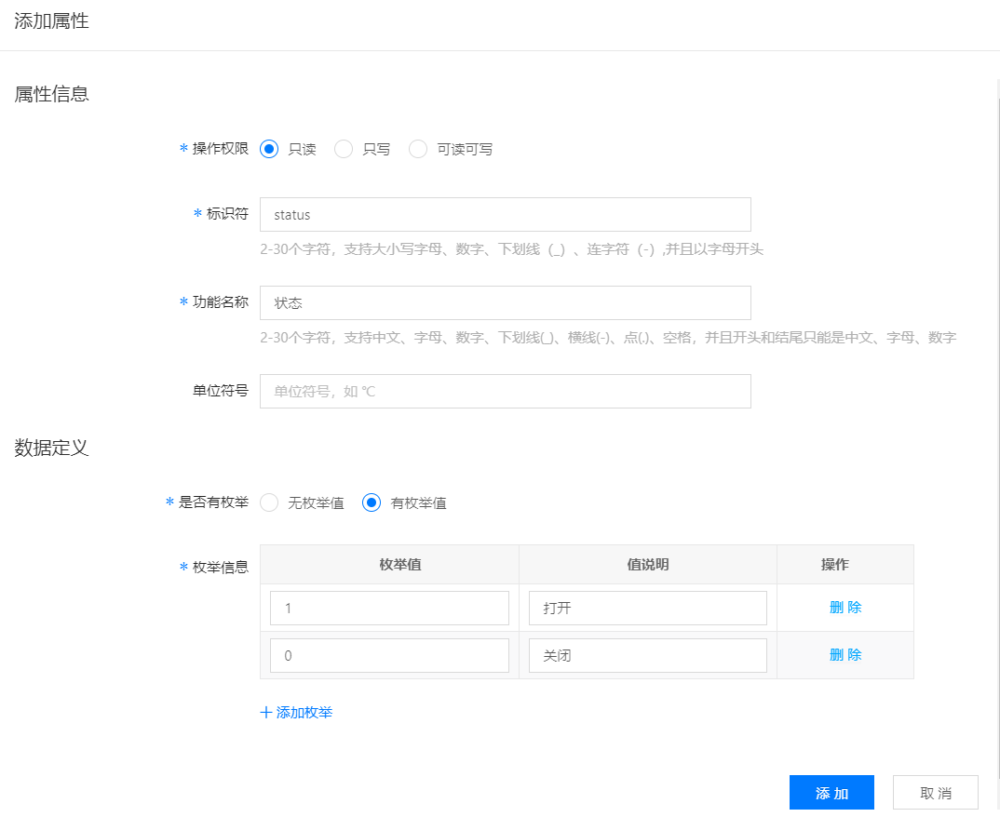
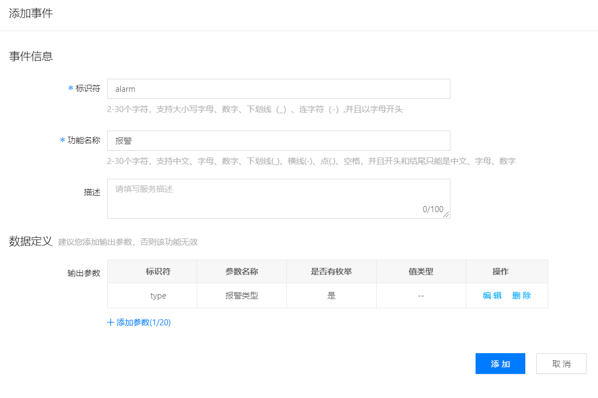
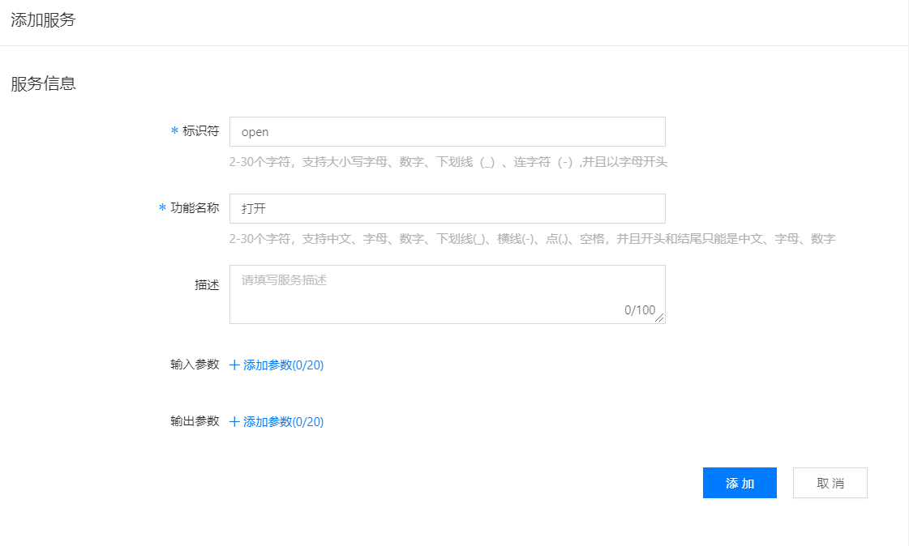
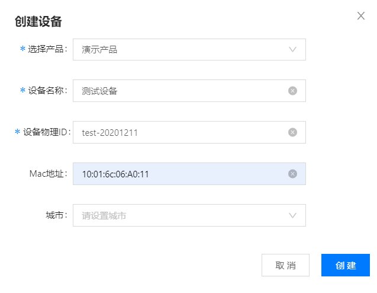
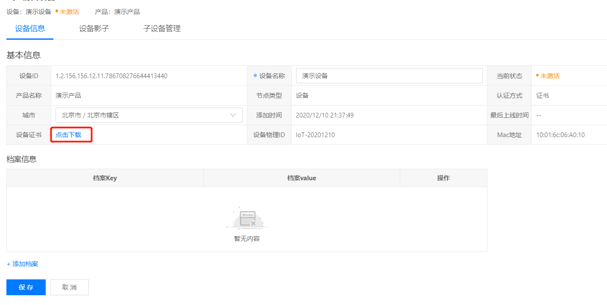
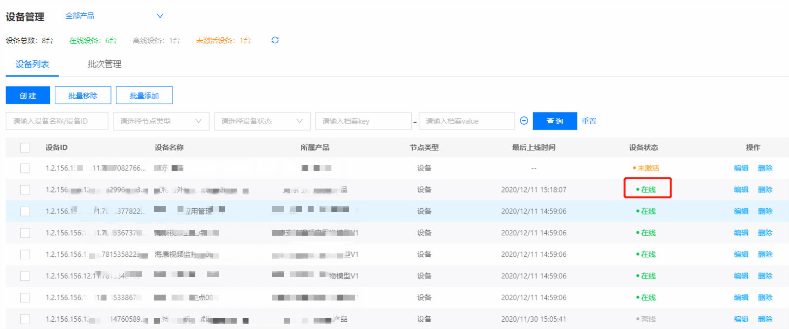

# 设备接入

登录智能生活物联管理平台官网， 共4步即可完成设备快速接入

## 创建产品

进入**产品管理**->**产品列表**，点击**新建产品**，并按如下步骤操作：

在新建产品页，输入产品名称，选择自定义物模型(或选择某个标准物模型)，并选择节点类型和联网方式，同时也可以输入一段文字来描述你的产品

点击**创建**，完成产品创建

在产品编辑页面，点击**添加属性**按钮，为当前产品新增一条属性信息

点击**添加**按钮，完成属性的新增

在产品编辑页面，点击**添加事件**按钮，为当前产品新增一条事件信息

点击**添加**按钮，完成事件的新增

在产品编辑页面，点击**添加服务**按钮，为当前产品新增一条服务信息

## 注册设备

进入**设备管理**->**设备列表**，点击**创建**，填写设备相关信息：

点击**创建**按钮，完成设备的新增

## 下载设备证书

在设备编辑页，点击设备证书栏的**点击下载**，下载设备证书

## SDK快速集成
将设备SDK集成到设备服务中，并将下载的证书导入存放到指定位置，按SDK文档说明填写配置信息连接EMQ服务

