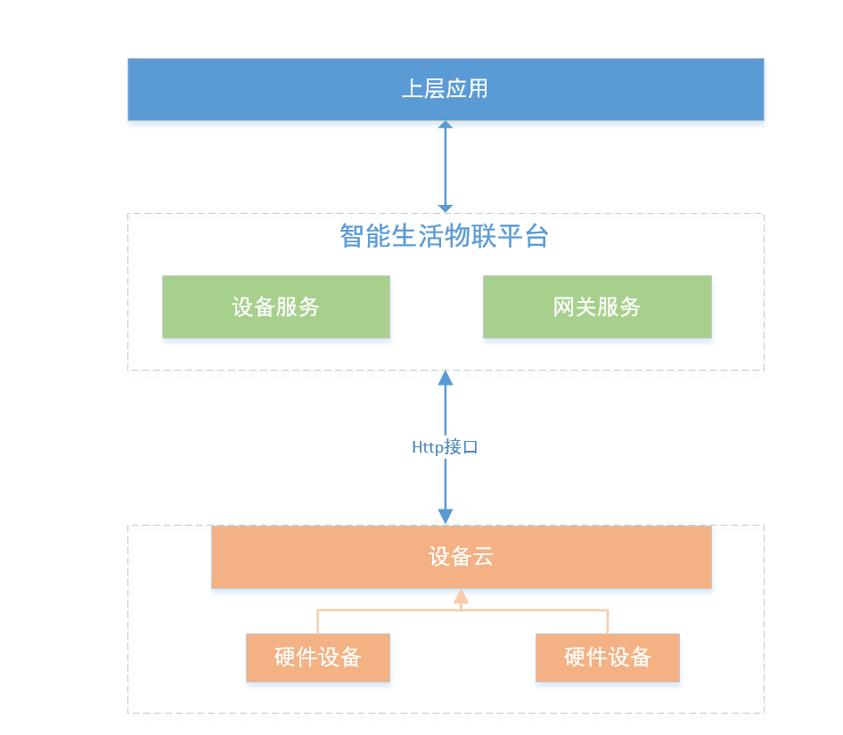

# 云对云接入简介

云对云接入的方式适用于设备侧已经有自建的比较完善的云端服务，硬件设备连接到自有云端，并通过HTTP协议按平台的接入规范进行接入。 云对云接入的架构图如图所示：

## 平台侧提供的接口
* 设备在线状态变更接口 /device/changeOnlineStatus
* 设备运行数据上报接口 /device/reportRunData
* 设备事件上报接口 /device/event/report

## 需设备云实现的接口
* 设备属性设置  /device/properties/set
* 获取设备属性 /device/properties/get
* 设备服务调用 /device/service/invoke
* 数据推送接口 /data/push

详细接口说明请参考：[云对云接入规范](../Related-Resources/京东智慧社区平台设备云接入协议v1.0.6.pdf)