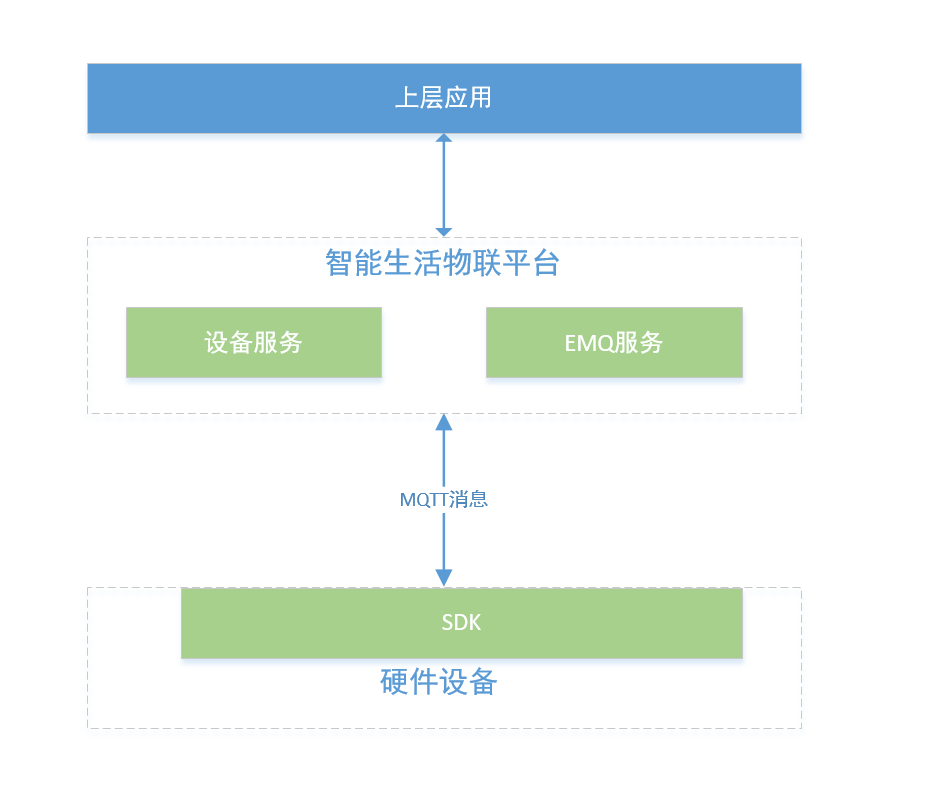

# 概述

设备厂商通过集成设备SDK的方式来实现设备接入智能生活物联网平台。注意：集成的设备必须要支持TCP/IP协议，其他非IP设备需要通过网关采用MQTT协议才能接入物联管理平台。 本平台提供的SDK面向MQTT协议不同平台和语言的开发者，如需要了解SDK细节，可参考用户开发手册。

# 获取SDK开发包
开发者需要选择适合自身设备平台环境的SDK，具体细节可联系平台技术支持人员。

开发者可参考 **[最佳实践-设备接入](../Best-Practices/Device-Access.md)** 章节，使用SDK快速接入设备

# 产品框架
设备、SDK 、平台间的关系如下图所示：

