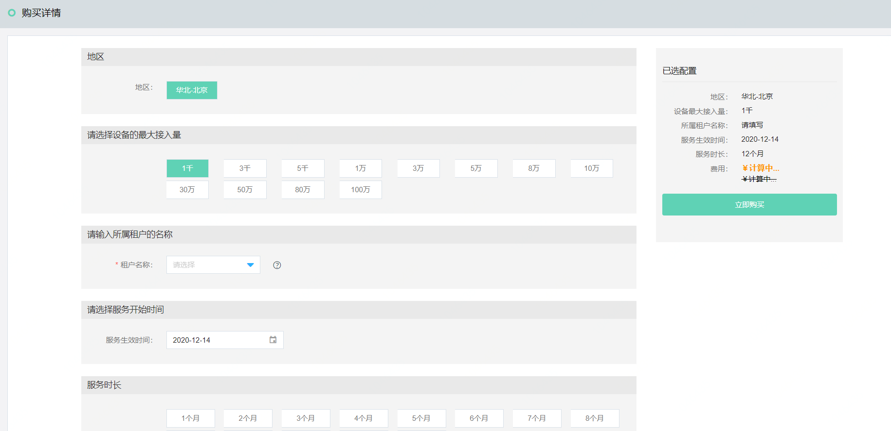
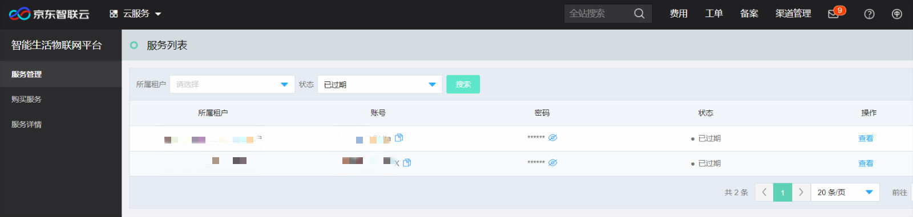

# 开通智能生活物联网平台服务

本文介绍如何快速开通智能生活物联网平台服务

1.登录智能生活物联网平台服务控制台, 在左侧导航栏点击**购买详情**

2.在购买详情页面，选择要购买的设备最大接入量，添加租户名称、选择服务开始时间和服务时长

3.全部填写完成后，点击**立即购买**，进入购买订单确认页，订单确认无误后点击**立即支付**

4.支付完成后会自动跳转至服务列表页，可查看本次购买所分配的账号和初始密码

