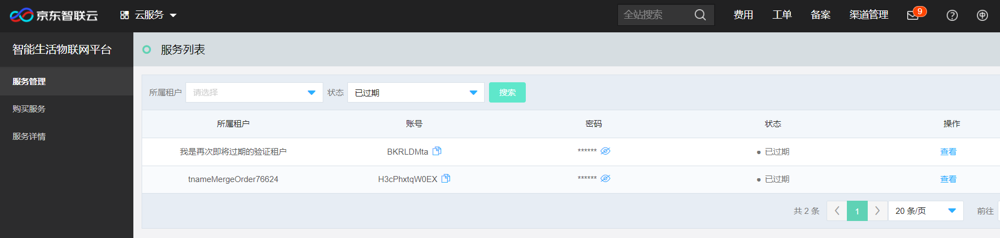

# 开通智能生活物联网平台服务

本文介绍如何快速开通智能生活物联网平台服务。

1. 登录智能生活物联网平台服务控制台, 在左侧导航栏进入购买详情。

2. 在购买详情页面，选择要购买的设备接入数量，指定所购买服务所属租户名称、服务时长和服务开始时间等信息。

3. 点击“立即购买”，进入购买订单确认页，订单确认无误后点击“立即支付”。

4. 支付订单完成后会跳转至服务列表页面，查看所购买服务分配的账号信息和初始密码。

