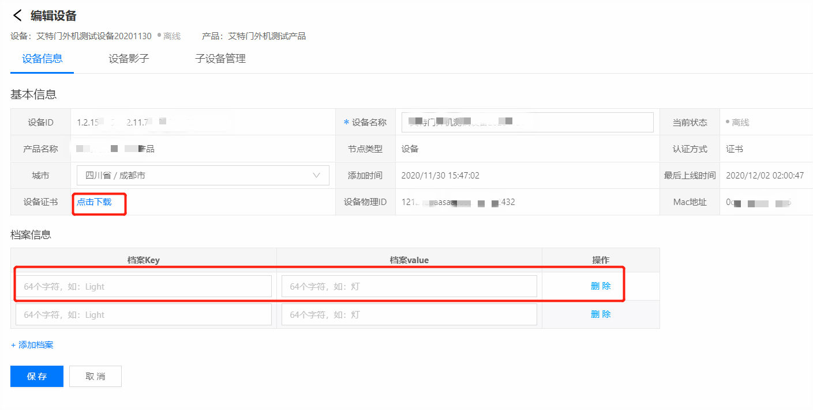
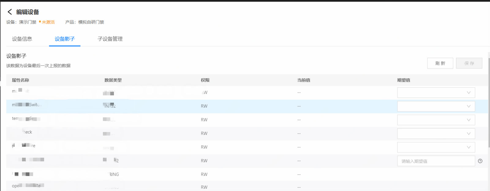
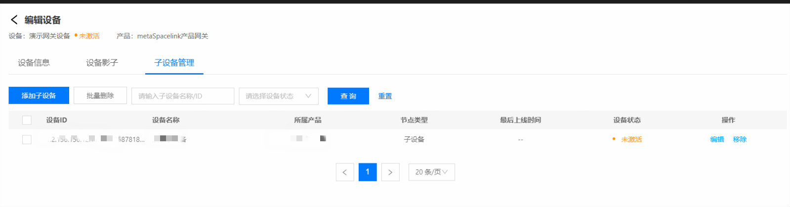

# 设备信息

编辑设备页可完成设备信息的编辑、设备影子的查看、子设备的管理

## 编辑设备信息

1.登录智能生活物联网平台

2.左侧导航栏选择 **设备管理** -> **设备列表**

3.设备管理页可根据设备名称、设备ID、节点类型、设备状态、档案信息来进行搜索

### 证书下载

在设备信息页面点击 设备证书栏的**点击下载**，即可下载设备证书

## 管理设备影子

在编辑设备页点击设备影子tab，选择要修改的设备属性，进行下发

## 子设备管理

在编辑设备页点击**添加子设备**按钮进行子设备添加（仅网关设备可添加子设备）

